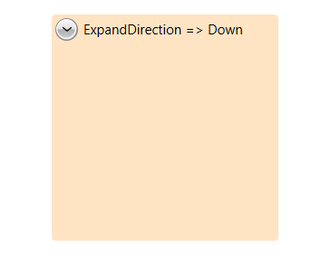
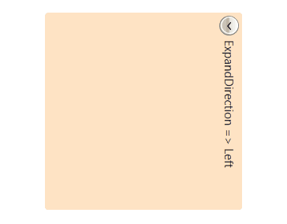
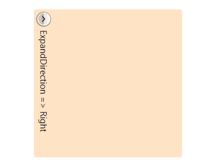
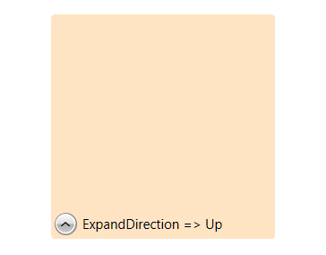

# Expand Direction

The __ExpandDirection__ property gets or sets the direction in which the content would expand. This property is an enumeration which exposes four values: __Down, Left, Right, Up__.

__Example 1: Setting ExpandDirection property__

<snippet id='radexpander-features-expand-direction-example_1_setting_expanddirection_property-xaml' />

#### __Figure 1: ExpandDirection set to Down__

#### __Figure 2: ExpandDirection set to Left__

#### __Figure 3: ExpandDirection set to Right__

#### __Figure 4: ExpandDirection set to Up__

