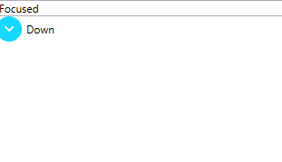

# How To Change the Action Trigering an Expand

This article describes how to control the mouse action that triggers an expand.

The __RadExpander__ control exposes a __ClickMode__ property to allow you to determine when the content of the control should be expanded. The property is an enumeration of type __ClickMode__ that exposes the following members:	  

* __Release__: Specifies that the content should be expanded when the left mouse button is pressed and released on top of the __RadExpander.Header__. If you are using the keyboard, this setting specifies that the content should be expanded when the __RadExpander.Header__ is focused and the __SPACEBAR__ or __ENTER__ key is pressed and released.

__Example 1: Setting ClickMode to Release__
<snippet id='radexpander-howto-change-expand-action-example_1_setting_clickmode_to_release-xaml' />

#### __Figure 1: Release ClickMode__

* __Press__: Specifies that the content should be expanded when the left mouse button is pressed on top of the __RadExpander.Header__. If you are using the keyboard, this setting specifies that the content should be expanded when the __RadExpander.Header__ is focused and the __SPACEBAR__ or __ENTER__ key is pressed.

__Example 2: Setting ClickMode to Press__
<snippet id='radexpander-howto-change-expand-action-example_2_setting_clickmode_to_press-xaml' />

#### __Figure 2: Press ClickMode__

* __Hover__: Specifies that the content should be expanded when the mouse pointer hovers over the __RadExpander.Header__. 

__Example 3: Setting ClickMode to Hover__
<snippet id='radexpander-howto-change-expand-action-example_3_setting_clickmode_to_hover-xaml' />

#### __Figure 3: Hover ClickMode__

> The default value of the __ClickMode__ property is __Release__ which means that by  default the __RadExpander__ control is expanded when the left mouse button is released after a click on the header or when  the __Enter__ or __Space__ keys are released while focusing the header.
