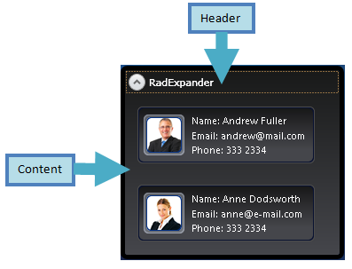

# Structure

This section defines terms and concepts used in the scope of __RadExpander__you have to get familiar with prior to continue reading this help. They can also be helpful when contacting our support service in order to describe your issue better.
			

## 

__RadExpander__inherits the __HeaderedContentControl__ and thus possess the following elements:
				

* __Header -__text that appears on top of the control
					

* __Content__- content of the control, can be any visual framework element.
					

# See Also

 * [Getting Started]()

 * [Features]()

 * [Expander Animation]()
