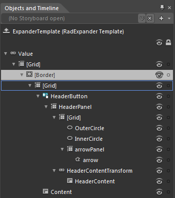

# Template Structure

Like most SilverlightWPF controls, the __RadExpander__ also allows you to template it in order to change the control from the inside.			

## RadExpander Template Structure

This section will explain the structure of the __RadExpander__'s template. Here is a snapshot of the template generated in Expression Blend.				

It contains the following parts:

* __[Grid]__ - is of type __Grid__ and represents the layout root for the template.						
	* __[Border]__ - hosts the __RadExpander__ and is of type __Border__ .
		* __[Grid]__ - represents the host control for the __RadExpander__ 's template elements.
			* __HeaderButton__ - is of type __RadToggleButton__ and represents the control that holds the __Header__ of the __RadExpander__ .
				* __HeaderPanel__ - is of type Grid and hosts the __RadExpander's__ __Header__ template elements
					* __[Grid]__ - is if type __Grid__ and hosts the expanded state indicator elements
						* __OuterCircle__ - is the circle drawn on the outer part of the arrow indicating whether the control is expanded
						* __InnerCircle__ - is the circle drawn inside the __OuterCircle__
						* __arrowPanel__ - is of type __Grid__ and hosts the arrow indicating whether the control is expanded
							* __arrow__ - is of type __Path__ and it indicates whether the control is expanded																			

					* __HeaderContentTransform__ - is of type __LayoutTransformControl__ and hosts the __Header__ content
						* __HeaderContent__ - is of type __ContentPresenter__ and is used to display the value of the __RadExpander.Header__ property.																	

				* __Content__ - is of type __ContentPresenter__ and is used to display the value of the __RadExpander.Content__ property.