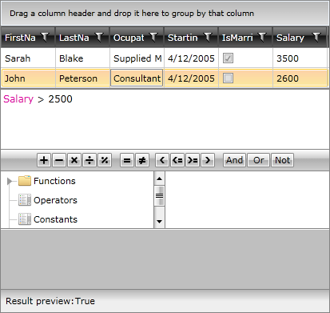
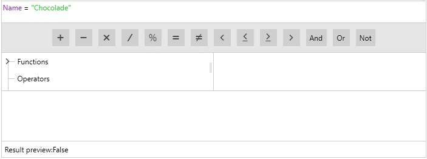
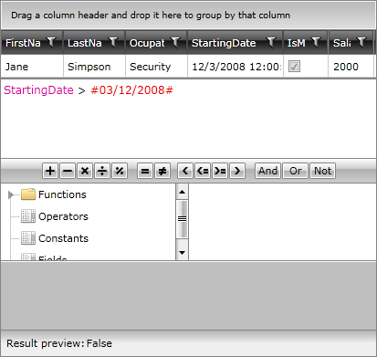
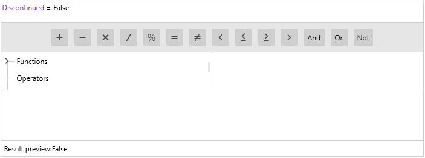

# Constants

## 

RadExpressionEditor allows you to use different constants for defining the expression you want. There are several types supported by the control:

* Numeric constants - you may define just a simple numeric expression like:

         
      

* String constants - they need to be surrounded by double quotation marks:

         
      

* DateTime constants - they need to be surrounded by hashes:

         
      

* Boolean constants - they can be defined as "True"/ "False" values. In the same way you may define null constant - "null".

         
      

