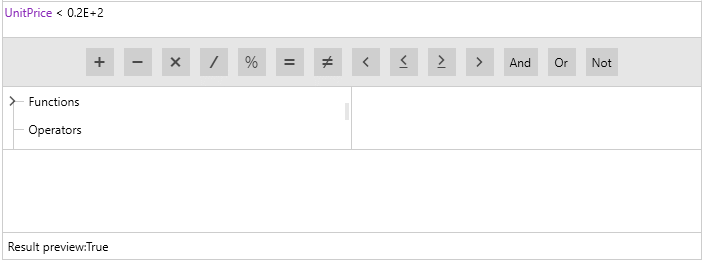
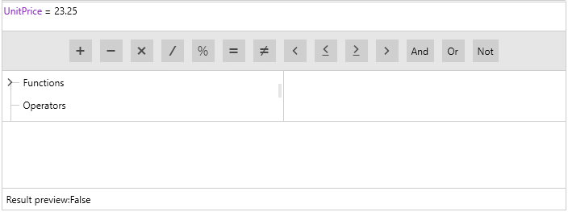
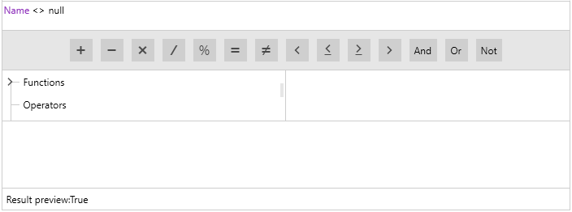

# Constants

**RadExpressionEditor** allows you to use different constants for defining the expression you want. There are several types supported by the control:

* **Numeric**: You may define just a simple numeric expression like:

In case of **Double** constant, you could use the exponential value: 0.0E+2. As a **Decimal** constant you could use '0.0'.

* **String**: They need to be surrounded by double quotation marks:

* **DateTime**: They need to be surrounded by hashes:

* **Boolean / Null**: They can be defined as **True** / **False** values. In the same way you may define the null constant - **null**.

# See also

* [Function Invocation]()