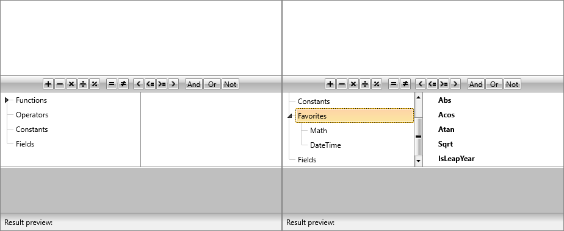
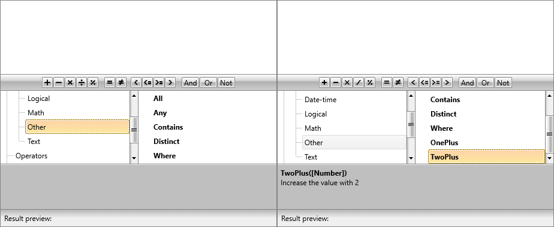

# Custom Categories and Functions

As of **R1 2019**, the RadExpressionEditor control allows users to add custom categories and functions to its UI as well as remove some of the already defined ones.

To do so, you have to create a custom implementation of the **ExpressionEditorViewModel** and override its virtual methods.

#### [C#] Example 1: The ExpressionEditorViewModel overrides

```C#

    public class CustomExpressionEditorViewModel : ExpressionEditorViewModel
    {
        protected override IEnumerable<EditorCategoryModel> GenerateCategories()
        {
            return base.GenerateCategories();
        }

        protected override IEnumerable<EditorModelBase> GetFunctionsItemModels()
        {
            return base.GetFunctionsItemModels();
        }

        protected override IEnumerable<EditorModelBase> GetFieldsItemModels(object currentItem)
        {
            return base.GetFieldsItemModels(currentItem);
        }

        protected override IEnumerable<EditorModelBase> GetOperatorsItemModels()
        {
            return base.GetOperatorsItemModels();
        }

        protected override IEnumerable<EditorModelBase> GetConstantsItemModels()
        {
            return base.GetConstantsItemModels();
        }

        protected override EditorCategoryModel GetFieldsCategory()
        {
            return base.GetFieldsCategory();
        }
    }
```

To assign the custom viewmodel to the RadExpressionEditor control, you have to set its **ViewModel** property.

#### [C#] Example 2: Set RadExpressionEditor's ViewModel

```C#

    this.ExpressionEditor.ViewModel = new CustomExpressionEditorViewModel();
```

## Custom Categories

To add custom categories as well as remove certain predefined categories, you need to override the **GenerateCategories** method.

#### [C#] Example 3: Add custom categories

```C#

    protected override IEnumerable<EditorCategoryModel> GenerateCategories()
    {
        List<EditorCategoryModel> list = new List<EditorCategoryModel>(base.GenerateCategories());

        EditorCategoryModel favorites = new EditorCategoryModel("Favorites");
        EditorCategoryModel math = new EditorCategoryModel("Math");
        EditorCategoryModel dateTime = new EditorCategoryModel("DateTime");

        math.Children.Add(new FunctionEditorItemModel(typeof(Math).GetMethod("Abs", BindingFlags.Public | BindingFlags.Static, null, new Type[] { typeof(double) }, null), favorites.Name));
        math.Children.Add(new FunctionEditorItemModel(typeof(Math).GetMethod("Acos", BindingFlags.Public | BindingFlags.Static), favorites.Name));
        math.Children.Add(new FunctionEditorItemModel(typeof(Math).GetMethod("Atan", BindingFlags.Public | BindingFlags.Static), favorites.Name));
        math.Children.Add(new FunctionEditorItemModel(typeof(Math).GetMethod("Sqrt", BindingFlags.Public | BindingFlags.Static), favorites.Name));
        dateTime.Children.Add(new FunctionEditorItemModel(typeof(DateTime).GetMethod("IsLeapYear", BindingFlags.Public | BindingFlags.Static), favorites.Name));

        favorites.Children.Add(math);
        favorites.Children.Add(dateTime);

        list.Add(favorites);

        return list;
    }
```

**Example 3** adds a **Favorites** category with two subcategories - **Math** and **DateTime**. Each of the categories contains some static methods of the respective class. The results before and after respectively can be observed in **Figure 1**.

__Custom category__



## Custom Functions

If you want to add your custom non-static functions to the control you need to set the **ExpressionFunctionContext.Context** property to an instance of the **ExpressionFunctionContext** class.

#### [C#] Example 4: Custom ExpressionFunctionContext

```C#

    public class CustomExpressionFunctionContext : ExpressionFunctionContext
    {
        [Description("Increase the value by 1")]
        public int OnePlus(int input)
        {
            return ++input;
        }
        
        [Description("Increase the value with 2")]
        public int TwoPlus(int input)
        {
            return input + 2;
        }
    }
```

**Example 4** defines two custom instance functions which we can now pass to the ExpressionParser as show in **Example 5**.

#### [C#] Example 5: Set the ExpressionFunctionContext.Context

```C#

    ExpressionFunctionContext.Context = new CustomExpressionFunctionContext();
```

You can then add these functions in the **GetFunctionsItemModels** override as well as remove some of the predefined functions.

#### [C#] Example 6: Add custom functions

```C#

    protected override IEnumerable<EditorModelBase> GetFunctionsItemModels()
    {
        List<EditorModelBase> list = new List<EditorModelBase>(base.GetFunctionsItemModels());

        var other = list.First(x => x.Name == "Other") as EditorCategoryModel;
        other.Children.Insert(5, new FunctionEditorItemModel(typeof(CustomExpressionFunctionContext).GetMethod("OnePlus", BindingFlags.Public | BindingFlags.Instance), other.Name));
        other.Children.Add(new FunctionEditorItemModel(typeof(CustomExpressionFunctionContext).GetMethod("TwoPlus", BindingFlags.Public | BindingFlags.Instance), other.Name));

        return list;
    }
```

**Example 6** adds the two custom functions defined in Example 4 to the **Other** subcategory. The results before and after respectively are illustrated in **Figure 2**. 

__Custom functions__



## Further Customizations

You can further customize the control by overriding the **GetFieldsItemModels**, **GetOperatorsItemModels**, **GetConstantsItemModels** and **GetFieldsCategory** methods.

#### [C#] Example 7: Remove operators, constants and fields and add subcategories to the Fields category

```C#

    protected override IEnumerable<EditorModelBase> GetOperatorsItemModels()
    {
        List<EditorModelBase> list = new List<EditorModelBase>(base.GetOperatorsItemModels());

        list.RemoveAll(m => m.Name.StartsWith("/", System.StringComparison.CurrentCultureIgnoreCase));
        list.RemoveAll(m => m.Name.StartsWith("Or", System.StringComparison.CurrentCultureIgnoreCase));
        list.RemoveAll(m => m.Name.StartsWith("And", System.StringComparison.CurrentCultureIgnoreCase));
        list.RemoveAll(m => m.Name.StartsWith("Not", System.StringComparison.CurrentCultureIgnoreCase));

        return list;
    }

    protected override IEnumerable<EditorModelBase> GetConstantsItemModels()
    {
        List<EditorModelBase> list = new List<EditorModelBase>(base.GetConstantsItemModels());

        list.RemoveAll(m => m.Name.StartsWith("null", System.StringComparison.CurrentCultureIgnoreCase));

        return list;
    }

    protected override IEnumerable<EditorModelBase> GetFieldsItemModels(object currentItem)
    {
        List<EditorModelBase> list = new List<EditorModelBase>(base.GetFieldsItemModels(currentItem));

        list.RemoveAll(m => m.Name.StartsWith("Discontinued", System.StringComparison.CurrentCultureIgnoreCase));

        return list;
    }
    
    protected override EditorCategoryModel GetFieldsCategory()
    {
        var fields = base.GetFieldsCategory();
        if (fields.Children.Any())
        {
            var subcategory = new EditorCategoryModel("Subcategory");
            subcategory.Children.Add(fields.Children.First(x => x.Name == "Car"));
            fields.Children.Add(subcategory);
        }
        
        return fields;
    }
```

The example above removes some of the operators, constants and the **Discontinued** field from the RadExpressionEditor. It also creates a subcategory for the Fields category which holds the **Car** field of the bound object.

## See Also

* [Lambdas]()

