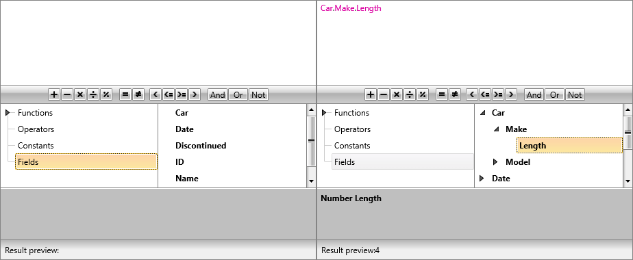

# Drill-Down

RadExpressionEditor allows users to expand complex objects and access their sub-properties. This functionality is controlled by the new **IsFieldsDrillDownEnabled** property.

__Example 1: Enabling drill-down in XAML__

```XAML
    <telerik:RadExpressionEditor IsFieldsDrillDownEnabled="True" />
```

__Example 2: Enabling drill-down in code-behind__

```C#
    this.radExpressionEditor.IsFieldsDrillDownEnabled = true;
```
```VB
    Me.radExpressionEditor.IsFieldsDrillDownEnabled = True
```

**Figure 1** illustrates the difference between the functionality being disabled and enabled.

__Drill-down functionality__



## See Also

* [Lambdas]()
* [Custom Categories and Functions]()