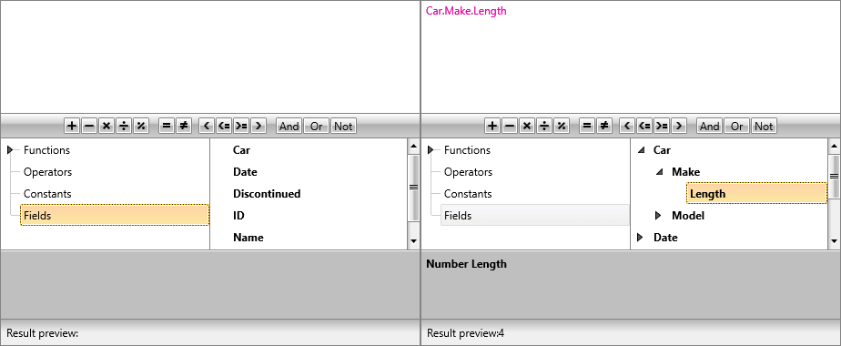

# Drill-Down

RadExpressionEditor allows users to expand complex objects and access their sub-properties. This functionality is controlled by the new **IsFieldsDrillDownEnabled** property.

__Example 1: Enabling drill-down in XAML__

<snippet id='radexpressioneditor-expressions-drill-down-example_1_enabling_drill_down_in_xaml-xaml' />

__Example 2: Enabling drill-down in code-behind__

<snippet id='radexpressioneditor-expressions-drill-down-example_2_enabling_drill_down_in_code_behind-cs' />

<snippet id='radexpressioneditor-expressions-drill-down-example_2_enabling_drill_down_in_code_behind-vb' />

**Figure 1** illustrates the difference between the functionality being disabled and enabled.

__Drill-down functionality__

## See Also

* [Lambdas]()
* [Custom Categories and Functions]()