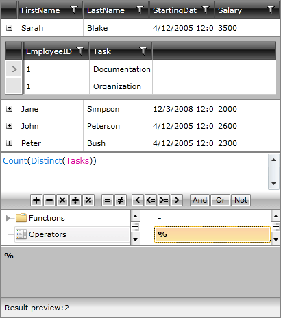
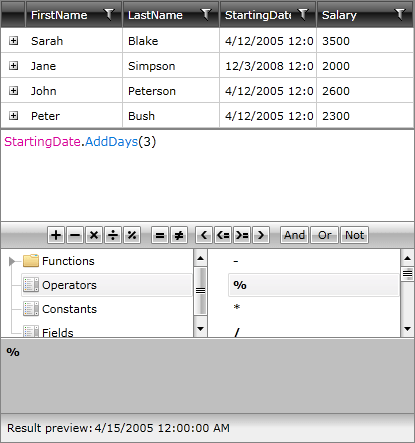

# Function Invocation

__RadExpressionEditor__ allows you to benefit from the built-in functions as well. So, you may easily invoke __Distinct([List])__ like: 

`“Distinct(Tasks)”`

In this case __"Tasks"__ property should be of type __IEnumerable__. Distinct expression will return a list of the unique items in __"Tasks"__ collection. 

In the example above the __Result preview__ displays the count of the distinct values in the __"Tasks"__ collection. 

However, it is also possible to call methods on values in the expression. For instance, the expression __“StartingDate.AddDays(3)”__ calls the __AddDays()__ method of the __DateTime__ value of the __StartingDate__ property:

In this case the __Result preview__ displays the result after the method has been executed.
 
In case of __Double__ constant, you could use the exponential value: 0.0E+2. As a __Decimal__ constant you could use '0.0'. 

It is not possible to remove any of the built-in functions or constants in RadExpressionEditor. However, if you would like to hide some of the fields of the item in the editor, you need to use the [Display DataAnnotations](https://msdn.microsoft.com/en-us/library/system.componentmodel.dataannotations.displayattribute(v=VS.95).aspx) attribute with AutoGenerateField = false on every property of the class that you wish to hide.

Manually adding user-defined functions is currently not supported. 

#See also  
* [Constants]()
