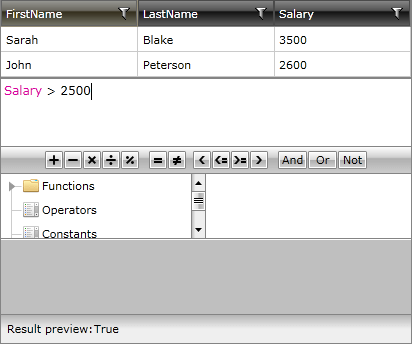
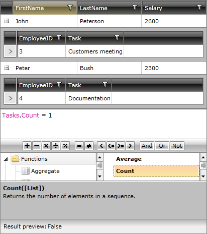

# Member Access

## 

You may access each member just as you do in __C#__ and __VB.NET__.

A simple expression such as __“Salary > 2500”__ will try to resolve the __Salary__ property on the parameter of the generated __LambdaExpression__:
        

Nested member access is also possible. For instance, __“Tasks.Count”__ will access the __Count__ property of the value of the __Tasks__ property in the expression’s parameter:

