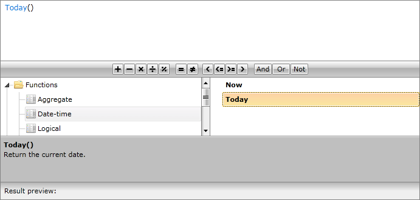
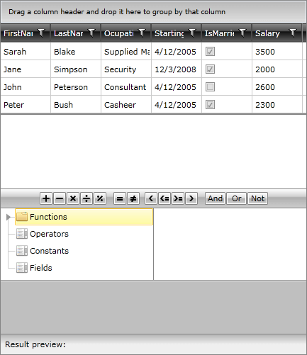
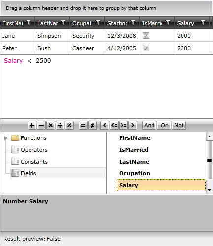

# Getting Started with {{ site.framework_name }} ExpressionEditor

This tutorial will walk your through the creation of a sample application containing __RadExpressionEditor__ and will show you how to: 

* Use __RadExpressionEditor__ in your project;

* Utilize __RadExpressionEditor__ with other controls.

## Adding Telerik Assemblies Using NuGet

To use __RadExpressionEditor__ when working with NuGet packages, install the `Telerik.Windows.Controls.Expressions.for.Wpf.Xaml` package. The [package name may vary]() slightly based on the Telerik dlls set - [Xaml or NoXaml]()

Read more about NuGet installation in the [Installing UI for WPF from NuGet Package]() article.

>tip With the 2025 Q1 release, the Telerik UI for WPF has a new licensing mechanism. You can learn more about it [here]().

## Adding Assembly References Manually

If you are not using NuGet packages, you can add a reference to the following assemblies:

* __Telerik.Licensing.Runtime__
* __Telerik.Windows.Controls__
* __Telerik.Windows.Controls.Data__
* __Telerik.Windows.Controls.Input__
* __Telerik.Windows.Controls.Expressions__
* __Telerik.Windows.Controls.Navigation__
* __Telerik.Windows.Data__
* __Telerik.Windows.Documents__
* __Telerik.Windows.Documents.Core__
* __Telerik.Windows.Documents.Flow__

You can find the required assemblies for each control from the suite in the [Controls Dependencies]() help article.

## Adding RadExpressionEditor to the project

* Create a new project;

>important If you are using **{{ site.minimum_net_core_version }}** and later, please note that instead of the **Telerik.Windows.Documents.dll** you need to use the new **Telerik.Windows.Controls.RichTextBox.dll** assembly.

>In case you use [Implicit Styles](), please make sure all the needed resource dictionaries are merged:  
* System.Windows.xaml
* Telerik.Windows.Controls.xaml
* Telerik.Windows.Controls.Expressions.xaml
* Telerik.Windows.Controls.Navigation.xaml
* Telerik.Windows.Documents.xaml

* Define __RadExpressionEditor__ as demonstrated below:

__Example 1__
```XAML
	  <telerik:RadExpressionEditor x:Name="expressionEditor" />
```

Now, when running the application, __RadExpressionEditor__ will be displayed:



## Binding RadExpressionEditor

The scenario we will try to create here would be to implement __RadExpressionEditor__ as an advanced manual filter for __RadGridView__. For that purpose, we will firstly create a new class __Employee__ with a couple of exposed properties and a method creating sample data:

__Example 2__

```C#
	public class Employee 
	 {
	  public string FirstName
	  {
	   get;
	   set;
	  }
	  public string LastName
	  {
	   get;
	   set;
	  }
	  public string Occupation
	  {
	   get;
	   set;
	  }
	  public DateTime StartingDate
	  {
	   get;
	   set;
	  }
	  public bool IsMarried
	  {
	   get;
	   set;
	  }  
	  public int Salary
	  {
	   get;
	   set;
	  }
	  public Employee()
	  {
	  }
	  public static ObservableCollection<Employee> GetEmployees()
	  {
	   ObservableCollection<Employee> employees = new ObservableCollection<Employee>();
	   employees.Add(new Employee() { FirstName = "Sarah", LastName = "Blake", Occupation = "Supplied Manager", StartingDate = new DateTime(2005, 04, 12), IsMarried = true, Salary = 3500 });
	   employees.Add(new Employee() { FirstName = "Jane", LastName = "Simpson", Occupation = "Security", StartingDate = new DateTime(2008, 12, 03), IsMarried = true, Salary = 2000 });
	   employees.Add(new Employee() { FirstName = "John", LastName = "Peterson", Occupation = "Consultant", StartingDate = new DateTime(2005, 04, 12), IsMarried = false, Salary = 2600 });
	   employees.Add(new Employee() { FirstName = "Peter", LastName = "Bush", Occupation = "Cashier", StartingDate = new DateTime(2005, 04, 12), IsMarried = true, Salary = 2300 });
	   return employees;
	  }
	 }
```
```VB.NET
	Public Class Employee
	 Public Property FirstName() As String
	  Get
	   Return m_FirstName
	  End Get
	  Set
	   m_FirstName = Value
	  End Set
	 End Property
	 Private m_FirstName As String
	 Public Property LastName() As String
	  Get
	   Return m_LastName
	  End Get
	  Set
	   m_LastName = Value
	  End Set
	 End Property
	 Private m_LastName As String
	 Public Property Occupation() As String
	  Get
	   Return m_Occupation
	  End Get
	  Set
	   m_Occupation = Value
	  End Set
	 End Property
	 Private m_Occupation As String
	 Public Property StartingDate() As DateTime
	  Get
	   Return m_StartingDate
	  End Get
	  Set
	   m_StartingDate = Value
	  End Set
	 End Property
	 Private m_StartingDate As DateTime
	 Public Property IsMarried() As Boolean
	  Get
	   Return m_IsMarried
	  End Get
	  Set
	   m_IsMarried = Value
	  End Set
	 End Property
	 Private m_IsMarried As Boolean
	 Public Property Salary() As Integer
	  Get
	   Return m_Salary
	  End Get
	  Set
	   m_Salary = Value
	  End Set
	 End Property
	 Private m_Salary As Integer
	 Public Sub New()
	 End Sub
	 Public Shared Function GetEmployees() As ObservableCollection(Of Employee)
	  Dim employees As New ObservableCollection(Of Employee)()
	  employees.Add(New Employee() With { _
	   Key .FirstName = "Sarah", _
	   Key .LastName = "Blake", _
	   Key .Occupation = "Supplied Manager", _
	   Key .StartingDate = New DateTime(2005, 4, 12), _
	   Key .IsMarried = True, _
	   Key .Salary = 3500 _
	  })
	  employees.Add(New Employee() With { _
	   Key .FirstName = "Jane", _
	   Key .LastName = "Simpson", _
	   Key .Occupation = "Security", _
	   Key .StartingDate = New DateTime(2008, 12, 3), _
	   Key .IsMarried = True, _
	   Key .Salary = 2000 _
	  })
	  employees.Add(New Employee() With { _
	   Key .FirstName = "John", _
	   Key .LastName = "Peterson", _
	   Key .Occupation = "Consultant", _
	   Key .StartingDate = New DateTime(2005, 4, 12), _
	   Key .IsMarried = False, _
	   Key .Salary = 2600 _
	  })
	  employees.Add(New Employee() With { _
	   Key .FirstName = "Peter", _
	   Key .LastName = "Bush", _
	   Key .Occupation = "Cashier", _
	   Key .StartingDate = New DateTime(2005, 4, 12), _
	   Key .IsMarried = True, _
	   Key .Salary = 2300 _
	  })
	  Return employees
	 End Function
	End Class
```

In our case we will create a simple __ViewModel__ taking care for the connection between the model and view. It will be set as __DataContext__ of the application.

__Example 3__

```C#
	public class MyViewModel
	 {
	  private ObservableCollection<Employee> employees;
	  public ObservableCollection<Employee> Employees
	  {
	   get
	   {
	    if (this.employees == null)
	    {
	     this.employees = Employee.GetEmployees();
	    }
	    return this.employees;
	   }
	  }  
	 }
```
```VB.NET
	Public Class MyViewModel
	 Private m_employees As ObservableCollection(Of Employee)
	 Public ReadOnly Property Employees() As ObservableCollection(Of Employee)
	  Get
	   If Me.m_employees Is Nothing Then
	    Me.m_employees = Employee.GetEmployees()
	   End If
	   Return Me.m_employees
	  End Get
	 End Property
	End Class
```

Once we declared the business object and the corresponding __ViewModel__, we can define __RadExpressionEditor__ and bind it appropriately. 

__Example 4__

```XAML
	<Window x:Class="RadExpressionEditor_WPF.MainPage"
	             xmlns="http://schemas.microsoft.com/winfx/2006/xaml/presentation"
	             xmlns:x="http://schemas.microsoft.com/winfx/2006/xaml"
	             xmlns:d="http://schemas.microsoft.com/expression/blend/2008"
	             xmlns:mc="http://schemas.openxmlformats.org/markup-compatibility/2006"
	             xmlns:telerik="http://schemas.telerik.com/2008/xaml/presentation"
	             xmlns:my="clr-namespace:RadExpressionEditor_WPF"
	             mc:Ignorable="d" d:DesignHeight="700" d:DesignWidth="700">
	 <Window.Resources>
	  <my:MyViewModel x:Key="MyViewModel" />
	 </Window.Resources>
	 <Grid DataContext="{StaticResource MyViewModel}">
	  <Grid.RowDefinitions>
	   <RowDefinition Height="*" />
	   <RowDefinition Height="*"/>
	   <RowDefinition Height="Auto"/>
	  </Grid.RowDefinitions>
	  <telerik:RadGridView x:Name="GridView" ItemsSource="{Binding Employees}" CanUserFreezeColumns="False"             RowIndicatorVisibility="Collapsed" />
	  <telerik:RadExpressionEditor Item="{Binding Employees[0]}" Grid.Row="1"
	                                     x:Name="ExpressionEditor" 
	                                     ExpressionChanged="ExpressionEditor_ExpressionChanged"/>
	  </Grid>
	</Window>
```

The functionality for defining a filter for __RadGridView__ will be implemented in the handler of __ExpressionChanged__ event:  

__Example 5__

```C#
	private FilterDescriptor<Employee> genericFilterDescriptor = new FilterDescriptor<Employee>();
	private void ExpressionEditor_ExpressionChanged(object sender, Telerik.Windows.RadRoutedEventArgs e)
	  {
	   if (this.ExpressionEditor.Expression != null && this.ExpressionEditor.Expression.GetType() == typeof(Expression<Func<Employee, bool>>))
	   {
	    this.genericFilterDescriptor.FilteringExpression = (Expression<Func<Employee, bool>>)this.ExpressionEditor.Expression;
	    if (!this.GridView.FilterDescriptors.Contains(this.genericFilterDescriptor))
	    {
	     this.GridView.FilterDescriptors.Add(this.genericFilterDescriptor);
	    }
	   }
	   else if (this.ExpressionEditor.Expression == null)
	   {
	    if (this.GridView.FilterDescriptors.Contains(this.genericFilterDescriptor))
	    {
	     this.GridView.FilterDescriptors.Remove(this.genericFilterDescriptor);
	    }    
	   }
	  }
```
```VB.NET
	    Private genericFilterDescriptor As New FilterDescriptor(Of Employee)()
	Private Sub ExpressionEditor_ExpressionChanged(sender As Object, e As Telerik.Windows.RadRoutedEventArgs)
	 If Me.ExpressionEditor.Expression IsNot Nothing AndAlso Me.ExpressionEditor.Expression.[GetType]() = GetType(Expression(Of Func(Of Employee, Boolean))) Then
	  Me.genericFilterDescriptor.FilteringExpression = DirectCast(Me.ExpressionEditor.Expression, Expression(Of Func(Of Employee, Boolean)))
	  If Not Me.GridView.FilterDescriptors.Contains(Me.genericFilterDescriptor) Then
	   Me.GridView.FilterDescriptors.Add(Me.genericFilterDescriptor)
	  End If
	 ElseIf Me.ExpressionEditor.Expression Is Nothing Then
	  If Me.GridView.FilterDescriptors.Contains(Me.genericFilterDescriptor) Then
	   Me.GridView.FilterDescriptors.Remove(Me.genericFilterDescriptor)
	  End If
	 End If
	End Sub
```

On running the application and testing the functionality of adding a filter descriptor for __RadGridView__, you should see a similar result:



Still, using the __Calculation Panel__ and the items in each __Category__, you are empowered to create far more complex filtering expressions.  

>You can access ExpressionEditor.Expression.Type.

>__RadExpressionEditor__ provides support for dynamic objects with __ICustomTypeProvider__ or __ICustomTypeDescriptor__ implementation. It will scan the object's properties and show them in the __Fields list__.

## Customizing the editor

You can edit the [template of the control](), extend its default editor and use your custom version of it to serve your requirements. The default editor for the ExpressionEditor is an __ExpressionTextBox__. 

## Pasting
     
By default pasting in the editor is not supported. This is the behavior as the inner ExpressionTextBox is configured to not accept returns. You can resolve this with the following approach ensuring the pasting will be executed in code:

__Example 7__
```C#
    void MainWindow_Loaded(object sender, RoutedEventArgs e)
    {
        this.expressionEditor.OnApplyTemplate();

        ExpressionTextBox expressionTextBox = ((ExpressionTextBox)this.expressionEditor.Template.FindName("PART_ExpressionNodeEditor", this.expressionEditor));
        RadRichTextBox radRichTextBox = ((RadRichTextBox)expressionTextBox.Template.FindName("RichTextBox", expressionTextBox));

        radRichTextBox.CommandExecuting += radRichTextBox_CommandExecuting;
    }

    void radRichTextBox_CommandExecuting(object sender, CommandExecutingEventArgs e)
    {
        RadRichTextBox radRichTextBox = (RadRichTextBox)sender;

        if (e.Command is PasteCommand)
        {
            e.Cancel = true;
            radRichTextBox.Insert(Clipboard.GetText());
        }
    }     
```

## Setting a Theme

The controls from our suite support different themes. You can see how to apply a theme different than the default one in the [Setting a Theme]() help article.

>important Changing the theme using implicit styles will affect all controls that have styles defined in the merged resource dictionaries. This is applicable only for the controls in the scope in which the resources are merged. 

To change the theme, you can follow the steps below:

* Choose between the themes and add reference to the corresponding theme assembly (ex: **Telerik.Windows.Themes.Windows8.dll**). You can see the different themes applied in the **Theming** examples from our [WPF Controls Examples](https://demos.telerik.com/wpf/) application.

* Merge the ResourceDictionaries with the namespace required for the controls that you are using from the theme assembly. For the __RadExpressionEditor__, you will need to merge the following resources:

	* __System.Windows.xaml__
	* __Telerik.Windows.Controls.xaml__
	* __Telerik.Windows.Controls.Expressions.xaml__
	* __Telerik.Windows.Controls.Navigation.xaml__
	* __Telerik.Windows.Documents.xaml__

__Example 8__ demonstrates how to merge the ResourceDictionaries so that they are applied globally for the entire application.

__Example 8: Merge the ResourceDictionaries__  
```XAML
	<Application.Resources>
		<ResourceDictionary>
			<ResourceDictionary.MergedDictionaries>
				<ResourceDictionary Source="/Telerik.Windows.Themes.Windows8;component/Themes/System.Windows.xaml"/>
				<ResourceDictionary Source="/Telerik.Windows.Themes.Windows8;component/Themes/Telerik.Windows.Controls.xaml"/>
				<ResourceDictionary Source="/Telerik.Windows.Themes.Windows8;component/Themes/Telerik.Windows.Controls.Navigation.xaml"/>
				<ResourceDictionary Source="/Telerik.Windows.Themes.Windows8;component/Themes/Telerik.Windows.Controls.Expressions.xaml"/>					
				<ResourceDictionary Source="/Telerik.Windows.Themes.Windows8;component/Themes/Telerik.Windows.Documents.xaml"/>
			</ResourceDictionary.MergedDictionaries>
		</ResourceDictionary>
	</Application.Resources>
```

>Alternatively, you can use the theme of the control via the [StyleManager](https://docs.telerik.com/devtools/wpf/styling-and-appearance/stylemanager/common-styling-apperance-setting-theme-wpf)

__Figure 14__ shows a __RadExpressionEditor__ with the **Windows8** theme applied.

#### __Figure 14: RadExpressionEditor with the Windows8 theme__


## Telerik UI for WPF Learning Resources

* [Telerik UI for WPF ExpressionEditor Component](https://www.telerik.com/products/wpf/expressioneditor.aspx)
* [Getting Started with Telerik UI for WPF Components]()
* [Telerik UI for WPF Installation]()
* [Telerik UI for WPF and WinForms Integration]()
* [Telerik UI for WPF Visual Studio Templates]()
* [Setting a Theme with Telerik UI for WPF]()
* [Telerik UI for WPF Virtual Classroom (Training Courses for Registered Users)](https://learn.telerik.com/learn/course/external/view/elearning/16/telerik-ui-for-wpf) 
* [Telerik UI for WPF License Agreement](https://www.telerik.com/purchase/license-agreement/wpf-dlw-s)
