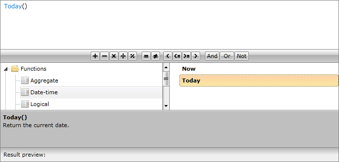
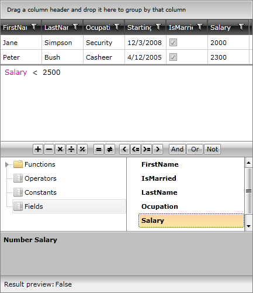

# Getting Started

This tutorial will walk your through the creation of a sample application that contains RadExpressionEditor and will show you how to: 

* Use RadExpressionEditor in your project;

* Utilize RadExpressionEditor with other RadControls.

## Adding RadExpressionEditor to the project

* Create a new SilverlightWPF project;

* Add references to the assemblies __Telerik.Windows.Controls__, __Telerik.Windows.Data__, __Telerik.Windows.Controls.Navigation__,__Telerik.Windows.Documents__, __Telerik.Windows.Documents.Core__,
            __Telerik.Windows.Documents.Flow__ and __Telerik.Windows.Controls.Expressions__.
            

* Make sure that your XAML page contains the Telerik XML namespace mapping:

#### __XAML__

{{region radexpressioneditor-getting-started_0}}
	xmlns:telerik="http://schemas.telerik.com/2008/xaml/presentation"
	{{endregion}}

* Add the RadExpressionEditor as demonstrated below:

#### __XAML__

{{region radexpressioneditor-getting-started_1}}
	<UserControl x:Class="RadExpressionEditor_SL.MainPage"
	             xmlns="http://schemas.microsoft.com/winfx/2006/xaml/presentation"
	             xmlns:x="http://schemas.microsoft.com/winfx/2006/xaml"
	             xmlns:d="http://schemas.microsoft.com/expression/blend/2008"
	             xmlns:mc="http://schemas.openxmlformats.org/markup-compatibility/2006"
	             xmlns:telerik="http://schemas.telerik.com/2008/xaml/presentation"
	             xmlns:my="clr-namespace:RadExpressionEditor_SL"
	             mc:Ignorable="d" d:DesignHeight="700" d:DesignWidth="700">
	 <Grid>
	  <telerik:RadExpressionEditor x:Name="expressionEditor" />
	 </Grid>
	</UserControl>
	{{endregion}}

#### __XAML__

{{region radexpressioneditor-getting-started_2}}
	<Window x:Class="RadExpressionEditor_WPF.MainPage"
	             xmlns="http://schemas.microsoft.com/winfx/2006/xaml/presentation"
	             xmlns:x="http://schemas.microsoft.com/winfx/2006/xaml"
	             xmlns:d="http://schemas.microsoft.com/expression/blend/2008"
	             xmlns:mc="http://schemas.openxmlformats.org/markup-compatibility/2006"
	             xmlns:telerik="http://schemas.telerik.com/2008/xaml/presentation"
	             xmlns:my="clr-namespace:RadExpressionEditor_WPF"
	             mc:Ignorable="d" d:DesignHeight="700" d:DesignWidth="700">
	 <Grid>
	  <telerik:RadExpressionEditor x:Name="expressionEditor" />
	 </Grid>
	</Window>
	{{endregion}}

Now, if you run the application, you will see a RadExpressionEditor:

## Binding RadExpressionEditor

The scenario we will try to create here would be to implement a RadExpressionEditor as an advanced manual filter for RadGridView. For that purpose, we will firstly create a new class Employee with a couple of exposed properties and a method creating sample data:

#### __C#__

{{region radexpressioneditor-getting-started_3}}
	public class Employee 
	 {
	  public string FirstName
	  {
	   get;
	   set;
	  }
	  public string LastName
	  {
	   get;
	   set;
	  }
	  public string Occupation
	  {
	   get;
	   set;
	  }
	  public DateTime StartingDate
	  {
	   get;
	   set;
	  }
	  public bool IsMarried
	  {
	   get;
	   set;
	  }  
	  public int Salary
	  {
	   get;
	   set;
	  }
	  public Employee()
	  {
	  }
	  public static ObservableCollection<Employee> GetEmployees()
	  {
	   ObservableCollection<Employee> employees = new ObservableCollection<Employee>();
	   employees.Add(new Employee() { FirstName = "Sarah", LastName = "Blake", Occupation = "Supplied Manager", StartingDate = new DateTime(2005, 04, 12), IsMarried = true, Salary = 3500 });
	   employees.Add(new Employee() { FirstName = "Jane", LastName = "Simpson", Occupation = "Security", StartingDate = new DateTime(2008, 12, 03), IsMarried = true, Salary = 2000 });
	   employees.Add(new Employee() { FirstName = "John", LastName = "Peterson", Occupation = "Consultant", StartingDate = new DateTime(2005, 04, 12), IsMarried = false, Salary = 2600 });
	   employees.Add(new Employee() { FirstName = "Peter", LastName = "Bush", Occupation = "Cashier", StartingDate = new DateTime(2005, 04, 12), IsMarried = true, Salary = 2300 });
	   return employees;
	  }
	 }
	{{endregion}}

#### __VB.NET__

{{region radexpressioneditor-getting-started_4}}
	Public Class Employee
	 Public Property FirstName() As String
	  Get
	   Return m_FirstName
	  End Get
	  Set
	   m_FirstName = Value
	  End Set
	 End Property
	 Private m_FirstName As String
	 Public Property LastName() As String
	  Get
	   Return m_LastName
	  End Get
	  Set
	   m_LastName = Value
	  End Set
	 End Property
	 Private m_LastName As String
	 Public Property Occupation() As String
	  Get
	   Return m_Occupation
	  End Get
	  Set
	   m_Occupation = Value
	  End Set
	 End Property
	 Private m_Occupation As String
	 Public Property StartingDate() As DateTime
	  Get
	   Return m_StartingDate
	  End Get
	  Set
	   m_StartingDate = Value
	  End Set
	 End Property
	 Private m_StartingDate As DateTime
	 Public Property IsMarried() As Boolean
	  Get
	   Return m_IsMarried
	  End Get
	  Set
	   m_IsMarried = Value
	  End Set
	 End Property
	 Private m_IsMarried As Boolean
	 Public Property Salary() As Integer
	  Get
	   Return m_Salary
	  End Get
	  Set
	   m_Salary = Value
	  End Set
	 End Property
	 Private m_Salary As Integer
	 Public Sub New()
	 End Sub
	 Public Shared Function GetEmployees() As ObservableCollection(Of Employee)
	  Dim employees As New ObservableCollection(Of Employee)()
	  employees.Add(New Employee() With { _
	   Key .FirstName = "Sarah", _
	   Key .LastName = "Blake", _
	   Key .Occupation = "Supplied Manager", _
	   Key .StartingDate = New DateTime(2005, 4, 12), _
	   Key .IsMarried = True, _
	   Key .Salary = 3500 _
	  })
	  employees.Add(New Employee() With { _
	   Key .FirstName = "Jane", _
	   Key .LastName = "Simpson", _
	   Key .Occupation = "Security", _
	   Key .StartingDate = New DateTime(2008, 12, 3), _
	   Key .IsMarried = True, _
	   Key .Salary = 2000 _
	  })
	  employees.Add(New Employee() With { _
	   Key .FirstName = "John", _
	   Key .LastName = "Peterson", _
	   Key .Occupation = "Consultant", _
	   Key .StartingDate = New DateTime(2005, 4, 12), _
	   Key .IsMarried = False, _
	   Key .Salary = 2600 _
	  })
	  employees.Add(New Employee() With { _
	   Key .FirstName = "Peter", _
	   Key .LastName = "Bush", _
	   Key .Occupation = "Cashier", _
	   Key .StartingDate = New DateTime(2005, 4, 12), _
	   Key .IsMarried = True, _
	   Key .Salary = 2300 _
	  })
	  Return employees
	 End Function
	End Class
	{{endregion}}

In our case we will create a simple ViewModel taking care for the connection between our model and view. It will be set as the DataContext of our small application.

#### __C#__

{{region radexpressioneditor-getting-started_5}}
	public class MyViewModel
	 {
	  private ObservableCollection<Employee> employees;
	  public ObservableCollection<Employee> Employees
	  {
	   get
	   {
	    if (this.employees == null)
	    {
	     this.employees = Employee.GetEmployees();
	    }
	    return this.employees;
	   }
	  }  
	 }
	{{endregion}}

#### __VB.NET__

{{region radexpressioneditor-getting-started_6}}
	Public Class MyViewModel
	 Private m_employees As ObservableCollection(Of Employee)
	 Public ReadOnly Property Employees() As ObservableCollection(Of Employee)
	  Get
	   If Me.m_employees Is Nothing Then
	    Me.m_employees = Employee.GetEmployees()
	   End If
	   Return Me.m_employees
	  End Get
	 End Property
	End Class
	{{endregion}}

Once we declared our business object and the corresponding ViewModel, we can define our RadExpressionEditor and bind it appropriately. 

#### __XAML__

{{region radexpressioneditor-getting-started_7}}
	<UserControl x:Class="RadExpressionEditor_SL.MainPage"
	             xmlns="http://schemas.microsoft.com/winfx/2006/xaml/presentation"
	             xmlns:x="http://schemas.microsoft.com/winfx/2006/xaml"
	             xmlns:d="http://schemas.microsoft.com/expression/blend/2008"
	             xmlns:mc="http://schemas.openxmlformats.org/markup-compatibility/2006"
	             xmlns:telerik="http://schemas.telerik.com/2008/xaml/presentation"
	             xmlns:my="clr-namespace:RadExpressionEditor_SL"
	             mc:Ignorable="d" d:DesignHeight="700" d:DesignWidth="700">
	 <UserControl.Resources>
	  <my:MyViewModel x:Key="MyViewModel" />
	 </UserControl.Resources>
	 <Grid DataContext="{StaticResource MyViewModel}">
	  <Grid.RowDefinitions>
	   <RowDefinition Height="*" />
	   <RowDefinition Height="*"/>
	   <RowDefinition Height="Auto"/>
	  </Grid.RowDefinitions>
	  <telerik:RadGridView x:Name="GridView" ItemsSource="{Binding Employees}" CanUserFreezeColumns="False" RowIndicatorVisibility="Collapsed" />
	  <telerik:RadExpressionEditor Item="{Binding Employees[0]}" Grid.Row="1"
	                                     x:Name="ExpressionEditor" 
	                                     ExpressionChanged="ExpressionEditor_ExpressionChanged"/>
	   </Grid>
	</UserControl>
	{{endregion}}

#### __XAML__

{{region radexpressioneditor-getting-started_8}}
	<Window x:Class="RadExpressionEditor_WPF.MainPage"
	             xmlns="http://schemas.microsoft.com/winfx/2006/xaml/presentation"
	             xmlns:x="http://schemas.microsoft.com/winfx/2006/xaml"
	             xmlns:d="http://schemas.microsoft.com/expression/blend/2008"
	             xmlns:mc="http://schemas.openxmlformats.org/markup-compatibility/2006"
	             xmlns:telerik="http://schemas.telerik.com/2008/xaml/presentation"
	             xmlns:my="clr-namespace:RadExpressionEditor_WPF"
	             mc:Ignorable="d" d:DesignHeight="700" d:DesignWidth="700">
	 <Window.Resources>
	  <my:MyViewModel x:Key="MyViewModel" />
	 </Window.Resources>
	 <Grid DataContext="{StaticResource MyViewModel}">
	  <Grid.RowDefinitions>
	   <RowDefinition Height="*" />
	   <RowDefinition Height="*"/>
	   <RowDefinition Height="Auto"/>
	  </Grid.RowDefinitions>
	  <telerik:RadGridView x:Name="GridView" ItemsSource="{Binding Employees}" CanUserFreezeColumns="False"             RowIndicatorVisibility="Collapsed" />
	  <telerik:RadExpressionEditor Item="{Binding Employees[0]}" Grid.Row="1"
	                                     x:Name="ExpressionEditor" 
	                                     ExpressionChanged="ExpressionEditor_ExpressionChanged"/>
	  </Grid>
	</Window>
	{{endregion}}

The functionality for defining a filter for the RadGridView will be implemented in the handler of the ExpressionChanged event of the  RadExpressionEditor:  

#### __C#__

{{region radexpressioneditor-getting-started_9}}
	private FilterDescriptor<Employee> genericFilterDescriptor = new FilterDescriptor<Employee>();
	private void ExpressionEditor_ExpressionChanged(object sender, Telerik.Windows.RadRoutedEventArgs e)
	  {
	   if (this.ExpressionEditor.Expression != null && this.ExpressionEditor.Expression.GetType() == typeof(Expression<Func<Employee, bool>>))
	   {
	    this.genericFilterDescriptor.FilteringExpression = (Expression<Func<Employee, bool>>)this.ExpressionEditor.Expression;
	    if (!this.GridView.FilterDescriptors.Contains(this.genericFilterDescriptor))
	    {
	     this.GridView.FilterDescriptors.Add(this.genericFilterDescriptor);
	    }
	   }
	   else if (this.ExpressionEditor.Expression == null)
	   {
	    if (this.GridView.FilterDescriptors.Contains(this.genericFilterDescriptor))
	    {
	     this.GridView.FilterDescriptors.Remove(this.genericFilterDescriptor);
	    }    
	   }
	  }
	{{endregion}}

#### __VB.NET__

{{region radexpressioneditor-getting-started_10}}
	    Private genericFilterDescriptor As New FilterDescriptor(Of Employee)()
	Private Sub ExpressionEditor_ExpressionChanged(sender As Object, e As Telerik.Windows.RadRoutedEventArgs)
	 If Me.ExpressionEditor.Expression IsNot Nothing AndAlso Me.ExpressionEditor.Expression.[GetType]() = GetType(Expression(Of Func(Of Employee, Boolean))) Then
	  Me.genericFilterDescriptor.FilteringExpression = DirectCast(Me.ExpressionEditor.Expression, Expression(Of Func(Of Employee, Boolean)))
	  If Not Me.GridView.FilterDescriptors.Contains(Me.genericFilterDescriptor) Then
	   Me.GridView.FilterDescriptors.Add(Me.genericFilterDescriptor)
	  End If
	 ElseIf Me.ExpressionEditor.Expression Is Nothing Then
	  If Me.GridView.FilterDescriptors.Contains(Me.genericFilterDescriptor) Then
	   Me.GridView.FilterDescriptors.Remove(Me.genericFilterDescriptor)
	  End If
	 End If
	End Sub
	{{endregion}}

On running the application and testing the functionality of adding a filter descriptor for the RadGridView, you should see the following:

Still, using the Calculation Panel and the items in each Category, you are empowered to create far more complex filtering expressions.  

>RadExpressionEditor provides support for dynamic objects with ICustomTypeProvider (.NET 4.5) or ICustomTypeDescriptor implementation. It will scan the object's properties and show them in the Fields list.
          
