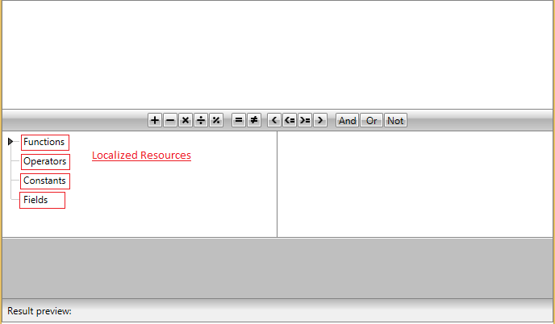

# Localization

The built-in localization mechanism in WPFSilverlight allows you to localize  the __RadExpressionEditor__ control.

Here is a list of the supported languages:

* English            
* German          
* Spanish           
* French
* Italian              
* Dutch             
* Turkish      

__: Some of RadExpressionEditor`s localized resources:__

>tipTo learn more about the ways to localize the RadControls please read the common topic on [Localization]().

>__In order to dynamically localize the RadExpressionEditor at runtime, you should recreate it.__

## Resource Keys

In order to be able to distinguish the resources within __RadExpressionEditor__, an unique identifier, called __resource key__, is assigned to each localizable string. 

Below you can find a list of all of the __Resources__ available and their default values:

Key	| Value
-----------------------------------------------	| -----------------------------------------------		
ExpressionEditor_Aggregate | Aggregate&nbsp;&nbsp;&nbsp;&nbsp;&nbsp;&nbsp;&nbsp;&nbsp;&nbsp;&nbsp;&nbsp;&nbsp;&nbsp;&nbsp;&nbsp;&nbsp;&nbsp;&nbsp;&nbsp;&nbsp;&nbsp;&nbsp;&nbsp;&nbsp;&nbsp;&nbsp;&nbsp;&nbsp;&nbsp;&nbsp;&nbsp;&nbsp;&nbsp;&nbsp;&nbsp;&nbsp;&nbsp;&nbsp;&nbsp;&nbsp;&nbsp;&nbsp;&nbsp;&nbsp;&nbsp;&nbsp;&nbsp;&nbsp;&nbsp;&nbsp;&nbsp;&nbsp;&nbsp;&nbsp;&nbsp;&nbsp;&nbsp;&nbsp;&nbsp;&nbsp;&nbsp;
ExpressionEditor_Constants | Constants
ExpressionEditor_DateTime | Date-time
ExpressionEditor_Fields | Fields
ExpressionEditor_Functions | Functions
ExpressionEditor_InsertTextCommand_Description | Insert text
ExpressionEditor_Logical | Logical
ExpressionEditor_Math | Math
ExpressionEditor_Operators | Operators
ExpressionEditor_Other | Other
ExpressionEditor_Text | Text
 

## See Also

 * [Getting Started]()

 * [Localization]()
