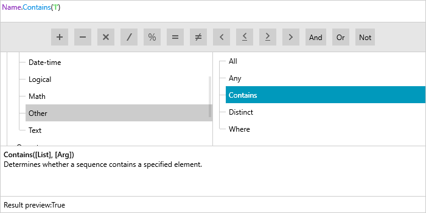

# {{ site.framework_name }} ExpressionEditor Overview

Thank you for choosing **RadExpressionEditor**!

__RadExpressionEditor__ allows your users to build powerful LINQ expressions using a simple Domain Specific Language, reminiscent of formulas in many popular spreadsheet applications.





## Key Features

* __Easy to Use Interface__: The user-friendly interface of the control makes it easy to generate the desired expression with just a few clicks and key strokes.

* __Syntax Highlighting__: The RadExpressionEditor also supports highlighting for the fields, functions and literals as can be observed in the image above.

* __Error Reporting__: Whenever an invalid expression is entered, this is immediately highlighted by a curly underline.

* __Rich Set of Built-In Functions__: The RadExpressionEditor provides a variety of functions to choose from such as mathematical and logical operations, functions for working with text and many more.

* __Reusable Expressions__: The resulting expressions can be used in any API that works with LINQ expressions.

>tip Get started with the control with its [Getting Started]() help article that shows how to use it in a basic scenario.

> Check out our online demos at [https://demos.telerik.com/wpf/](https://demos.telerik.com/wpf/)[https://demos.telerik.com/silverlight/#ExpressionEditor/FirstLook](https://demos.telerik.com/silverlight/#ExpressionEditor/FirstLook).


## Telerik UI for WPF Support and Learning Resources

* [Telerik UI for WPF ExpressionEditor Homepage](https://www.telerik.com/products/wpf/expressioneditor.aspx)
* [Get Started with the Telerik UI for WPF ExpressionEditor]()
* [Telerik UI for WPF API Reference](https://docs.telerik.com/devtools/wpf/api/)
* [Getting Started with Telerik UI for WPF Components]()
* [Telerik UI for WPF Virtual Classroom (Training Courses for Registered Users)](https://learn.telerik.com/learn/course/external/view/elearning/16/telerik-ui-for-wpf) 
* [Telerik UI for WPF ExpressionEditor Forums](https://www.telerik.com/forums/wpf)
* [Telerik UI for WPF Knowledge Base](https://docs.telerik.com/devtools/wpf/knowledge-base)


## See Also
 * [Visual Structure]()
 * [Expressions]()
