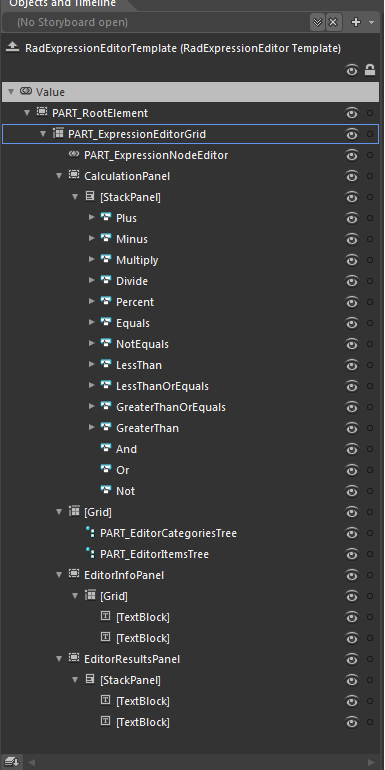
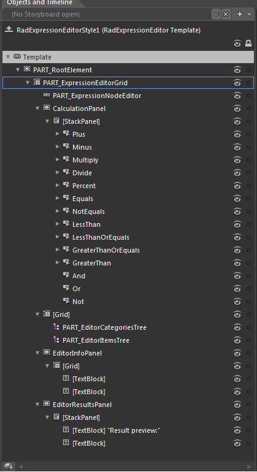

# Templates Structure

Like most SilverlightWPF controls, the RadExpressionEditor allows you to template it in order to change the control from inside. Except for templating the whole control, you can template parts of it or even independent controls related to it. This topic will make you familiar with the template structure of the RadExpressionEditor.

## RadExpressionEditor

* __PART_RootElement__ - hosts the elements of the template. It represents the border of the RadExpressionEditor and is of type Border

* __PART_ExpressionEditorGrid__ - provides rows for the template elements. It represents the background of the RadExpressionEditor and is of type Grid.

* __PART_ExpressionNodeEditor__ - represents the editor of RadExpressionEditor and it is of type ExpressionTextBox.

* __CalculationPanel__ - represents the Panel which hosts the ExpressionEditor’s buttons and is of type Border.

* __StackPanel__

* __Plus__ - represents the Plus button and is of type RadButton.

* __[Path]__

* __Minus__- represents the Minus button and is of type RadButton.

* __[Path]__

* __Multiply__- represents the Multiply button and is of type RadButton.

* __[Path]__

* __Divide__- represents the Divide button and is of type  RadButton.

* __[Path]__

* __Percent__- represents the Percent button and is of type RadButton.

* __[Path]__

* __Equals__- represents the Equals button and is of type RadButton.

* __[Path]__

* __NotEquals__- represents the NotEquals button and is of type RadButton.

* __[Path]__

* __LessThan__- represents the LessThan button and is of type RadButton.

* __[Path]__

* __LessThanOrEquals__- represents the LessThanOrEquals button and is of type RadButton.

* __[Path]__

* __GreaterThanOrEquals__- represents the GreaterThanOrEquals button and is of type RadButton.

* __[Path]__

* __GreaterThan__ - represents the GreaterThan button and is of type RadButton.

* __[Path]__

* __And__- represents the And button and is of type RadButton.

* __Or__- represents the Or button and is of type RadButton.

* __Not__- represents the Not button and is of type RadButton.

* __Grid__

* __PART_EditorCategoriesTree__- represents the Categories of the functions exposed by RadExpressionEditor and is of type RadTreeView. 

* __PART_EditorItemsTree__- represents the items of the functions exposed by RadExpressionEditor and is of type RadTreeView.

* __EditorInfoPanel__- represents the info panel of RadExpressionEditor, which provides information about a specific functions exposed by RadExpressionEditor and is of type Border.

* __Grid__

* __TextBlock__ - represents the QuickInfo of the SelectedItem in RadExpressionEditor and it is of type TextBlock.

* __TextBlock__ - represents the Description of the SelectedItem in RadExpressionEditor and it is of type TextBlock.

* __EditorResultsPanel__- represents the results panel of RadExpressionEditor, which provides information about the returned result by the performed calculations. 

* __StackPanel__

* __TextBlock__

* __TextBlock__- represents the result preview of RadExpressionEditor and it is of type TextBlock.



				 
			



				 
			

