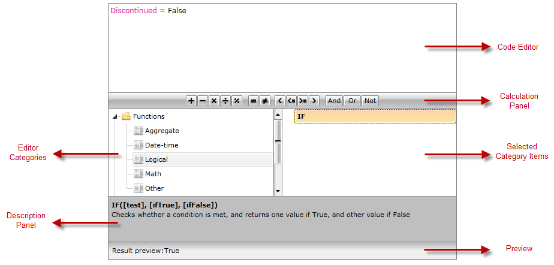

# Visual Structure

## 

This section defines the terms and concepts used in the scope of the RadExpressionEditor that you have to get familiar with prior to continue reading this help. They can also be useful when contacting with the support service in order to better describe your issue. Below you can see snapshot and explanations of the main states and visual elements of the standard RadExpressionEditor control.

         
      

* __Code Editor__ - enables you to create your own custom expression;

* __Calculation Panel__ - displays shortcuts for the most common operators;

* __Editor Categories__ - lists all the available categories; 

* __Selected Category Items__ - lists the items in the selected category from the Editor Categories;

* __Description Panel__ - provides a brief description of the selected item;

* __Preview__ - displays a preview of the result of the expression.
