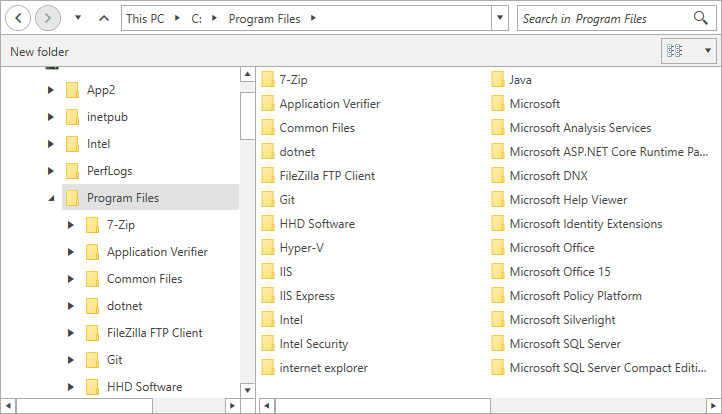

# ExplorerControl

The __ExplorerControl__ is the view that presents the UI of the dialogs. When a dialog is opened its content is shown via this control.

The ExplorerControl element can be used as a stand-alone control, thus allowing you to set is as the content of a UserControl, a Window, etc.

## Defining ExplorerControl

>tip The explorer control can be found in the Telerik.Windows.Controls.FileDialogs namespace, so in order to use it in XAML you can define the following namespace: `xmlns:fileDialogs="clr-namespace:Telerik.Windows.Controls.FileDialogs;assembly=Telerik.Windows.Controls.FileDialogs"`.

#### __[XAML] Example 1: Define explorer control__
{{region radfiledialogs-explorercontrol-0}}
	<fileDialogs:ExplorerControl CurrentDirectoryPath="C:\Program Files"  />
{{endregion}}

#### __Figure 1: ExplorerControl__ 

## Common Features

The ExplorerControl supports most of the features described in the [Features]() section of the documentation.

## Browser Mode

The control can work in two modes - the first one allows you to select folders and files. The second one allows you to select only folders. You can control this via the __IsFolderBrowser__ property. If you set the property to __True__ you will be able to see and select only folders.

#### __[XAML] Example 2: Allow selecting folders only__
{{region xaml-radfiledialogs-explorercontrol-01}}
	<fileDialogs:ExplorerControl IsFolderBrowser="True" />
{{endregion}}

## Navigating Through Directories

To navigate the explorer to a specific directory you can set its __CurrentDirectoryPath__ property as shown in __Example 1__.

## Selection

To get the selected files or folders you can use the __SelectedFileName__, __SelectedFileNames__ and __SelectedSafeFileNames__ properties of the control.

> The difference between SelectedFileNames and SelectedSafeFileNames is that the first collection contains the full paths of the files/folders. And the second collection contains only the names (safe names) of the files/folders.

#### __[C#] Example 3: Getting the first item from the selected files/folders__
{{region xaml-radfiledialogs-explorercontrol-02}}
	string selectedFile = this.explorerControl.SelectedFileNames[0];
{{endregion}}

By default the selection mode is single which allows you to select a single file or folder. To change this you can set the __Multiselect__ property to __True__.

#### __[XAML] Example 4: Enable multi selection__
{{region radfiledialogs-explorercontrol-03}}
	<fileDialogs:ExplorerControl Multiselect="True" />
{{endregion}}

## Filtering 

The ExplorerControl can be filtered using its __Filter__ and __FilterIndex__ properties. Read more about them in the [Filtering]() article.

>important Filtering is available only if the __IsFolderBrowser__ property is set to __False__.

## Events

The control exposes the following events -  __DirectoryRequesting__ and __ExceptionRaised__. Read more about the events and their arguments in the [Events]() article.

## See Also
* [Getting Started]()
* [Visual Structure]()
* [RadOpenFileDialog]()
* [RadOpenFolderDialog]()
* [RadSaveFileDialog]()
