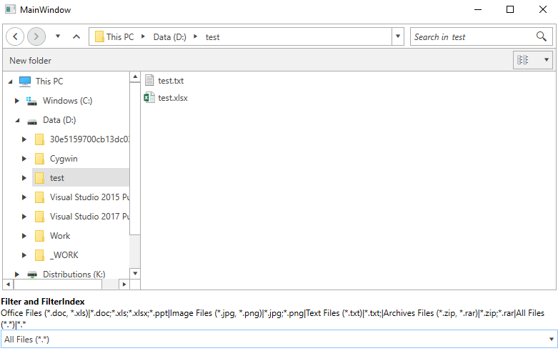
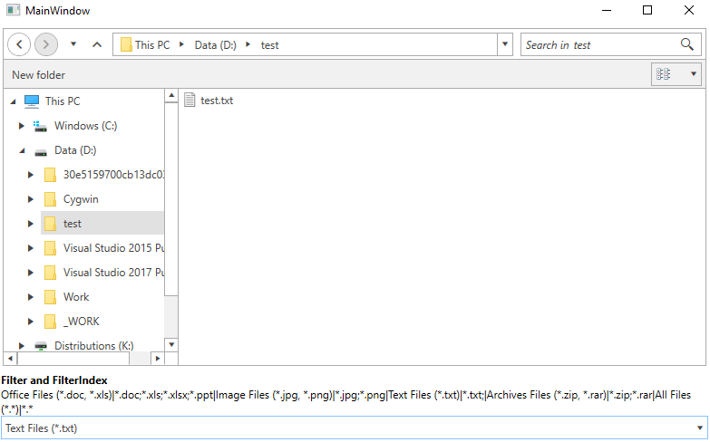

# ExplorerControl

The __ExplorerControl__ is the view that presents the UI of the dialogs. When a dialog is opened its content is shown via this control.

The ExplorerControl element can be used as a stand-alone control, thus allowing you to set is as the content of a UserControl, a Window, etc.

## Defining ExplorerControl

>tip The explorer control can be found in the Telerik.Windows.Controls.FileDialogs namespace, so in order to use it in XAML you can define the following namespace: `xmlns:fileDialogs="clr-namespace:Telerik.Windows.Controls.FileDialogs;assembly=Telerik.Windows.Controls.FileDialogs"`.

#### __[XAML] Example 1: Define explorer control__
{{region xaml-radfiledialogs-explorercontrol-0}}
	<fileDialogs:ExplorerControl CurrentDirectoryPath="C:\Program Files"  />
{{endregion}}

#### __Figure 1: ExplorerControl__ 

## Common Features

The ExplorerControl supports most of the features described in the [Features]() section of the documentation.

## Using the ExplorerControl 

Here are some of the key properties that the **ExplorerControl** exposes: 

* **CurrentDirectoryPath** - Gets or sets a value indicating the path of the current directory in the ExplorerControl instance.

* **CustomPlacesPaths** - Gets or sets the paths to the custom places navigation tree view. It is of type IEnumerable of string which differs from the [CustomPlaces]() property of the dialogs which is of type IList of string.

* **ExpandToCurrentDirectory** - Gets or sets a value indicating whether the main navigation pane expands and brings into view the current directory.

* **Filter** - Gets or sets the filter string that describes the list of extensions to filter by. It has an effect only when the IsFolderBrowser property is False.

* **FilterDescriptors** -  Gets the list of the Telerik.Windows.Controls.FileDialogs.FileFilterDescriptor specified by the Filter property. It has effect only when IsFolderBrowser is False.

* **FilterIndex** - Gets or sets a value indicating the current filter index from the list of filter strings specified by the **Filter** property. It has an effect only when the IsFolderBrowser property is False.

* **IsFolderBrowser** - Gets or sets a value indicating whether the ExplorerControl instance is used for directories selection or both directories and files.

* **Layout** - Gets or sets the current Telerik.Windows.Controls.FileDialogs.LayoutType of the Main pane.

* **MultiSelect** - Gets or sets a value indicating whether multiple selection of files or folders is allowed.

* **SelectedFileName** -  Gets the full path of the currently selected file or directory.

* **SelectedFileNames** - Gets the list of full paths of the currently selected files and / or folders.

* **SelectedSafeFileNames** - Gets the list of names of the currently selected files and / or folders.

* **ShowHiddenFiles** - Gets or sets a boolean value indicating whether hidden files and folders should be visible in the Explorer.

* **ShowNetworkLocations** - Gets or sets a value indicating whether the dialog shows network computers in the navigation tree.

## Setting the Layout 

The ExplorerControl exposes a __Layout__ property that determines the layout of the list with the files. This property is similar to the [InitialSelectedLayout](#setting-the-initial-layout-of-the-tiles) property of the file dialogs.

## Custom Places 

The ExplorerControl provides you with the option display directories to the left of the Main Pane above the Tree Navigation Pane similarly to Windows' Quick Access view. You can do that by setting the **CustomPlacesPaths** property of the control. This property is similar to the [CustomPlaces]() property of the dialogs.

## Browser Mode

The control can work in two modes - the first one allows you to select folders and files. The second one allows you to select only folders. You can control this via the __IsFolderBrowser__ property. If you set the property to __True__ you will be able to see and select only folders.

#### __[XAML] Example 2: Allow selecting folders only__
{{region xaml-radfiledialogs-explorercontrol-01}}
	<fileDialogs:ExplorerControl IsFolderBrowser="True" />
{{endregion}}

> Changing the **IsFolderBrowser** property during runtime is not supported. The property is respected only during initializing of the ExplorerControl.

## Navigating Through Directories

To navigate the explorer to a specific directory you can set its __CurrentDirectoryPath__ property as shown in __Example 1__.

## Selection

To get the selected files or folders you can use the __SelectedFileName__, __SelectedFileNames__ and __SelectedSafeFileNames__ properties of the control.

> The difference between SelectedFileNames and SelectedSafeFileNames is that the first collection contains the full paths of the files/folders. And the second collection contains only the names (safe names) of the files/folders.

#### __[C#] Example 3: Getting the first item from the selected files/folders__
{{region xaml-radfiledialogs-explorercontrol-02}}
	string selectedFile = this.explorerControl.SelectedFileNames[0];
{{endregion}}

By default the selection mode is single which allows you to select a single file or folder. To change this you can set the __Multiselect__ property to __True__.

#### __[XAML] Example 4: Enable multi selection__
{{region xaml-radfiledialogs-explorercontrol-03}}
	<fileDialogs:ExplorerControl Multiselect="True" />
{{endregion}}

## Filtering 

In order to filter the ExplorerControl, you can bind its **Filter** and **FilterIndex** properties.  **Example 5** demonstrates how you can bind the FilterIndex property to the SelectedValue property of a RadComboBox which is bound to the FilterDescriptors property of the ExplorerControl.

#### __[XAML] Example 5: Filtering ExplorerControl__
{{region xaml-radfiledialogs-explorercontrol-03}}
	<Grid>
        <Grid.RowDefinitions>
            <RowDefinition Height="*"/>
            <RowDefinition Height="*"/>
        </Grid.RowDefinitions>
        <fileDialogs:ExplorerControl x:Name="explorer"
                                     IsFolderBrowser="False"
                                     Filter="{Binding Text, ElementName=filtertext}"
                                     FilterIndex="{Binding SelectedIndex, ElementName=filterindex}" />

       
        <StackPanel Orientation="Vertical" Margin="2 4" Grid.Row="1">
            <TextBlock Text="Filter and FilterIndex " FontWeight="Bold" />
            <TextBlock  TextWrapping="Wrap" Text="Office Files (*.doc, *.xls)|*.doc;*.xls;*.xlsx;*.ppt|Image Files (*.jpg, *.png)|*.jpg;*.png|Text Files (*.txt)|*.txt;|Archives Files (*.zip, *.rar)|*.zip;*.rar|All Files (*.*)|*.*" x:Name="filtertext"/>
            <telerik:RadComboBox  x:Name="filterindex" SelectedIndex="4"
                                          ItemsSource="{Binding FilterDescriptors, ElementName=explorer}" DisplayMemberPath="FilterName"/>
        </StackPanel>
        
    </Grid>
{{endregion}}

#### __Figure 2: Result from Example 5 before filtering__ 

#### __Figure 3: Result from Example 5 after filtering__ 

You can read some more about the __Filter__ and __FilterIndex__ properties in the [Filtering]() article.

>important Filtering is available only if the __IsFolderBrowser__ property is set to __False__.

## Events

The control exposes the following events -  __DirectoryRequesting__ and __ExceptionRaised__. Read more about the events and their arguments in the [Events]() article.

## See Also
* [Getting Started]()
* [Visual Structure]()
* [RadOpenFileDialog]()
* [RadOpenFolderDialog]()
* [RadSaveFileDialog]()