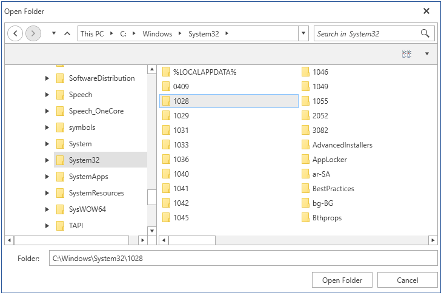

# RadOpenFolderDialog

__RadOpenFolderDialog__ is a modal dialog box that allows you to specify one or multiple folder names to open.

#### __Figure 1: RadOpenFolderDialog in single selection mode__ 


## Showing the Dialog

To show the dialog call its __ShowDialog__ method. If a valid folder is opened when you press OK, the __DialogResult__ property will return True and the __FileName__, and __FileNames__ properties will be set. You can use FileName and FileNames to get the names of the selected folders.

> Note that when the ShowDialog method is called the UI of the host application will freeze until the dialog closes.

__Example 1: Show a open folder dialog__
```C#
	public partial class MainWindow : Window
	{
		public MainWindow()
		{
			InitializeComponent();
			this.Loaded += MainWindow_Loaded;			
		}
		
		private void MainWindow_Loaded(object sender, RoutedEventArgs e)
		{
 			ShowOpenFolderDialog();
        	}

		private void ShowOpenFolderDialog()
		{
			RadOpenFolderDialog openFolderDialog = new RadOpenFolderDialog();
			openFolderDialog.Owner = this;
			openFolderDialog.ShowDialog();
			if (openFolderDialog.DialogResult == true)
			{
				string folderName = openFolderDialog.FileName;
			}
		}
	}
```

> The __Owner__ property holds a reference of the Window which owned the dialog. Before calling the __ShowDialog()__ method, the __Owner__ property should be set to ensure correct behavior. Ownership is established when this property is set. 

## Enabling Multiple Selection

The dialog supports single and multiple selection modes. By default you can select only one folder at a time. To alter this you can set the __Multiselect__ property of RadOpenFolderDialog.

__Example 3: Enable multiple selection__
```C#
	public partial class MainWindow : Window
	{
		public MainWindow()
		{
			InitializeComponent();
			this.Loaded += MainWindow_Loaded;			
		}
		
		private void MainWindow_Loaded(object sender, RoutedEventArgs e)
		{
 			ShowOpenFolderDialog();
        	}

		private void ShowOpenFolderDialog()
		{
			RadOpenFolderDialog openFolderDialog = new RadOpenFolderDialog();
			openFolderDialog.Owner = this;
			openFolderDialog.Multiselect = true;
			openFolderDialog.ShowDialog();        
		}
	}
```

#### __Figure 2: Multiple selection__ 


## Working with the Selected Folders

You can get the paths of the selected folders via the __FileName__ and __FileNames__ properties. Note that the properties are empty until the DialogResult is valid. When you open folder(s) the properties will return the corresponding directory paths.

You can get only the name of the selected folders, without the full path, via the __SafeFileNames__ collection property.

__Example 3: Get the selected folder names__
```C#
	public partial class MainWindow : Window
	{
		public MainWindow()
		{
			InitializeComponent();
			this.Loaded += MainWindow_Loaded;			
		}
		
		private void MainWindow_Loaded(object sender, RoutedEventArgs e)
		{
 			ShowOpenFolderDialog();
        	}

		private void ShowOpenFolderDialog()
		{
			RadOpenFolderDialog openFolderDialog = new RadOpenFolderDialog();
			openFolderDialog.Owner = this;
			openFolderDialog.ShowDialog();
			if (openFolderDialog.DialogResult == true)
			{
				string folderPath = openFolderDialog.FileName;
				IEnumerable<string> folderPaths = openFolderDialog.FileNames;
				IEnumerable<string> folderNames = openFolderDialog.SafeFileNames;
			}
		}
	}
```

The __FileName__ property can be set manually. This will change the value displayed in the selected file autocomplete box area. Note that setting this won't change the selected item in the list with the files.

## Saving the Last Used Directory

You can save the last used directory by setting the __RestoreDirectory__ property of the RadOpenFolderDialog. After setting this property to __True__ and opening a folder the __InitialDirectory__ of this RadOpenFolderDialog instance will be set to the parent of the opened folder.

__Example 4: Set RestoreDirectory property__
```C#
	RadOpenFolderDialog openFolderDialog = new RadOpenFolderDialog();
	openFolderDialog.RestoreDirectory = true;
```

## See Also
* [Visual Structure]()
* [RadOpenFileDialog]()
* [RadSaveFileDialog]()
* [Events]()
