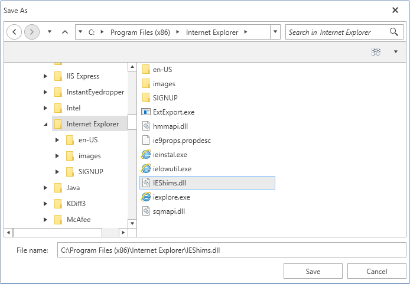
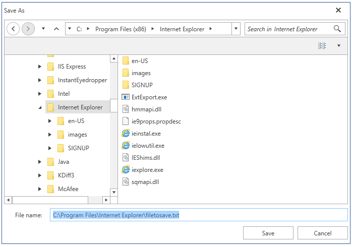

# RadSaveFileDialog

__RadSaveFileDialog__ is a modal dialog box that allows you to specify a filename to save.

#### __Figure 1: RadSaveFileDialog__ 


## Showing the dialog

To show the dialog call its __ShowDialog__ method. If a valid file is selected when you press OK, the __DialogResult__ property will return True and the __FileName__ property will be set. You can use FileName to get the name of the selected file.

> Note that when the ShowDialog method is called the UI of the host application will freeze until the dialog closes.

__Example 1: Show a save file dialog__
```C#
	public partial class MainWindow : Window
	{
		public MainWindow()
		{
			InitializeComponent();
			ShowSaveFileDialog();
		}

		private void ShowSaveFileDialog()
		{
			RadSaveFileDialog saveFileDialog = new RadSaveFileDialog();
			saveFileDialog.Owner = this;
			saveFileDialog.ShowDialog();
			if (saveFileDialog.DialogResult == true)
			{
				string selectedFileName = saveFileDialog.FileName;
			}
		}
	}
```

> The __Owner__ property holds a reference of the Window which owned the dialog. Before calling the __ShowDialog()__ method, the __Owner__ property should be set to ensure correct behavior. Ownership is established when this property is set. 

## Creating a stream for the selected file

You can open a read-write file stream for the selected file using the __OpenFile__ method. Or alternatively you can use the FileName property and open the file manually.

__Example 2: Open a file stream__
```C#
	public partial class MainWindow : Window
	{
		public MainWindow()
		{
			InitializeComponent();
			ShowSaveFileDialog();
		}

		private void ShowSaveFileDialog()
		{
			RadSaveFileDialog saveFileDialog = new RadSaveFileDialog();
			saveFileDialog.Owner = this;
			saveFileDialog.ShowDialog();
			if (saveFileDialog.DialogResult == true)
			{
				Stream fileStream = saveFileDialog.OpenFile();
			}
		}
	}
```

## Working with the selected file

You can get the path of the selected file via the __FileName__ property (see __Example 1__). Note that the property is empty until the DialogResult is valid. When the dialog closes and if DialogResutl is True the property will return the corresponding file path.

The __FileName__ property can be set manually. This will change the value displayed in the selected file autocomplete box area. Note that setting this won't change the selected item in the list with the files.

__Example 3: Set the file name__
```C#
	public partial class MainWindow : Window
	{
		public MainWindow()
		{
			InitializeComponent();
			ShowSaveFileDialog();
		}

		private void ShowSaveFileDialog()
		{
			RadSaveFileDialog saveFileDialog = new RadSaveFileDialog();
			saveFileDialog.Owner = this;
			saveFileDialog.InitialDirectory = @"C:\Program Files\Internet Explorer\";
			saveFileDialog.FileName = @"C:\Program Files\Internet Explorer\filetosave.txt";
			saveFileDialog.ShowDialog();
		}
	}
```

#### __Figure 2: Setting the file name__
	

## See Also
* [Visual Structure]()
* [RadOpenFileDialog]()
* [RadOpenFolderDialog]()
* [Events]()