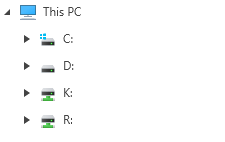
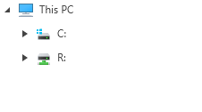

# Events

This article lists the events specific to all of the RadFileDialog controls.

* __PreviewClosed__: This event occurs when the dialog is closing. The event arguments are of type __WindowPreviewClosedEventArgs__. You can use the arguments to cancel the event.
	
	__Example 1: Cancel dialog closing__
	```C#
		private void OnFileDialogPreviewClosed(object sender, WindowPreviewClosedEventArgs e)
        {
			e.Cancel = true;
        }
	```
	
* __Closed__: This event occurs when the dialog is closed. The event arguments are of type __WindowClosedEventArgs__. 

* __ExceptionRaised__: This event occurs when an exception is raised. This event could be raised in different occasions, for example - if the selected folder cannot be accessed or if the file path is too long, or when there is an error while searching, etc.

	__Example 2: Showing an alert when an error appears__
	```C#
		private void OnFileDialogExceptionRaised(object sender, FileBrowserExceptionRaisedEventArgs e)
        {
            MessageBox.Show(e.Exception.Message);
        }
	```

* __DirectoryRequesting__: This event can be used to filter the navigation RadTreeView and RadBreadcrumb or any [Custom Places]() that are added. The following example demonstrates how you can filter out the "D:\\" and "K:\\" directories:

	__Example 3: Filtering the D and K directories__
	```C#
		private void OnFileDialogDirectoryRequesting(object sender, Telerik.Windows.Controls.FileDialogs.DirectoryRequestingEventArgs e)
        {
            if (e.Directory.FullName.StartsWith("D:\\\\") || e.Directory.FullName.StartsWith("K:\\\\"))
            {
                e.Cancel = true;
            }
        }
	```

	> If the __InitialDirectory__ of the RadFileDialog is filtered out as in __Example 3__, the current directory on load will be the default one. 

	#### Figure 1: Unfiltered Directories
	
	
	#### Figure 2: Filtered Directories Based on Example 3
	
	
* __DirectoryNavigating__: This event occurs when the current folder is about to change. You can use it to execute an additional action or to cancel the navigation. 
	
	__Example 4: Disable navigation to the Program Files folder__
	```C#
		private void OnFileDialogDirectoryNavigating(object sender, Telerik.Windows.Controls.FileDialogs.DirectoryNavigatingEventArgs e)
		{
			if (e.DirectoryPath == "C:\\\\Program Files")
            {
                e.Cancel = true;
            }
		}
	```	
	
* __ShellContextMenuOpening__: This event occurs when the context menu is about to open. You can use it to cancel the menu opening or to add/remove options from the short menu (the one opened when the cursor is on an empty space in the explorer).
	
	__Example 5: Canceling context menu opening and adding only New Folder and Paste options in the short menu__
	```C#
		private void OnFileDialogShellContextMenuOpening(object sender, Telerik.Windows.Controls.FileDialogs.ContextMenuOpeningEventArgs e)
		{
			if (e.SelectedFiles.Count > 0 && e.SelectedFiles[0].Path == "C:\\\\Program Files")
            {
                e.Cancel = true;
            }
            else
            {
                e.ShortContextMenuOptions = ShortContextMenuOptions.Paste | ShortContextMenuOptions.NewFolder;
            }
		}
	```	
	
	Additional feature of the ContextMenuOpeningEventArgs provided with the ShellContextMenuOpening event handler is the __IsOpeningOnEmptySpace__ property. You can use this to determine whether the mouse clicked on a file/folder or on empty space in the files list.
	
	__Example 6: Checking if the click was on an empty space__
	```C#
		private void OnFileDialogShellContextMenuOpening(object sender, Telerik.Windows.Controls.FileDialogs.ContextMenuOpeningEventArgs e)
		{
			if (e.IsOpeningOnEmptySpace)
           		{
              			  // do something
            		}
		}
	```	

* __Renaming__: This event occurs when a file or a folder is about to be renamed. You can use it to prevent certain files or folders from having their name changed. 
	
	The event arguments will be of the type __RenamingEventArgs__ that exposes the following properties:

	* __Cancel__: Boolean property that will indicate if a renaming operation will be performed or not.
	* __FileInfo__: Property of the type __FileSystemInfoWrapper__. This property contains the __FileSystemInfoWrapper__ object for the file system information that will be renamed.

	>important This event will occur only when the __CanUserRename__ property is set to __True__.

	__Example 7: Cancel the renaming operation for certain a file/directory__
	```C#
		private void OnFileDialogRenaming(object sender, Telerik.Windows.Controls.FileDialogs.RenamingEventArgs e)
		{
		    if (e.FileInfo.Path.StartsWith("C:\\Windows")
		    {
		    	e.Cancel = true;
		    }
		}
	```

## See Also
* [Getting Started]()
* [RadOpenFileDialog]()
* [RadOpenFolderDialog]()
* [RadSaveFileDialog]()
