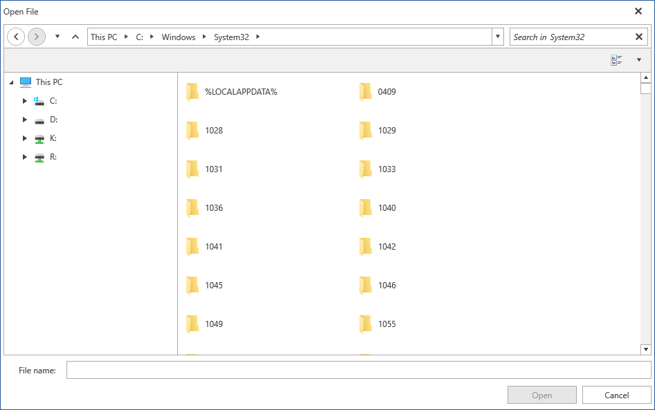
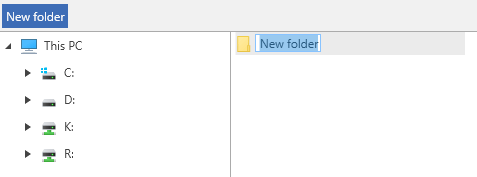
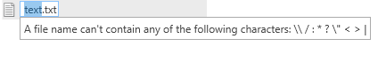
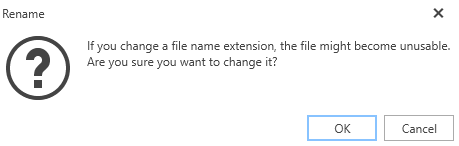
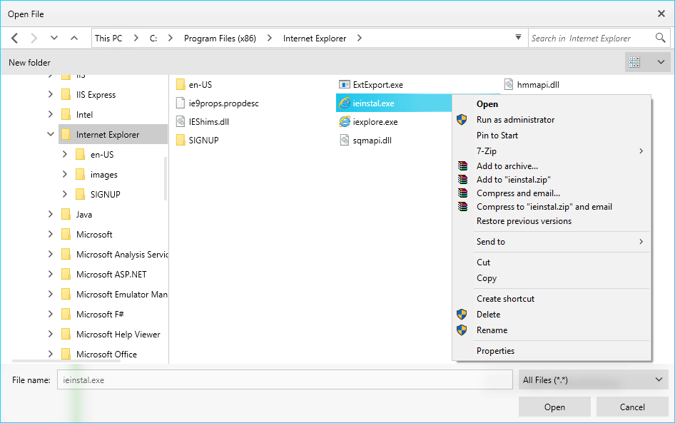

# Common

This articles shows the minor features shared between all file dialogs - __RadOpenFileDialog, RadSaveFileDialog and RadOpenFolderDialog__.

## Setting Initial Directory

All the dialog controls expose a __InitialDirectory__ property that determines the directory that will be opened when the dialog shows.

#### __[C#] Example 1: Setting initial directory__ 
{{regiond radfiledialogs-features-common-0}}
	RadSaveFileDialog saveFileDialog = new RadSaveFileDialog();	
	saveFileDialog.Owner = this;
	
	saveFileDialog.InitialDirectory = @"C:\Temp\";
	
	saveFileDialog.ShowDialog();	
{{endregiond}}

## Setting the Initial Layout of the Tiles

All the dialog controls expose a __InitialSelectedLayout__ property that determines the initial layout of the list with the files

#### __[C#] Example 2: Setting initial layout__ 
{{regiond radfiledialogs-features-common-1}}
	RadSaveFileDialog saveFileDialog = new RadSaveFileDialog();	
	saveFileDialog.Owner = this;
	
	saveFileDialog.InitialSelectedLayout = Telerik.Windows.Controls.FileDialogs.LayoutType.Tiles;
	
	saveFileDialog.ShowDialog();	
{{endregiond}}

#### Figure 1: RadOpenFileDialog in Tile view mode in the Office2016 theme

The layout is determined by the LayoutType enum that provides the following modes:

* __SmallIcons__

* __MediumIcons__

* __LargeIcons__

* __ExtraLargeIcons__

* __List__

* __Tiles__

* __Details__

## New Folder Button

Since __R1 2018__, you can add a new folder in all the dialog controls with the __New Folder__ button. The created folder enters edit mode in all [Layout View Modes](#setting-the-initial-layout-of-the-tiles). 

#### Figure 2: New folder button and new folder in edit mode in the Office2016 theme

## Edit Mode

In order to edit the selected file/folder, you can press the __F2__ key. Alternatively, you can click on the TextBlock which holds the file/folder name in all layouts except the **Details** layout where you can click on the cell holding the file/folder name. If you try to add a reserved character in a file/folder name, you will receive the warning illustrated in **Figure 3**:

#### Figure 3: Reserved character warning in the Office2016 theme

Trying to change the file extension prompts the message box shown in **Figure 4**:

#### Figure 4: Changing file extension message box in the Office2016 theme

## Using the ContextMenu

As of __R1 2018 RadFileDialogs__ has a ContextMenu. The well-known ContextMenu used in Windows is used for this purpose. It is available for the __RadListBox, RadTreeView and RadGridView__ components used in the Main Pane.

#### Figure 5: Showing the ContextMenu

## See Also

* [Custom Places]()
* [Filtering]()
