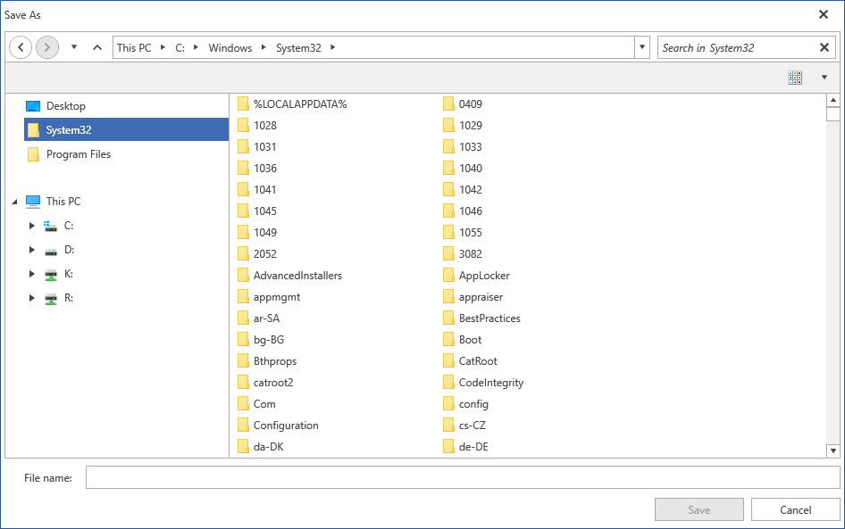

# Custom Places

The file dialogs provide you with the option the specify a list of directories to be displayed to the left of the **Main Pane** above the **Tree Navigation Pane** similarly to Windows' **Quick Access** view.

To enable this functionality, you should add a list of directories to the control's **CustomPlaces** collection. It is of type **IList<string>**.

#### [C#] Example 1: Add custom places  
```C# 
    RadSaveFileDialog saveFileDialog = new RadSaveFileDialog(); 
    saveFileDialog.Owner = this;

    saveFileDialog.CustomPlaces.Add(@"C:\Users\currentuser\Desktop");
    saveFileDialog.CustomPlaces.Add(@"C:\Windows\System32");
    saveFileDialog.CustomPlaces.Add(@"C:\Program Files\");

    saveFileDialog.ShowDialog();    
```

> Note that this collection is read-only - you can only add and/or remove items from it but you cannot replace it with another collection.

The specified folders will then appear in the dialogs navigation pane.

#### Figure 1: Custom directories shown in the navigation pane



## See Also

* [Common Features]()
* [RadOpenFileDialog]()
* [RadOpenFolderDialog]()
* [RadSaveFileDialog]()