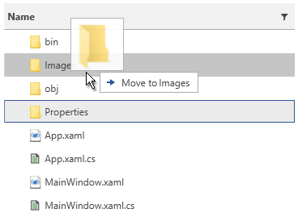
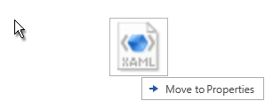
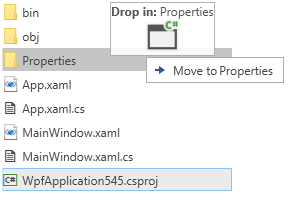
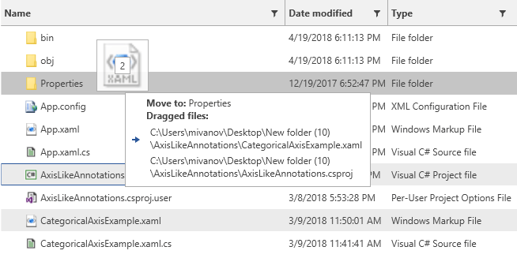

# Customizing the Drag Visual

The visual element shown when you drag an item is presented by the __FileBrowserDragVisual__ control. To customize the appearance you can set several properties of the control or [extract its template]() and modify it.

#### __Figure 1: Default drag visual__


## Setting the Drag Visual Appearance

To customize the FileBrowserDragVisual you will need to define an implicit Style targeting the control and place it in the App.xaml Resources.

> The FileBrowserDragVisual element can be found in the following namespace: `xmlns:fileDialogs="clr-namespace:Telerik.Windows.Controls.FileDialogs.DragDrop;assembly=Telerik.Windows.Controls.FileDialogs"`

__Example 1: Setting the drag visual properties__ 
```XAML
	<Application.Resources>
        <Style TargetType="fileDialogs:FileBrowserDragVisual">
            <Setter Property="DragVisualOffset" Value="50, 0" />
        </Style>
    </Application.Resources>
```

> It is important to define the style in the application's Resources. Otherwise, it won't be applied.

<!-- -->
> If you use [NoXaml]() dlls you will need to set the following property on the FileBrowserDragVisual Style - `BasedOn="{StaticResource FileBrowserDragVisualStyle}"`

## Setting the Drag Visual Offset

You can use the __DragVisualOffset__ property of the FileBrowserDragVisual control to offset it from the mouse cursor position. The previous example (Example 1) shows how to set the property.

#### __Figure 2: Setting the drag visual offset__


## Setting Icon Template

You can use the IconTemplate property of the FileBrowserDragVisual control to define the image that will be displayed in the drag visual. The data context of the template will be an object of type __DropIndicationDetails__ which you can use to display the required image or UIElement in the IconTemplate.

The following example shows how to define a custom template containing an image and some additional text showing the name of the drop target folder.

__Example 2: Setting the icon template__ 
```XAML
    <Application.Resources>
        <Style TargetType="fileDialogs:FileBrowserDragVisual">
            <Setter Property="IconTemplate">
                <Setter.Value>
                    <DataTemplate>
                        <StackPanel>
                            <StackPanel Orientation="Horizontal">
                                <TextBlock Text="Drop in: " FontWeight="Bold"/>
                                <TextBlock Text="{Binding DropFolderName}" />
                            </StackPanel>
                            <Image Source="{Binding Icon}" Width="36" Height="36" Stretch="UniformToFill" />
                        </StackPanel>                        
                    </DataTemplate>
                </Setter.Value>
            </Setter>
        </Style>
    </Application.Resources>
```

#### __Figure 3: Custom icon template__


## Setting Content Template

You can use the ContentTemplate property of the FileBrowserDragVisual control to define the content that will be shown in the tooltip of the drag visual. The data context of the template will be an object of type __DropIndicationDetails__ which you can use to display the required information.

The following example shows how to define a custom template containing a list of the dragged files.

__Example 3: Setting the content template__ 
```XAML
     <Application.Resources>
        <Style TargetType="fileDialogs:FileBrowserDragVisual">
            <Setter Property="ContentTemplate">
                <Setter.Value>
                    <DataTemplate>
                        <StackPanel>
                            <StackPanel Orientation="Horizontal">
                                <TextBlock Text="{Binding Operation}" FontWeight="Bold"/>
                                <TextBlock Text=" to: " FontWeight="Bold"/>
                                <TextBlock Text="{Binding DropFolderName}" />
                            </StackPanel>
                            <TextBlock Text="Dragged files:" FontWeight="Bold"/>
                            <ItemsControl ItemsSource="{Binding DraggedFiles}" Margin="3">
                                <ItemsControl.ItemTemplate>
                                    <DataTemplate>
                                        <TextBlock Text="{Binding}" MaxWidth="300" TextWrapping="Wrap" Margin="2" />
                                    </DataTemplate>
                                </ItemsControl.ItemTemplate>
                            </ItemsControl>
                        </StackPanel>
                    </DataTemplate>
                </Setter.Value>
            </Setter>
        </Style>
    </Application.Resources>
```

#### __Figure 4: Custom content template__


## See Also  
* [Getting Started]()
* [Drag Drop Overview]()
