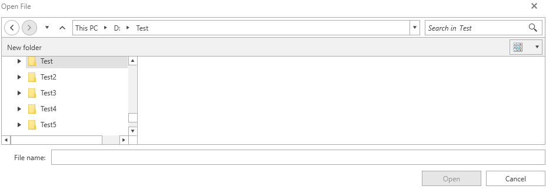
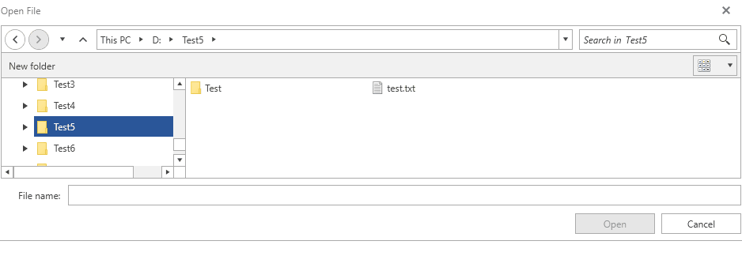

# Environment Variables

The RadFileDialogs provide out of the box support for the most common system environment variables that refer to well known directories in the Windows file system, as well as, to any user defined variables. This article will showcase the common behavior that all file dialogs share with regards to environment variables and also the differences between them.

> When adding a new environment variable, you have to restart the application (if you started it from the .exe file). This is needed in order to get the new environement variables from Windows. If the application is started from Visual Studio, a restart of Visual Studio is required. 

## Common behavior 

>The examples in this section assume that you have an environment variable defined, named "test" with value - "D:\Test5".

When typing an environment variable in the Path Navigation Pane of the file dialogs and typing enter, the Tree Navigation Pane will navigate to the respective directory. **Figure 1** demonstrates what will happen when typing %test% in the Path Navigation Pane.

#### Figure 1: Typing an EV in the breadcrumb

When typing an enviroment variable followed by **"\"** in the Path Navigation Pane, the suggestions list containing all of the child folders of the current directory will be listed. When doing the same in the Operations Pane, all child folders and files will be listed. This is demonstrated in **Figure 2**.

#### Figure 2: Listing all child files/folders in an EV directory from breadcrumb and autocomplete

## Different Behavior

Depending on whether the environment variable points to a folder or a file, the different RadFileDialogs have different behavior.

* **Environment variables that point to files**

    When typing an environment variable which points to a file in the Operations Pane, the **RadOpenFileDialog's** Open button will be enabled. If you click it, the respective name of the file will be returned. As for the **RadSaveFileDialog**, when clicking the Save button, an attempt will be made to override the file and a message box will appear for confirmation. In the **RadOpenFolderDialog**, when typing an EV which points to a file, the Open Folder button will remain disabled.

* **Environment variables that point to folders**

    In both the **RadOpenFileDialog** and the **RadSaveFileDialog**, when typing an environment variable that points to a folder in the Operations Pane, the Tree Navigation Pane will navigate to the respective directory. In the same case the **RadOpenFolderDialog** will have its Open Folder button enabled and if clicked, it will return the FileName, FileNames and SafeFileNames of the respective directory.

## See Also

* [Visual Structure]()
* [Common Features]()
* [RadOpenFileDialog]()
* [RadOpenFolderDialog]()
* [RadSaveFileDialog]()