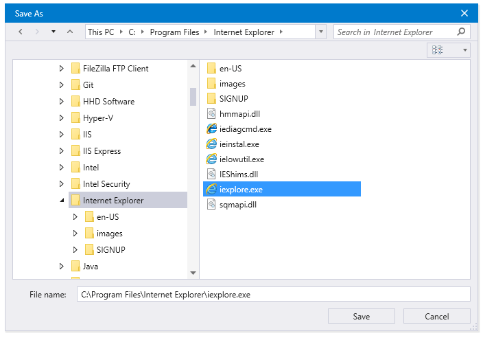

# Getting Started with {{ site.framework_name }} FileDialogs

This article will provide you with the knowledge required to use the file dialogs in a basic scenario.

## Adding Telerik Assemblies Using NuGet

To use RadFileDialogs when working with NuGet packages, install the `Telerik.Windows.Controls.FileDialogs.for.Wpf.Xaml` package. The [package name may vary]() slightly based on the Telerik dlls set - [Xaml or NoXaml]()

Read more about NuGet installation in the [Installing UI for WPF from NuGet Package]() article.

>tip With the 2025 Q1 release, the Telerik UI for WPF has a new licensing mechanism. You can learn more about it [here]().

## Adding Assembly References Manually

If you are not using NuGet packages, you can add a reference to the following assemblies:

* __Telerik.Licensing.Runtime__
* __Telerik.Windows.Controls__
* __Telerik.Windows.Controls.Input__
* __Telerik.Windows.Controls.Navigation__
* __Telerik.Windows.Controls.GridView__
* __Telerik.Windows.Controls.FileDialogs__
* __Telerik.Windows.Data__

>For __{{ site.minimum_net_core_version }}__ and later you will need to install also the `System.Data.OleDb` NuGet package. This is __required only if the Telerik assemblies are referenced manually__ in the project. In case you install the dlls using NuGet or the Telerik Visual Studio Extension, this package is included automatically.

You can find the required assemblies for each control from the Telerik UI for WPF suite in the [Controls Dependencies]() help article.

## Using the dialogs

There are few dialogs that you can use in a similar way. __Example 1__ shows how to show a __RadOpenFileDialog__. You can use this code to also show the __open folder__ and __save file__ dialogs.

#### __[C#] Example 1: Opening a dialog__ 
{{region radfiledialogs-getting-started-0}}
	RadOpenFileDialog openFileDialog = new RadOpenFileDialog();	
	openFileDialog.Owner = theHostWindowInstance;	
	openFileDialog.ShowDialog();
	if (openFileDialog.DialogResult == true)
	{
		string selectedFileName = openFileDialog.FileName;
	}
{{endregion}}

You can see how to define and show the different dialogs in the corresponding articles.

* [RadOpenFileDialog]()

* [RadOpenFolderDialog]()

* [RadSaveFileDialog]()

## Setting a Theme

The controls from our suite support different themes. You can see how to apply a theme different than the default one in the [Setting a Theme (Using Implicit Styles)]() help article.

>important Changing the theme using implicit styles will affect all controls that have styles defined in the merged resource dictionaries. This is applicable only for the controls in the scope in which the resources are merged. 

To change the theme, you can follow the steps below:
* Choose between the [themes]() and add reference to the corresponding theme assembly (for example: Telerik.Windows.Themes.VisualStudio2013.dll). You see the different themes applied in the Theming examples from our [demos application](https://demos.telerik.com/wpf/).

* Merge the ResourceDictionaries with the namespace required for the controls that you are using from the theme assembly. For __RadTreeView__, you will need to merge the following resources:
	* __System.Windows.xaml__
	* __Telerik.Windows.Controls.xaml__
	* __Telerik.Windows.Controls.Input.xaml__
	* __Telerik.Windows.Controls.Navigation.xaml__
	* __Telerik.Windows.Controls.GridView.xaml__
	* __Telerik.Windows.Controls.FileDialogs.xaml__	

	__Example 2__ demonstrates where you can merge the ResourceDictionaries so they are applied globally in the application.
	
	#### __[XAML] Example 2: Merging the ResourceDictionaries__  
	{{region radfiledialogs-getting-started-1}}
		<Application x:Class="MyTestApplication.App"
				 xmlns="http://schemas.microsoft.com/winfx/2006/xaml/presentation"
				 xmlns:x="http://schemas.microsoft.com/winfx/2006/xaml"
				 StartupUri="MainWindow.xaml">
			<Application.Resources>
				<ResourceDictionary>
					<ResourceDictionary.MergedDictionaries>
						<ResourceDictionary Source="/Telerik.Windows.Themes.VisualStudio2013;component/Themes/Telerik.Windows.Controls.xaml" />
						<ResourceDictionary Source="/Telerik.Windows.Themes.VisualStudio2013;component/Themes/Telerik.Windows.Controls.Input.xaml" />
						<ResourceDictionary Source="/Telerik.Windows.Themes.VisualStudio2013;component/Themes/Telerik.Windows.Controls.Navigation.xaml" />
						<ResourceDictionary Source="/Telerik.Windows.Themes.VisualStudio2013;component/Themes/Telerik.Windows.Controls.GridView.xaml" />
						<ResourceDictionary Source="/Telerik.Windows.Themes.VisualStudio2013;component/Themes/Telerik.Windows.Controls.FileDialogs.xaml" />
					</ResourceDictionary.MergedDictionaries>
				</ResourceDictionary>
			</Application.Resources>
		</Application>
	{{endregion}}

#### __Figure 1: File dialog with VisualStudio2013 theme applied__


## Telerik UI for WPF Learning Resources

* [Telerik UI for WPF FileDialogs Component](https://www.telerik.com/products/wpf/file-dialogs.aspx)
* [Getting Started with Telerik UI for WPF Components]()
* [Telerik UI for WPF Installation]()
* [Telerik UI for WPF and WinForms Integration]()
* [Telerik UI for WPF Visual Studio Templates]()
* [Setting a Theme with Telerik UI for WPF]()
* [Telerik UI for WPF Virtual Classroom (Training Courses for Registered Users)](https://learn.telerik.com/learn/course/external/view/elearning/16/telerik-ui-for-wpf) 
* [Telerik UI for WPF License Agreement](https://www.telerik.com/purchase/license-agreement/wpf-dlw-s)


## See Also
* [Visual Structure]()
* [Events]()
