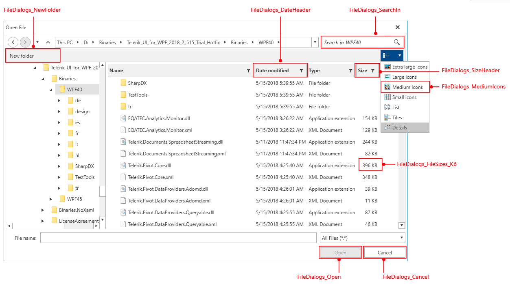

# Localization

> More detailed look over the localization capabilities that the framework provides can be found in the [Localization]() article.

This topic will go available resource keys for localizing __RadFileDialogs__.

Below is the list of supported languages.

* **English**

* **German**

* **Spanish**

* **French**

* **Italian**

* **Dutch**

* **Turkish**

## Resource Keys

__RadFileDialogs__ provides strings for localizing various of its elements. In order to be able to distinguish these resources, an unique identifier, called resource key, is assigned to each string that can be localized.

Key	|	Value
---	|	---	
FileDialogs_Back | Back
FileDialogs_Cancel | Cancel
FileDialogs_CheckThePath | Check the path and try again.
FileDialogs_ConfirmSave | Confirm save as
FileDialogs_Copy | Copy
FileDialogs_CopyTo | Copy to
FileDialogs_Cut | Cut
FileDialogs_DateHeader | Date modified
FileDialogs_Delete | Delete
FileDialogs_Details | Details
FileDialogs_Edit | Edit
FileDialogs_ExtraLargeIcons | Extra large icons
FileDialogs_FileExists | already exists.
FileDialogs_FileFolderType | File folder
FileDialogs_FileName | File name:
FileDialogs_FileNameWrongCharacters | A file name can't contain any of the following characters: \\ / : * ? \" < > |
FileDialogs_FileSizes_B | bytes
FileDialogs_FileSizes_GB | GB
FileDialogs_FileSizes_KB | KB
FileDialogs_FileSizes_MB | MB
FileDialogs_FileSizes_TB | TB
FileDialogs_Folder | Folder:
FileDialogs_Forward | Forward
FileDialogs_InvalidExtensionConfirmation | Are you sure you want to change it?
FileDialogs_InvalidFileName | The file name is not valid.
FileDialogs_InvalidOrMissingExtension | If you change a file name extension, the file might become unusable. 
FileDialogs_InvalidPath | Path does not exist.
FileDialogs_LargeIcons | Large icons
FileDialogs_List | List
FileDialogs_MediumIcons | Medium icons
FileDialogs_MoveTo | Move to
FileDialogs_NameHeader | Name
FileDialogs_NewFolder | New folder
FileDialogs_No | No
FileDialogs_OK | OK
FileDialogs_Open | Open
FileDialogs_OpenFileDialogHeader | Open File
FileDialogs_OpenFolder | Open Folder
FileDialogs_OpenFolderDialogHeader | Open Folder
FileDialogs_OpenReadOnly | Open as read-only
FileDialogs_Paste | Paste
FileDialogs_Properties | Properties
FileDialogs_Rename | Rename
FileDialogs_ReplacementQuestion | Do you want to replace it?
FileDialogs_Save | Save
FileDialogs_SaveAsType | Save as type:
FileDialogs_SaveFileDialogHeader | Save As
FileDialogs_SearchIn | Search in
FileDialogs_SearchResults | Search results in
FileDialogs_SizeHeader | Size
FileDialogs_SmallIcons | Small icons
FileDialogs_Tiles | Tiles
FileDialogs_TypeHeader | Type
FileDialogs_Up | Up
FileDialogs_View | View
FileDialogs_Yes | Yes

## See Also

* [Localization]()