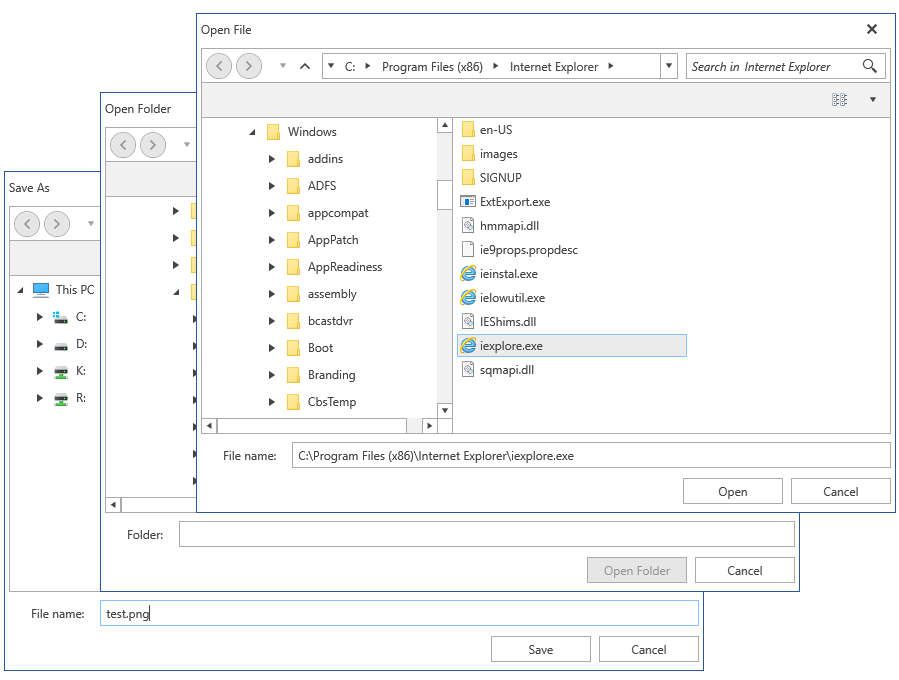

# Overview

Whenever you open or save a file in almost any Windows application, you will see roughly the same dialogs for doing so. As of **R3 2017** you can keep the UI appearance throughout your application consistent with the new file dialogs provided by the **Telerik UI for WPF** suite.

Apart from support of all predefined themes of the suite, the controls provide most of the functionality of the standard MS dialogs while leaving room for further customization.

## Key Features

Here are a few of the controls' main features:

* **Easy Navigation**: The dialogs allow you to easily browse through your file system either through the **tree-view-like navigation pane** or the **breadcrumb/path pane**. A **history** of the visited folders is kept so that you can seamlessly jump back and forth between folders.

* **Search**: The out-of-the-box search functionality allows you to quickly find just the files and folders you're looking for by using the **Windows Search index** when available.

* **Customizable Layouts**: The controls also provide you with an API to set an **InitialDirectory**, specify **custom folders** to be displayed top-most in the navigation pane and switch between **different view modes** (Tiles, Small Icons, Large Icons, etc.).

* **Variety of Themes**: You can persist the appearance throughout your application by applying any of the **predefined themes** provided by the UI for WPF suite to your dialogs.

>tip Get started with the file dialogs with the [Getting Started]() help article that shows how to use them in basic scenarios.

> Check out the controls' demos at [demos.telerik.com](https://demos.telerik.com/wpf/)

## See Also

* [Getting Started]()
* [Visual Structure]()
* [Styles and Templates]()