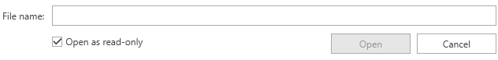

# RadOpenFileDialog

__RadOpenFileDialog__ is a modal dialog box that allows you to specify one or multiple filenames to open.

#### __Figure 1: RadOpenFileDialog in single selection mode__ 

## Showing the Dialog

To show the dialog call its __ShowDialog__ method. If a valid file is opened when you press OK, the __DialogResult__ property will return True and the __FileName__, and __FileNames__ properties will be set. You can use FileName and FileNames to get the names of the selected items.

> Note that when the ShowDialog method is called the UI of the host application will freeze until the dialog closes.

#### __[C#] Example 1: Show a open file dialog__
{{region cs-radfiledialogs-radopenfiledialog-0}}
	RadOpenFileDialog openFileDialog = new RadOpenFileDialog();
	openFileDialog.Owner = theHostWindowInstance;
	openFileDialog.ShowDialog();
	if (openFileDialog.DialogResult == true)
	{
		string fileName = openFileDialog.FileName;
	}
{{endregion}}

## Opening the Selected File

You can open a read-only file stream for the selected file using the __OpenFile__ method. Or alternatively you can use the FileName and FileNames properties and open the file manually.

#### __[C#] Example 2: Open a file stream__
{{region cs-radfiledialogs-radopenfiledialog-1}}
	RadOpenFileDialog openFileDialog = new RadOpenFileDialog();
	openFileDialog.Owner = theHostWindowInstance;
	openFileDialog.ShowDialog();
	if (openFileDialog.DialogResult == true)
	{
		Stream fileStream = openFileDialog.OpenFile();
	}
{{endregion}}

## Enabling Multiple Selection

The dialog supports single and multiple selection modes. By default you can select only one file at a time. To alter this you can set the __Multiselect__ property of RadOpenFileDialog.

#### __[C#] Example 3: Enable multiple selection__
{{region cs-radfiledialogs-radopenfiledialog-2}}
	RadOpenFileDialog openFileDialog = new RadOpenFileDialog();
	openFileDialog.Owner = theHostWindowInstance;
	openFileDialog.Multiselect = true;
{{endregion}}

#### __Figure 2: Multiple selection__ 

## Working with the Selected Files

You can get the paths of the selected files via the __FileName__ and __FileNames__ properties. Note that the properties are empty until the DialogResult is valid. When you open file(s) the properties will return the corresponding paths.

You can get only the name of the selected files, without the full path, via the __SafeFileNames__ collection property.

#### __[C#] Example 3: Get the selected file names__
{{region cs-radfiledialogs-radopenfiledialog-3}}
	RadOpenFileDialog openFileDialog = new RadOpenFileDialog();
	openFileDialog.Owner = theHostWindowInstance;
	openFileDialog.Multiselect = true;
	openFileDialog.ShowDialog();
	if (openFileDialog.DialogResult == true)
	{
		string filePath = openFileDialog.FileName;
		IEnumerable<string> filePaths = openFileDialog.FileNames;
		IEnumerable<string> fileNames = openFileDialog.SafeFileNames;
	}
{{endregion}}

The __FileName__ property can be set manually. This will change the value displayed in the selected file autocomplete box area. Note that setting this won't change the selected item in the list with the files.

## Enabling ReadOnly CheckBox

You can display a checkbox to control whether the file should be opened in readonly mode with the __ShowReadOnly__ property of the RadOpenFileDialog. You can control the state of that checkbox by using the __ReadOnlyChecked__ property of the RadOpenFileDialog.

#### __[C#] Example 4: Enabling the ReadOnly CheckBox__
{{region cs-radfiledialogs-radopenfiledialog-4}}
	RadOpenFileDialog openFileDialog = new RadOpenFileDialog();
	openFileDialog.Owner = theHostWindowInstance;
	openFileDialog.ShowReadOnly = true;
	openFileDialog.ReadOnlyChecked = true;
	openFileDialog.ShowDialog();
{{endregion}}

#### __Figure 3: RadOpenFileDialog with Checked ReadOnly CheckBox__ 

## DereferenceLinks

As of **R1 2018**, the **RadOpenFileDialog** exposes a **DereferenceLinks** property indicating whether a file dialog returns the location of the file referenced by a shortcut or the location of the actual shortcut file (with the **.lnk** extension).

#### __[C#] Example 5: Using the DereferenceLinks property__
{{region cs-radfiledialogs-radopenfiledialog-5}}
	RadOpenFileDialog openFileDialog = new RadOpenFileDialog();
	openFileDialog.Owner = theHostWindowInstance;
	openFileDialog.DereferenceLinks = true;
	openFileDialog.ShowDialog();
	if (openFileDialog.DialogResult == true)
	{
		string filePath = openFileDialog.FileName;
		// If the selected file was C:\Users\\<user>\Desktop\Shortcut.lnk, for example,
		// the FileName property will now contain the actual location of the file,
		// for example - C:\Program Files\Program\Shortcut.exe.
	}
{{endregion}}

> If in multiple or single selection the first selected item is a link to a **directory** and DereferenceLinks is set to **True**, clicking the **Open** button will actually navigate to this directory.

## See Also
* [Visual Structure]()
* [RadOpenFolderDialog]()
* [RadSaveFileDialog]()
* [Events]()