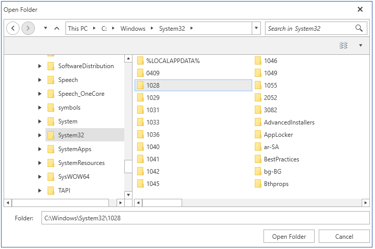
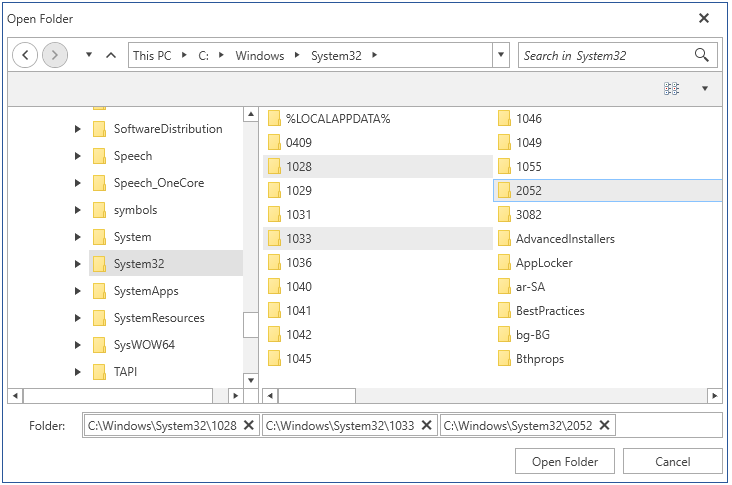

# RadOpenFolderDialog

__RadOpenFolderDialog__ is a modal dialog box that allows you to specify one or multiple folder names to open.

#### __Figure 1: RadOpenFolderDialog in single selection mode__ 

## Showing the dialog

To show the dialog call its __ShowDialog__ method. If a valid folder is opened when you press OK, the __DialogResult__ property will return True and the __FileName__, and __FileNames__ properties will be set. You can use FileName and FileNames to get the names of the selected folders.

> Note that when the ShowDialog method is called the UI of the host application will freeze until the dialog closes.

#### __[C#] Example 1: Show a open folder dialog__
{{regiond radfiledialogs-radopenfolderdialog-0}}
	RadOpenFolderDialog openFolderDialog = new RadOpenFolderDialog();
	openFolderDialog.Owner = theHostWindowInstance;            
	openFolderDialog.ShowDialog();
	if (openFolderDialog.DialogResult == true)
	{
		string folderName = openFolderDialog.FileName;
	}
{{endregiond}}

## Enabling multiple selection

The dialog supports single and multiple selection modes. By default you can select only one folder at a time. To alter this you can set the __Multiselect__ property of RadOpenFolderDialog.

#### __[C#] Example 3: Enable multiple selection__
{{regiond radfiledialogs-radopenfolderdialog-1}}
	RadOpenFolderDialog openFolderDialog = new RadOpenFolderDialog();
	openFolderDialog.Owner = theHostWindowInstance;
	openFolderDialog.Multiselect = true;
{{endregiond}}

#### __Figure 2: Multiple selection__ 

## Working with the selected folders

You can get the paths of the selected folders via the __FileName__ and __FileNames__ properties. Note that the properties are empty until the DialogResult is valid. When you open folder(s) the properties will return the corresponding directory paths.

You can get only the name of the selected folders, without the full path, via the __SafeFileNames__ collection property.

#### __[C#] Example 3: Get the selected folder names__
{{regiond radfiledialogs-radopenfolderdialog-2}}
	RadOpenFolderDialog openFolderDialog = new RadOpenFolderDialog();
	openFolderDialog.Owner = theHostWindowInstance;                  
	openFolderDialog.ShowDialog();
	if (openFolderDialog.DialogResult == true)
	{
		string folderPath = openFolderDialog.FileName;
		IEnumerable<string> folderPaths = openFolderDialog.FileNames;
		IEnumerable<string> folderNames = openFolderDialog.SafeFileNames;
	}
{{endregiond}}

The __FileName__ property can be set manually. This will change the value displayed in the selected file autocomplete box area. Note that setting this won't change the selected item in the list with the files.

## See Also
* [Visual Structure]()
* [RadOpenFileDialog]()
* [RadSaveFileDialog]()
* [Events]()