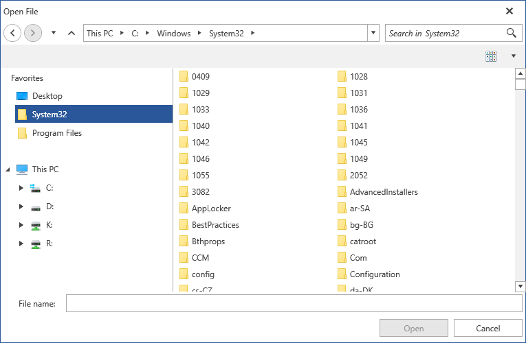

# Styles and Templates

This article is intended to give you a general understanding of how to change the visual appearance of the file dialogs and their elements. There is also comprehensive information about their control templates.

Using [implicit styles]() gives you the ability to style the controls per your liking. You can also follow [this article]() for two different approaches on how to extract and edit control templates.
        
>tip Note that when changing a __ControlTemplate__ you should include all required parts. Even if your code compiles, some of the functionality may be impacted due to the omission of the required parts. The required parts are usually marked with the prefix "__PART___".

## Template Structure

Here is the template structure for each of the dialogs:

* **OpenFileDialogControl**, **SaveFileDialogControl**, **OpenFolderDialogControl**: The controls holding the **ExplorerControl** and the operations pane. All controls inherit the appearance from **DialogWindowBase**.

* **ExplorerControl**: It holds all other elements apart from the operations pane and the dialog's header.

* **HistoryNavigationPaneControl**: Holds the controls used to navigate through the browse history. It consists of two **RadPathButtons** for navigating back and forward a **RadDropDownButton** which displays the history and another **RadPathButton** used to navigate up one directory.

* **FileDialogsBreadcrumb**: The control which handles the path navigation. It inherits its visual appearance from **RadBreadcrumb**.

* **FileDialogSearchPane**: The control used for executing search queries. Consists of a **RadWatermarkTextBox**, search icon and a clear **RadButon**.

* **FileBrowserTabControl**: Used for displaying all files and/or folders in the current directory after the search filters (if any) have been applied. Either a **FileBrowserListBox** or a **FileBrowserGridView** is displayed based on the selected layout in the layout configurator combobox - through its **ContentTemplateSelector**.

## Styling the Controls

To modify the appearance of each of the individual elements, you should first create an appropriate style targeting the specific control. You can then customize it by setting the available visual properties or modify its control template altogether.

**Example 1** demonstrates how to add a Favorites title to the **Custom Places Pane**.

#### [XAML] Example 1: Add title to the Custom Places Pane

```XAML
    <ControlTemplate x:Key="ExplorerControlTemplate" TargetType="fileDialogs:ExplorerControl">
        <Border
        Background="{TemplateBinding Background}"
        BorderBrush="{TemplateBinding BorderBrush}"
        BorderThickness="{TemplateBinding BorderThickness}"
        Margin="{TemplateBinding Padding}">
            <Grid>
                <Grid.RowDefinitions>
                    <RowDefinition Height="Auto"/>
                    <RowDefinition Height="Auto"/>
                    <RowDefinition Height="*"/>
                </Grid.RowDefinitions>
                <Grid Grid.Row="0">
                    <Grid.ColumnDefinitions>
                        <ColumnDefinition Width="Auto"/>
                        <ColumnDefinition Width="*"/>
                        <ColumnDefinition Width="Auto"/>
                    </Grid.ColumnDefinitions>
                    <Border BorderBrush="{TemplateBinding BorderBrush}" BorderThickness="0 0 0 1" Grid.ColumnSpan="3"/>
                    <fileDialogs:HistoryNavigationPaneControl x:Name="PART_HistoryNavigationPane" Grid.Row="0" Grid.Column="0"/>
                    <fileDialogs:FileDialogsBreadcrumb x:Name="PART_PathNavigationPane"
                    Grid.Column="1"
                    CurrentItem="{Binding CurrentParentDirectory, Mode=OneWayToSource}"
                    HeaderTemplate="{StaticResource BreadCrumbHeaderTemplate}"
                    Header="{Binding MainNavigationRoot, Mode=OneTime}"
                    ItemsSource="{Binding MainNavigationRoot.ChildDirectories}"
                    HeaderMemberPath="Name"
                    HierarchicalItemsSource="ChildDirectories"
                    HierarchicalMemberPath="Name"
                    TextModePath="Name"/>
                    <fileDialogs:FileDialogSearchPane x:Name="PART_SearchPane" Grid.Column="2"/>
                </Grid>
                <Grid Grid.Row="1" x:Name="ConfigurationPane">
                    <Border BorderBrush="{TemplateBinding BorderBrush}" BorderThickness="0 0 0 1" Background="{telerik1:Office2016Resource ResourceKey=AlternativeBrush}">
                        <telerik:RadComboBox x:Name="PART_LayoutConfigurator"
                        HorizontalAlignment="Right"
                        ItemsSource="{Binding Layouts}"
                        SelectedItem="{Binding SelectedLayout}"
                        IsTextSearchEnabled="False"
                        ItemTemplate="{StaticResource LayoutConfiguratorItemTemplate}"
                        SelectionBoxTemplate="{StaticResource LayoutConfiguratorSelectedItemTemplate}"
                        Padding="0"
                        Background="Transparent"
                        BorderThickness="0"
                        Height="26"
                        Margin="8 4"
                        Width="56"
                        VerticalAlignment="Center"/>
                    </Border>
                </Grid>
                <Grid Grid.Row="2">
                    <Grid.ColumnDefinitions>
                        <ColumnDefinition MinWidth="100" Width="250"/>
                        <ColumnDefinition Width="5"/>
                        <ColumnDefinition Width="*"/>
                    </Grid.ColumnDefinitions>
                    <Grid x:Name="PART_TreeNavigationPane">
                        <Grid.RowDefinitions>
                            <RowDefinition Height="Auto"/>
                            <RowDefinition Height="Auto"/>
                            <RowDefinition Height="*"/>
                        </Grid.RowDefinitions>
                        <!-- Favorites Container Start -->
                        <StackPanel Orientation="Horizontal">
                            <TextBlock Text="Favorites" Margin="15 5 5 5" />
                        </StackPanel>
                        <!-- Favorites Container End -->
                        <telerik:RadTreeView x:Name="PART_CustomPlacesPane"
                        Grid.Row="1"
                        ItemsSource="{Binding CustomPlaces}"
                        SelectedItem="{Binding CurrentParentDirectory, Mode=TwoWay}"
                        telerik:AnimationManager.IsAnimationEnabled="False"
                        IsVirtualizing="True"
                        Visibility="{Binding HasItems, RelativeSource={RelativeSource Self}, Converter={StaticResource BooleanToVisibilityConverter}}"
                        Margin="0 0 0 26"
                        DisplayMemberPath="Name"
                        ItemContainerStyle="{StaticResource NavigationTreeViewCustomPlacesItemStyle}"/>
                        <telerik:RadTreeView
                        Grid.Row="2"
                        x:Name="PART_MainNavigationPane"
                        telerik:AnimationManager.IsAnimationEnabled="False"
                        IsVirtualizing="True"
                        ItemsSource="{Binding MainNavigationRootSource}"
                        SelectionMode="Single"
                        SelectedItem="{Binding CurrentParentDirectory, Mode=TwoWay}"
                        DisplayMemberPath="Name"
                        ItemContainerStyle="{StaticResource NavigationTreeViewItemStyle}"/>
                    </Grid>
                    <GridSplitter Grid.Column="1" Style="{StaticResource ExplorerControlGridSplitter}"/>
                    <fileDialogs:FileBrowserTabControl x:Name="PART_MainPane"
                    Grid.Column="2"
                    SelectedIndex="{Binding ElementName=PART_LayoutConfigurator, Path=SelectedIndex}"
                    ItemsSource="{Binding Layouts}"
                    ContentTemplateSelector="{StaticResource MainPaneTabControlTemplateSelector}"/>
                </Grid>
            </Grid>
        </Border>
        <ControlTemplate.Triggers>
            <Trigger Property="IsDropDownOpen" SourceName="PART_LayoutConfigurator" Value="True">
                <Setter Property="BorderThickness" TargetName="PART_LayoutConfigurator" Value="1"/>
            </Trigger>
        </ControlTemplate.Triggers>
    </ControlTemplate>
    <Style TargetType="fileDialogs:ExplorerControl">
        <Setter Property="Template" Value="{StaticResource ExplorerControlTemplate}"/>
    </Style>
```

>tip If you're using [the NoXaml binaries](), you should base your style on the __ExplorerControlStyle__.

> Note that we've added a new **RowDefinition** to the **PART&#95;TreeNavigationPane** and modified the Grid.Row attached properties of the **PART&#95;MainNavigationPane** and **PART&#95;CustomPlacesPane** elements. Additionally, we've defined the following namespaces:
* **xmlns:fileDialogs="clr-namespace:Telerik.Windows.Controls.FileDialogs;assembly=Telerik.Windows.Controls.FileDialogs"**
* **xmlns:telerik1="clr-namespace:Telerik.Windows.Controls;assembly=Telerik.Windows.Controls"**
* **xmlns:telerik="http://schemas.telerik.com/2008/xaml/presentation"**

**Figure 1** displays the resulting dialog:

#### Figure 1: RadOpenFileDialog with modified Custom Places Pane



## See Also

* [Visual Structure]()
* [Setting a Theme]()
* [Editing Control Templates]()