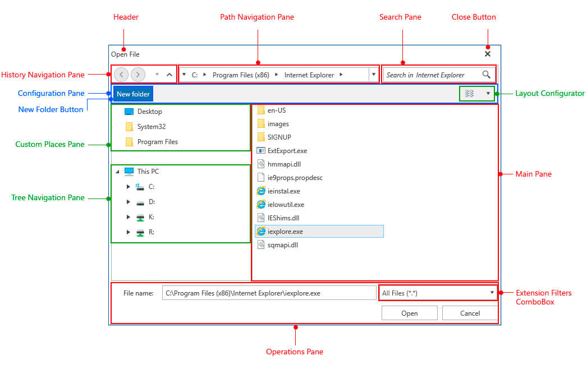

# Visual Structure

This help article will help you understand the visual structure of the file dialog controls with which you have to get familiar prior to using them. This information can also be helpful when contacting our support service in order to describe your issue better.

**Figure 1** shows all the basic elements used inside the dialogs with the **Office2016** theme:

#### Figure 1: Visual Structure of the File Dialogs

* **Header**: Displays the content specified by the **Header** or **HeaderTemplate** properties. Additionally, an icon can be displayed to the left of the header by setting the **Icon** or **IconTemplate** of the dialog.

* **Close Button**: The button which closes the file dialog.

* **History Navigation Pane**: Represents the controls used to navigate through the browse history.

* **Path Navigation Pane**: The breadcrumb control used to select a particular directory.

* **Search Pane**: Consists of a RadWatermarkTextBox in which the user can enter the search criteria and a button to clear the inserted text.

* **Configuration Pane**: The pane where the layout configurator is placed in.

* **New Folder Button**: The button for creating a new folder.

* **Layout Configurator**: Represents a RadComboBox to select the view mode to be used in the main pane.

* **Custom Places Pane**: Lists all directories provided in the dialog's **CustomPlaces** collection.

* **Tree Navigation Pane**: The RadTreeView used to navigate through the directories.

* **Main Pane**: Displays all files and/or folders in the current directory after the search filters (if any) have been applied. This view depends on the layout selected in the layout configurator combobox.

* **Operations Pane**: Consist of a RadAutoCompleteBox where the currently selected item(s) are displayed and can be set and the operation buttons for the given dialog.

* **Extensions Filter ComboBox**: Displays all file extensions added with the **Filter** property to the RadOpenFileDialog and RadSaveFileDialog controls in order to indicate to the user which types of files should be opened or saved.

## See Also

* [Getting Started]()
* [Styles and Templates]()