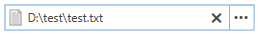

# IconTemplateSelector

The __RadFilePathPicker__ control exposes an __IconTemplateSelector__, which allows you to easily change the displayed icon depending on the __FilePath__.

## FilePathPickerIconTemplateSelector

The default value of the __IconTemplateSelector__ property of the control is an instance of __FilePathPickerIconTemplateSelector__. It exposes the following properties:

* __EmptyTemplate__

    The __EmptyTemplate__ is displayed, when the __FilePath__ property of the control is null or empty as demonstrated in __Figure 1__.

    #### __Figure 1: FilePathPickerIconTemplateSelector EmptyTemplate__
    

* __NonEmptyTemplate__

    The __NonEmptyTemplate__ is displayed, when the __FilePath__ property of the control is not empty as demonstrated in __Figure 2__.

    #### __Figure 2: FilePathPickerIconTemplateSelector NonEmptyTemplate__
    

>tip In order to hide the icon, you can set the __IconVisibility__ property of the control to __Collapsed__.

## Custom FilePathPickerIconTemplateSelector

__Example 1__ demonstrates how to create a custom FilePathPickerIconTemplateSelector and display red/green Rectangle elements depending on whether the __FilePath__ is empty. 

__Example 1: Custom FilePathPickerIconTemplateSelector__
```XAML
    
    <StackPanel>
        <StackPanel.Resources>
            <DataTemplate x:Key="MyEmptyTemplate">
                <Rectangle Fill="Red" />
            </DataTemplate>

            <DataTemplate x:Key="MyNonEmptyTemplate">
                <Rectangle Fill="Green" />
            </DataTemplate>
            <telerik:FilePathPickerIconTemplateSelector x:Key="MyItemTemplateSelector" EmptyTemplate="{StaticResource MyEmptyTemplate}" NonEmptyTemplate="{StaticResource MyNonEmptyTemplate}" />
        </StackPanel.Resources>
        <telerik:RadFilePathPicker IconTemplateSelector="{StaticResource MyItemTemplateSelector}" />
    </StackPanel>
```

#### __Figure 3: Custom FilePathPickerIconTemplateSelector EmptyTemplate__


#### __Figure 4: Custom FilePathPickerIconTemplateSelector NonEmptyTemplate__


## See Also 

* [Commands]()
* [Dialog Types]()
* [WatermarkTextbox Properties]()