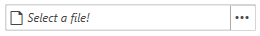

# WatermarkTextBox Properties

The __RadFilePathPicker__ has a [RadWatermarkTextBox]() element inside it, which is responsible for holding the text. This article will list the properties that the control exposes for working with the RadWatermarkTextBox.

## WatermarkContent

The __WatermarkContent__ property of the control sets the [WatermarkContent](#using-the-watermarkcontent-property) of the RadWatermarkTextBox. 

__Example 1: Setting the WatermarkContent__
```XAML
	<telerik:RadFilePathPicker WatermarkContent="Select a file!" />
```

#### __Figure 1: RadFilePathPicker with WatermarkContent__


## WatermarkTemplate

The __WatermarkTemplate__ property of the control sets the [WatermarkTemplate](#using-watermarktemplate-property) of the RadWatermarkTextBox.

__Example 2: Setting the WatermarkTemplate__
```XAML
	<StackPanel>
        <StackPanel.Resources>
            <DataTemplate x:Key="WatermarkTemplate">
                <StackPanel Orientation="Horizontal">
                    <TextBlock Text="{Binding}" Margin="0 0 5 0" />
                    <telerik:RadGlyph Glyph="&#xe403;" Foreground="Red"/>
                </StackPanel>
            </DataTemplate>
        </StackPanel.Resources>
        <telerik:RadFilePathPicker WatermarkContent="Select a file" WatermarkTemplate="{StaticResource WatermarkTemplate}" />
    </StackPanel>
```

#### __Figure 2: RadFilePathPicker with WatermarkTemplate__


## EditorVisibility

The __EditorVisibility__ property controls the __Visibility__ of the RadWatermarkTextbox. 

__Example 3: Setting the WatermarkTemplate property__
```XAML

    <telerik:RadFilePathPicker EditorVisibility="Collapsed" />
```

## See Also

* [Dialog Types]()
* [Commands]()
* [IconTemplateSelector]()