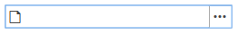
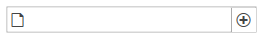
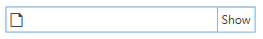
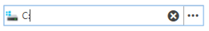
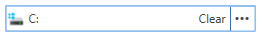
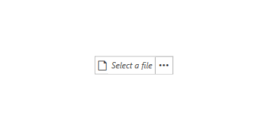

# Getting Started with {{ site.framework_name }} FilePathPicker

This tutorial will walk you through the creation of a sample application that contains a __RadFilePathPicker__ control.
			
## Adding Telerik Assemblies Using NuGet

To use __RadFilePathPicker__ when working with NuGet packages, install the `Telerik.Windows.Controls.FileDialogs.for.Wpf.Xaml` package. The [package name may vary]() slightly based on the Telerik dlls set - [Xaml or NoXaml]()

Read more about NuGet installation in the [Installing UI for WPF from NuGet Package]() article.

>tip With the 2025 Q1 release, the Telerik UI for WPF has a new licensing mechanism. You can learn more about it [here]().

## Adding Assembly References Manually

If you are not using NuGet packages, you can add a reference to the following assemblies:

* __Telerik.Licensing.Runtime__
* __Telerik.Windows.Controls__
* __Telerik.Windows.Controls.Input__
* __Telerik.Windows.Controls.Navigation__
* __Telerik.Windows.Controls.GridView__
* __Telerik.Windows.Controls.FileDialogs__
* __Telerik.Windows.Data__

You can find the required assemblies for each control from the suite in the [Controls Dependencies]() help article.

## Defining RadFilePathPicker

__Example 1__ demonstrates how you can define a RadFilePathPicker in xaml.

__Example 1: Defining RadFilePathPicker__
```XAML
    <telerik:RadFilePathPicker x:Name="filePathPicker"  />
```

#### __Figure 1: RadFilePathPicker in the Office2016 theme__


Even at this point, you are ready to start using the control. The following few sections will demonstrate some of the features of the __RadFilePathPicker__.

## IsReadOnly

By default the RadFilePathPicker is read-only, which means that you cannot input text in the RadWatermarkTextBox inside it. In order to change this, you can set the __IsReadOnly__ property to __False__ as demonstrated in __Example 2__.

__Example 2: Setting the IsReadOnly property__
```XAML
    <telerik:RadFilePathPicker IsReadOnly="False"  />
```

## Text and FilePath

The __RadFilePathPicker__ control exposes two properties that come in handy for working with input: __Text__ and __FilePath__. The __Text__ property is updated constantly when the user is typing. The __FilePath__ property is only updated when a valid file path is entered or when one is selected through a file dialog. 

## ShowDialogButtonContent and ShowDialogButtonTemplate 

There are two properties that allow for modifying the appearance of the button on the right side of the control, which opens the dialog. The __ShowDialogButtonContent__ expects a glyph as a value, since the default __ShowDialogButtonTemplate__ contains a [RadGlyph](). __Example 3__ demonstrates how to change the default glyph shown in the button.

__Example 3: Setting the ShowDialogButtonContent__
```XAML
    <telerik:RadFilePathPicker ShowDialogButtonContent="&#xe11f;" />
```

#### __Figure 2: RadFilePathPicker with ShowDialogButtonContent set in the Office2016 theme__


If you don't want to show a RadGlyph in the show dialog button, you can set the __ShowDialogButtonTemplate__ property to a custom DataTemplate. Note, that whatever is set to the __ShowDialogButtonContent__ will be the DataContext inside the __ShowDialogButtonTemplate__. 

__Example 4: Setting the ShowDialogButtonTemplate__
```XAML

    <StackPanel>
        <StackPanel.Resources>
            <DataTemplate x:Key="ShowDialogButtonTemplate">
                <TextBlock Text="{Binding}" />
            </DataTemplate>
        </StackPanel.Resources>

        <telerik:RadFilePathPicker ShowDialogButtonContent="Show" ShowDialogButtonTemplate="{StaticResource ShowDialogButtonTemplate}"  />
    </StackPanel>
```

#### __Figure 3: RadFilePathPicker with ShowDialogButtonTemplate set in the Office2016 theme__


## ClearButtonContent and ClearButtonTemplate 

There are two properties that allow for modifying the appearance of the clear button, which is shown when some text is entered. The __ClearButtonContent__ expects a glyph as a value, since the default __ClearButtonTemplate__ contains a [RadGlyph](). __Example 5__ demonstrates how to change the default glyph shown in the button.

__Example 5: Setting the ClearButtonContent__
```XAML
    <telerik:RadFilePathPicker IsReadOnly="False" ClearButtonContent="&#xe11d;" />
```

#### __Figure 4: RadFilePathPicker with ClearButtonContent set in the Office2016 theme__


To avoid showing a RadGlyph in the clear button, you can set the __ClearButtonTemplate__ property to a custom DataTemplate. Note, that whatever is set to the __ClearButtonContent__ will be the DataContext inside the __ClearButtonTemplate__. 

__Example 6: Setting the ClearButtonTemplate__
```XAML

    <StackPanel>
        <StackPanel.Resources>
            <DataTemplate x:Key="ClearButtonTemplate">
                <TextBlock Text="{Binding}" />
            </DataTemplate>
        </StackPanel.Resources>

        <telerik:RadFilePathPicker IsReadOnly="False" ClearButtonContent="Clear" ClearButtonTemplate="{StaticResource ClearButtonTemplate}"/>
    </StackPanel>
```

#### __Figure 5: RadFilePathPicker with ClearButtonTemplate set in the Office2016 theme__


## Setting FilePath on Drop

Since the __2020.1.316__ internal build version, the RadFilePathPicker automatically sets its __FilePath__ when a file is dropped over it. If multiple files are dropped, the first one will be used. In order to disable this functionality, you can set the __AllowDrop__ property of the control to __False__.
 
#### __Figure 6: Dropping a file over the RadFilePathPicker__


## Setting a Theme

The controls from our suite support different themes. You can see how to apply a theme different than the default one in the [Setting a Theme]() help article.

>important Changing the theme using implicit styles will affect all controls that have styles defined in the merged resource dictionaries. This is applicable only for the controls in the scope in which the resources are merged. 

To change the theme, you can follow the steps below:

* Choose between the themes and add reference to the corresponding theme assembly (ex: **Telerik.Windows.Themes.Windows8.dll**). You can see the different themes applied in the **Theming** examples from our [WPF Controls Examples](https://demos.telerik.com/wpf/) application.

* Merge the ResourceDictionaries with the namespace required for the controls that you are using from the theme assembly. For the __RadFilePathPicker__, you will need to merge the following resources:

	* __Telerik.Windows.Controls__
	* __Telerik.Windows.Controls.Input__
	* __Telerik.Windows.Controls.Navigation__
	* __Telerik.Windows.Controls.GridView__
	* __Telerik.Windows.Controls.FileDialogs__

__Example 7__ demonstrates how to merge the ResourceDictionaries so that they are applied globally for the entire application.

__Example 7: Merge the ResourceDictionaries__  
```XAML
	<Application.Resources>
		<ResourceDictionary>
			<ResourceDictionary.MergedDictionaries>
				<ResourceDictionary Source="/Telerik.Windows.Themes.Windows8;component/Themes/System.Windows.xaml"/>
				<ResourceDictionary Source="/Telerik.Windows.Themes.Windows8;component/Themes/Telerik.Windows.Controls.xaml"/>
				<ResourceDictionary Source="/Telerik.Windows.Themes.Windows8;component/Themes/Telerik.Windows.Controls.Input.xaml"/>
				<ResourceDictionary Source="/Telerik.Windows.Themes.Windows8;component/Themes/Telerik.Windows.Controls.Navigation.xaml"/>
				<ResourceDictionary Source="/Telerik.Windows.Themes.Windows8;component/Themes/Telerik.Windows.Controls.GridView.xaml"/>				
				<ResourceDictionary Source="/Telerik.Windows.Themes.Windows8;component/Themes/Telerik.Windows.Controls.FileDialogs.xaml"/>
			</ResourceDictionary.MergedDictionaries>
		</ResourceDictionary>
	</Application.Resources>
```

>Alternatively, you can use the theme of the control via the [StyleManager](https://docs.telerik.com/devtools/wpf/styling-and-appearance/stylemanager/common-styling-apperance-setting-theme-wpf)[StyleManager](https://docs.telerik.com/devtools/silverlight/styling-and-appearance/stylemanager/common-styling-apperance-setting-theme).

__Figure 7__ shows a __RadFilePathPicker__ with the **Windows8** theme applied.

#### __Figure 7: RadFilePathPicker with the Windows8 theme__



## Telerik UI for WPF Learning Resources

* [Telerik UI for WPF FilePathPicker Component](https://www.telerik.com/products/wpf/filepathpicker.aspx)
* [Getting Started with Telerik UI for WPF Components]()
* [Telerik UI for WPF Installation]()
* [Telerik UI for WPF and WinForms Integration]()
* [Telerik UI for WPF Visual Studio Templates]()
* [Setting a Theme with Telerik UI for WPF]()
* [Telerik UI for WPF Virtual Classroom (Training Courses for Registered Users)](https://learn.telerik.com/learn/course/external/view/elearning/16/telerik-ui-for-wpf) 
* [Telerik UI for WPF License Agreement](https://www.telerik.com/purchase/license-agreement/wpf-dlw-s)


## See Also 

* [Commands]()
* [Dialog Types]()
* [WatermarkTextbox Properties]()
* [IconTemplateSelector]()
