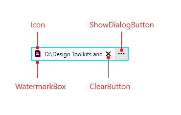

# {{ site.framework_name }} RadFilePathPicker Visual Structure

This topic defines terms and concepts related to __RadFilePathPicker__ that you have to get familiar with before you continue reading this help. 

#### __Figure 1: RadFilePathPicker Visual Stucture__

The following table lists the elements that make up a RadFilePathPicker:

* __Icon__: It changes dynamically depending on the current __FilePath__. In order to learn how to customize the shown icon, visit the [IconTemplateSelector]() article.

* __WatermarkBox__: The [RadWatermarkTextBox]() that visualizes the Text. Check the [WatermarkTextBox Properties]() article to learn about the API that the __RadFilePathPicker__ exposes for modifying it.

* __ClearButton__: This button is shown only when some Text is inputted and allows the user to clear it.  

* __ShowDialogButton__: This button opens a RadFileDialog. The type of the dialog is controlled through the [DialogType]() property.

## See Also

* [Getting Started]()
* [Commands]()