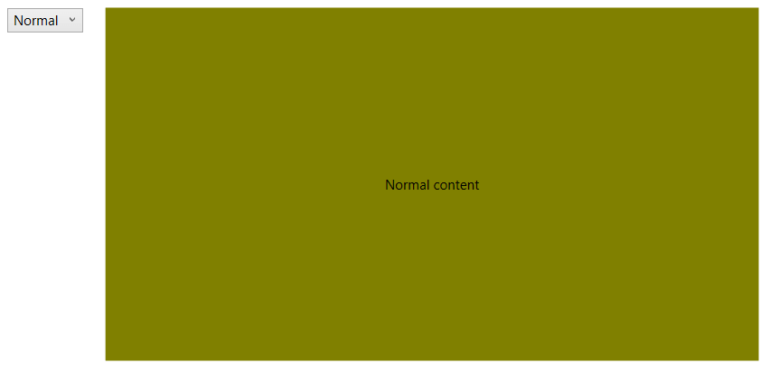

# Data Binding

RadFluidContentControl provides data binding support. This means that you can bind its Content, SmallContent and LargeContent properties and also define a DataTemplate for each content.

This article demonstrates how to data bind the control to a simple business model.

## Defining the model

The model will contain few string properties for each content and also a property that holds the current state of the control.

__Example 1: Defining the model__
<snippet id='radfluidcontentcontrol-data-binding-example_1_defining_the_model-cs' />

<snippet id='radfluidcontentcontrol-data-binding-example_1_defining_the_model-vb' />

> The ViewModelBase class is part of the Telerik.Windows.Controls.dll. Read more about this in the [ViewModelBase]() article.

## Setting up the View

When the model is set up, it can be provided to the RadFluidContentControl via its DataContext property. In the example we will set it explicitly but in the general case the property will be probably inherited from the parent control.

__Example 3: Setting up the model__
<snippet id='radfluidcontentcontrol-data-binding-example_3_setting_up_the_model-cs' />

<snippet id='radfluidcontentcontrol-data-binding-example_3_setting_up_the_model-vb' />

__Example 4: Setting up the control__
<snippet id='radfluidcontentcontrol-data-binding-example_4_setting_up_the_control-xaml' />

Each content property has a corresponding content template property, so you can define a DataTemplate and bind it's controls to the view model as shown in __Example 4__. 

## Defining Additiona Logic for Updating the State

This section shows how to link the State property of the RadFluidContentControl to a drop down list via the State property defined in the view model.

__Example 5: Setting up the control__
<snippet id='radfluidcontentcontrol-data-binding-example_5_setting_up_the_control-xaml' />

To make the binding in the drop down list work we need to move the data context from the RadFluidContentControl parent control that hosts it. 

__Example 6: Setting up the control__
<snippet id='radfluidcontentcontrol-data-binding-example_6_setting_up_the_control-cs' />

<snippet id='radfluidcontentcontrol-data-binding-example_6_setting_up_the_control-vb' />

#### Figure 1: Data binding example

## See Also
* [Getting Started]()
* [Data Binding]()
* [Events]()
