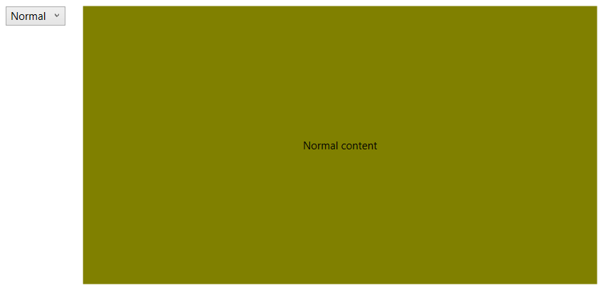

# Data Binding

RadFluidContentControl provides data binding support. This means that you can bind its Content, SmallContent and LargeContent properties and also define a DataTemplate for each content.

This article demonstrates how to data bind the control to a simple business model.

## Defining the model

The model will contain few string properties for each content and also a property that holds the current state of the control.

#### __[C#] Example 1: Defining the model__
{{region radfluidcontentcontrol-data-binding-0}}
	public class FluidContentModel : ViewModelBase
    {
        private FluidContentControlState state;        
        
        public FluidContentControlState State
        {
            get { return this.state; }
            set
            {
                this.state = value;
                this.OnPropertyChanged("State");
            }
        }

        public string SmallContent { get; set; }
        public string NormalContent { get; set; }
        public string LargeContent { get; set; }
    }    
{{endregion}}

#### __[VB.NET] Example 2: Defining the model__
{{region radfluidcontentcontrol-data-binding-1}}
	Public Class FluidContentModel
		Inherits ViewModelBase

		Private state As FluidContentControlState

		Public Property State As FluidContentControlState
			Get
				Return Me.state
			End Get
			Set(ByVal value As FluidContentControlState)
				Me.state = value
				Me.OnPropertyChanged("State")
			End Set
		End Property

		Public Property SmallContent As String
		Public Property NormalContent As String
		Public Property LargeContent As String
	End Class    
{{endregion}}

> The ViewModelBase class is part of the Telerik.Windows.Controls.dll. Read more about this in the [ViewModelBase]() article.

## Setting up the View

When the model is set up, it can be provided to the RadFluidContentControl via its DataContext property. In the example we will set it explicitly but in the general case the property will be probably inherited from the parent control.

#### __[C#] Example 3: Setting up the model__
{{region radfluidcontentcontrol-data-binding-2}}
	public partial class MyUserControl : UserControl
    {
        public MyUserControl()
        {
            InitializeComponent();

            FluidContentModel model = new FluidContentModel();
            model.SmallContent = "Small content";
            model.NormalContent = "Normal content";
            model.LargeContent = "Large content";
            model.State = FluidContentControlState.Normal;
            this.radFluidContentControl.DataContext = model;            
        }
	}
{{endregion}}

#### __[VB.NET] Example 3: Setting up the model__
{{region radfluidcontentcontrol-data-binding-3}}
	Public Partial Class MyUserControl
		Inherits UserControl

		Public Sub New()
			InitializeComponent()
			Dim model As FluidContentModel = New FluidContentModel()
			model.SmallContent = "Small content"
			model.NormalContent = "Normal content"
			model.LargeContent = "Large content"
			model.State = FluidContentControlState.Normal
			Me.radFluidContentControl.DataContext = model
		End Sub
	End Class
{{endregion}}

#### __[XAML] Example 4: Setting up the control__
{{region radfluidcontentcontrol-data-binding-4}}
	<telerik:RadFluidContentControl x:Name="radFluidContentControl"
									ContentChangeMode="Manual"
									State="{Binding State}"
									SmallContent="{Binding SmallContent}"
									Content="{Binding NormalContent}" 
									LargeContent="{Binding LargeContent}">
		<telerik:RadFluidContentControl.SmallContentTemplate>
			<DataTemplate>
				<Border Background="Bisque">
					<TextBlock Text="{Binding}" VerticalAlignment="Center" TextAlignment="Center" />
				</Border>
			</DataTemplate>
		</telerik:RadFluidContentControl.SmallContentTemplate>
		<telerik:RadFluidContentControl.ContentTemplate>
			<DataTemplate>
				<Border Background="Olive">
					<TextBlock Text="{Binding}" VerticalAlignment="Center" TextAlignment="Center" />
				</Border>
			</DataTemplate>
		</telerik:RadFluidContentControl.ContentTemplate>
		<telerik:RadFluidContentControl.LargeContentTemplate>
			<DataTemplate>
				<Border Background="LightGoldenrodYellow">
					<TextBlock Text="{Binding}" VerticalAlignment="Center" TextAlignment="Center" />
				</Border>
			</DataTemplate>
		</telerik:RadFluidContentControl.LargeContentTemplate>
	</telerik:RadFluidContentControl>
{{endregion}}

Each content property has a corresponding content template property, so you can define a DataTemplate and bind it's controls to the view model as shown in __Example 4__. 

## Defining Additiona Logic for Updating the State

This section shows how to link the State property of the RadFluidContentControl to a drop down list via the State property defined in the view model.

#### __[XAML] Example 5: Setting up the control__
{{region radfluidcontentcontrol-data-binding-5}}
	<Grid x:Name="gridPanel">
        <Grid.ColumnDefinitions>
            <ColumnDefinition Width="Auto"/>
            <ColumnDefinition />
        </Grid.ColumnDefinitions>
        <ComboBox SelectedValue="{Binding State, Mode=TwoWay}" SelectedValuePath="Content" 
				  VerticalAlignment="Top" Margin="20 0 20 0">
            <ComboBoxItem Content="{x:Static telerik:FluidContentControlState.Small}" />
            <ComboBoxItem Content="{x:Static telerik:FluidContentControlState.Normal}" />
            <ComboBoxItem Content="{x:Static telerik:FluidContentControlState.Large}" />
        </ComboBox>
        <telerik:RadFluidContentControl x:Name="contentControl"
                                        Grid.Column="1"
                                        ContentChangeMode="Manual"
                                        State="{Binding State}"
                                        SmallContent="{Binding SmallContent}"
                                        Content="{Binding NormalContent}" 
                                        LargeContent="{Binding LargeContent}">
            <telerik:RadFluidContentControl.SmallContentTemplate>
                <DataTemplate>
                    <Border Background="Bisque">
                        <TextBlock Text="{Binding}" VerticalAlignment="Center" TextAlignment="Center" />
                    </Border>
                </DataTemplate>
            </telerik:RadFluidContentControl.SmallContentTemplate>
            <telerik:RadFluidContentControl.ContentTemplate>
                <DataTemplate>
                    <Border Background="Olive">
                        <TextBlock Text="{Binding}" VerticalAlignment="Center" TextAlignment="Center" />
                    </Border>
                </DataTemplate>
            </telerik:RadFluidContentControl.ContentTemplate>
            <telerik:RadFluidContentControl.LargeContentTemplate>
                <DataTemplate>
                    <Border Background="LightGoldenrodYellow">
                        <TextBlock Text="{Binding}" VerticalAlignment="Center" TextAlignment="Center" />
                    </Border>
                </DataTemplate>
            </telerik:RadFluidContentControl.LargeContentTemplate>
        </telerik:RadFluidContentControl>
    </Grid>
{{endregion}}

To make the binding in the drop down list work we need to move the data context from the RadFluidContentControl parent control that hosts it. 

#### __[C#] Example 6: Setting up the control__
{{region radfluidcontentcontrol-data-binding-6}}
	this.gridPanel.DataContext = model;
{{endregion}}

#### __[VB.NET] Example 6: Setting up the control__
{{region radfluidcontentcontrol-data-binding-7}}
	Me.gridPanel.DataContext = model
{{endregion}}

#### Figure 1: Data binding example

## See Also
* [Getting Started]()
* [Data Binding]()
* [Events]()
