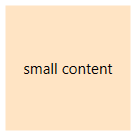
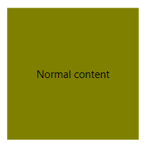
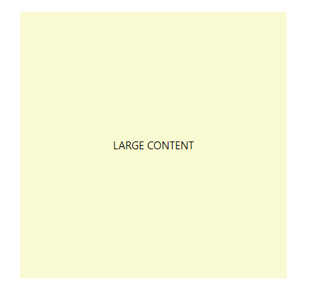

# {{ site.framework_name }} RadFluidContentControl Getting Started

This tutorial will walk you through the creation of a sample application that contains __RadFluidContentControl__.

## Assembly References

In order to use __RadFluidContentControl__, you will need to add references to the following assemblies:
* __Telerik.Windows.Controls__

You can find the required assemblies for each control from the suite in the [Controls Dependencies]()[Controls Dependencies]() help article.

## Content States

RadFluidContentControl supports three states for displaying the different contents. When the control enters a state the corresponding view will be displayed.

* __Small__
* __Normal__
* __Large__

>important Only a single content will be displayed at a time.

Read the [Setting up the Content Changing Mechanism](#setting-up-the-content-changing-mechanism) section of this article to see how to change states.

## Defining a RadFluidContentControl

The control exposes a few properties that allow you to set a different content for the different states. 

* __SmallContent__: The property accepts any object and it will display it when the control is in __Small__ state.

* __Content__: The property accepts any object and it will display it when the control is in __Normal__ state.

* __LargeContent__: The property accepts any object and it will display it when the control is in __Large__ state.

> Each of the content properties has a corresponding content template property - __SmallContentTemplate__, __ContentTemplate__ and __LargeContentTemplate__

#### __[XAML] Example 1: RadFluidContentControl definition in XAML__
{{region fluidcontentcontrol-getting-started-0}}
	<telerik:RadFluidContentControl>
		<telerik:RadFluidContentControl.SmallContent>
			<Border Background="Bisque">
				<TextBlock Text="small content" VerticalAlignment="Center" TextAlignment="Center" />
			</Border>                
		</telerik:RadFluidContentControl.SmallContent>
		<telerik:RadFluidContentControl.Content>
			<Border Background="Olive">
				<TextBlock Text="Normal content" VerticalAlignment="Center" TextAlignment="Center" />
			</Border>
		</telerik:RadFluidContentControl.Content>
		<telerik:RadFluidContentControl.LargeContent>
			<Border Background="LightGoldenrodYellow">
				<TextBlock Text="LARGE CONTENT" VerticalAlignment="Center" TextAlignment="Center" />
			</Border>
		</telerik:RadFluidContentControl.LargeContent>
	</telerik:RadFluidContentControl>
{{endregion}}

#### __Figure 1: RadFluidContentControl with size 100,100__

## Setting up the Content Changing Mechanism

There are two mechanisms for changing the currently visible content. The default one is based on the size of the control. When it reaches a specific size range the content will be change accordingly. The second mechanism is manual. In this case you can manually set the __State__ property of the __RadFluidContentControl__.

To enable the size based mechanism set the __ContentChangeMode__ property of RadFluidContentControl to __Automatic__. You can control the size thresholds via the following properties.
* __NormalToSmallThreshold__: The maximum size at which the control can be in Small state. When the control reaches this size it enters into Normal state. The default value of the property is *new Size(150, 150)*.

* __NormalToLargeThreshold__: The maximum size at which the control can be in Normal state. When the control reaches this size it enters into Large state. The default value of the property is *new Size(150, 150)*.

>tip The size where the Normal content is visible is the size between NormalToSmallThreshold and NormalToLargeThreshold.

#### __[XAML] Example 2: Setting thresholds__
{{region fluidcontentcontrol-getting-started-1}}
	 <telerik:RadFluidContentControl NormalToSmallThreshold="100,100" 
									 NormalToLargeThreshold="300,300">
            <telerik:RadFluidContentControl.SmallContent>
                <Border Background="Bisque">
                    <TextBlock Text="small content" VerticalAlignment="Center" TextAlignment="Center" />
                </Border>                
            </telerik:RadFluidContentControl.SmallContent>
            <telerik:RadFluidContentControl.Content>
                <Border Background="Olive">
                    <TextBlock Text="Normal content" VerticalAlignment="Center" TextAlignment="Center" />
                </Border>
            </telerik:RadFluidContentControl.Content>
            <telerik:RadFluidContentControl.LargeContent>
                <Border Background="LightGoldenrodYellow">
                    <TextBlock Text="LARGE CONTENT" VerticalAlignment="Center" TextAlignment="Center" />
                </Border>
            </telerik:RadFluidContentControl.LargeContent>
        </telerik:RadFluidContentControl>
{{endregion}}

> The default ContentChangeMode default value is set to Automatic.

#### __Figure 2: RadFluidContentControl with size 150,150__

To enable the manual mechanism set the __ContentChangeMode__ property of RadFluidContentControl to __Manual__. This allows you to manually set the __State__ property of the control, thus changing the visible content.

#### __[XAML] Example 2: Setting the content state manually__
{{region fluidcontentcontrol-getting-started-2}}
	<telerik:RadFluidContentControl ContentChangeMode="Manual" State="Large">
		<telerik:RadFluidContentControl.SmallContent>
			<Border Background="Bisque">
				<TextBlock Text="small content" VerticalAlignment="Center" TextAlignment="Center" />
			</Border>                
		</telerik:RadFluidContentControl.SmallContent>
		<telerik:RadFluidContentControl.Content>
			<Border Background="Olive">
				<TextBlock Text="Normal content" VerticalAlignment="Center" TextAlignment="Center" />
			</Border>
		</telerik:RadFluidContentControl.Content>
		<telerik:RadFluidContentControl.LargeContent>
			<Border Background="LightGoldenrodYellow">
				<TextBlock Text="LARGE CONTENT" VerticalAlignment="Center" TextAlignment="Center" />
			</Border>
		</telerik:RadFluidContentControl.LargeContent>
	</telerik:RadFluidContentControl>
{{endregion}}

#### __Figure 3: RadFluidContentControl with large content manually set via the State property__

## Data Binding

The Content, SmallContent and LargeContent properties can be data bound to properties from a business object. In this case you can define the views for each state via the __ContentTemplate, SmallContentTemplate__ and __LargeContentTemplate__ properties. Read more about this in the [Data Binding]() article.

## See Also
 * [Integration Examples]()
 * [Events]()
 * [Transitions]()
