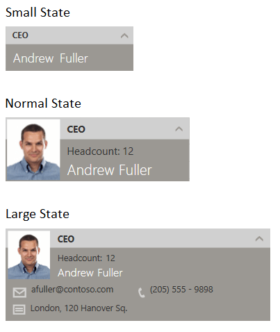

# {{ site.framework_name }} FluidContentControl Overview

__RadFluidContentControl__ is a flexible content control used to build responsive layouts. In its nature the control is a ContentControl, but instead of a single content it can define three that can be switched under specific conditions. By default the condition is the size of the control. So, you can show different content based on the size of the application.





## Key Features

* __Flexible content switching__: The control allows you to easily switch between the three content views (small, normal and large). The switching happens if the control reaches a specific resolution or if you manually set up the current state.

* __Customizable transition animation__: RadFluidContentControl comes with a transition animation support. Additionally, you can define a custom transition to enrich the user experience. Read more about this in the [Transitions]() article.

* __Data binding support__: The control provides several bindable properties for the different contents along with corresponding ContentTemplate properties. Read more about this in the [Data Binding]() article.

>tip Get started with the control with its [Getting Started]() help article that shows how to use it in a basic scenario.


## Telerik UI for WPF Support and Learning Resources

* [Telerik UI for WPF FluidContentControl Homepage](empty)
* [Get Started with the Telerik UI for WPF FluidContentControl]()
* [Telerik UI for WPF API Reference](https://docs.telerik.com/devtools/wpf/api/)
* [Getting Started with Telerik UI for WPF Components]()
* [Telerik UI for WPF Virtual Classroom (Training Courses for Registered Users)](https://learn.telerik.com/learn/course/external/view/elearning/16/telerik-ui-for-wpf) 
* [Telerik UI for WPF FluidContentControl Forums](https://www.telerik.com/forums/wpf)
* [Telerik UI for WPF Knowledge Base](https://docs.telerik.com/devtools/wpf/knowledge-base)


## See Also
 * [Integration Examples]()
 * [Events]()
