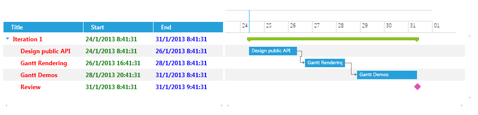

# Customizing the CellTemplate

The __CellTemplate__ is the Template that is displayed in the cell of each roll. It could easily be customized by setting it to any valid DataTemplate.

>It is important to note that when customizing the CellTemplate of a ColumnDefinition there could be some performance loses if the new CellTemplate contains heavy controls. This is because the Template is rendered for each cell when the control is loading. Also note that the CellTemplate influences the size of the row.

The next example demonstrates how to customize the CellTemplate of the Title columns in order to change the __FontWeight__ and __Foreground__ of the text. All that you need to do is set the Template to the wanted DataTemplate in the xaml of the control. The next code snippet shows how the GanttView control should look like:


```XAML
	<telerik:RadGanttView TasksSource="{Binding Tasks}"
	VerticalAlignment="Top"
	VisibleRange="{Binding VisibleTime}">
	    <telerik:RadGanttView.Columns>
	        <telerik:TreeColumnDefinition Header="Title" MemberBinding="{Binding Title}" Width="AutoHeaderAndContent">
	            <telerik:ColumnDefinition.CellTemplate>
	                <DataTemplate>
	                    <TextBlock Text="{Binding FormattedValue}" FontWeight="Bold" Foreground="Red" VerticalAlignment="Center"/>
	                </DataTemplate>
	            </telerik:ColumnDefinition.CellTemplate>
	        </telerik:TreeColumnDefinition>
	        <telerik:ColumnDefinition MemberBinding="{Binding Start}" Header="Start" Width="AutoHeaderAndContent">
	            <telerik:ColumnDefinition.CellTemplate>
	                <DataTemplate>
	                    <TextBlock Text="{Binding FormattedValue}" FontWeight="Bold" Foreground="Green" VerticalAlignment="Center"/>
	                </DataTemplate>
	            </telerik:ColumnDefinition.CellTemplate>
	        </telerik:ColumnDefinition>
	        <telerik:ColumnDefinition MemberBinding="{Binding End}" Header="End" Width="AutoHeaderAndContent">
	            <telerik:ColumnDefinition.CellTemplate>
	                <DataTemplate>
	                    <TextBlock Text="{Binding FormattedValue}" FontWeight="Bold" Foreground="Blue" VerticalAlignment="Center"/>
	                </DataTemplate>
	            </telerik:ColumnDefinition.CellTemplate>
	        </telerik:ColumnDefinition>
	    </telerik:RadGanttView.Columns>
	</telerik:RadGanttView>
```

>important When creating a custom CellTemplate for a ColumnDefinition which __MemberBinding__ is set to a custom property or a property that is not the Start, End or Title properties of the GanttTask you should set the binding in the DataTemplate to the built-in __FormattedValue__ property as the above code snippet shows. This is an optimized string value that comes from the built-in virtualization of the control in order to achieve maximum performance.

>tip Find a runnable project of the previous example in the [WPF Samples GitHub repository](https://github.com/telerik/xaml-sdk/tree/master/GanttView/CustomCellTemplates).

The next screenshot shows the final result:



## See Also

 * [Overview]()

 * [Customizing the CellEditTemplate]()

 * [Customizing the CellHighlightTemplate]()

 * [Customizing the CellSelectionTemplate]()
