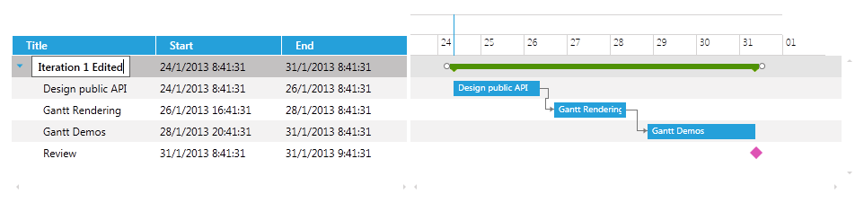
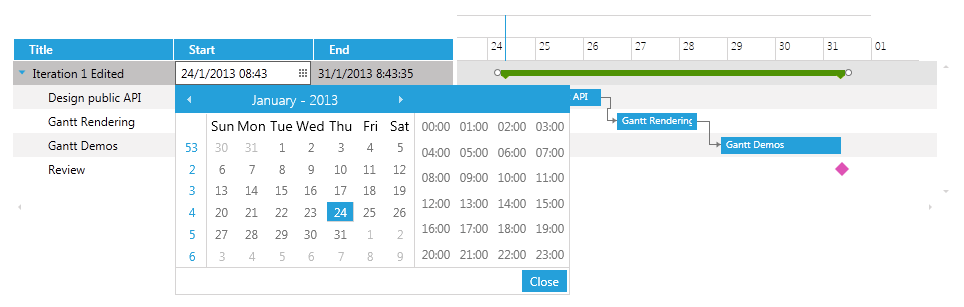

# Customizing the CellEditTemplate

The __CellEditTemplate__ is the Template that is displayed when the cell is in edit mode. The edit mode is entered by double clicking a specific cell. It could easily be customized by setting it to any valid DataTemplate.
      

>Note that when the cell is in edit mode and is scrolled out of the visible range, the changes made to it will be applied to the task.

## 

The next example will demonstrate how to customize the CellEditTemplate of the __Title__, __Start__ and __End__ columns so that those fields are editable.
        

The xaml of the GanttView should look like this:

#### __XAML__

{{region radganttview-features-columns-edit-template-0}}
	<telerik:RadGanttView TasksSource="{Binding Tasks}" 
						  VerticalAlignment="Top"
						  VisibleRange="{Binding VisibleTime}">
		<telerik:RadGanttView.Columns>
			<telerik:TreeColumnDefinition Header="Title" MemberBinding="{Binding Title}" Width="AutoHeaderAndContent">
				<telerik:ColumnDefinition.CellEditTemplate>
					<DataTemplate>
						<TextBox Text="{Binding Title, Mode=TwoWay}"/>
					</DataTemplate>
				</telerik:ColumnDefinition.CellEditTemplate>
			</telerik:TreeColumnDefinition>
			<telerik:ColumnDefinition MemberBinding="{Binding Start}" Header="Start" Width="AutoHeaderAndContent">
				<telerik:ColumnDefinition.CellEditTemplate>
					<DataTemplate>
						<telerik:RadDateTimePicker SelectedValue="{Binding Start, Mode=TwoWay}"/>
					</DataTemplate>
				</telerik:ColumnDefinition.CellEditTemplate>
			</telerik:ColumnDefinition>
			<telerik:ColumnDefinition MemberBinding="{Binding End}" Header="End" Width="AutoHeaderAndContent">
				<telerik:ColumnDefinition.CellEditTemplate>
					<DataTemplate>
						<telerik:RadDateTimePicker SelectedValue="{Binding End, Mode=TwoWay}"/>
					</DataTemplate>
				</telerik:ColumnDefinition.CellEditTemplate>
			</telerik:ColumnDefinition>
		</telerik:RadGanttView.Columns>
	</telerik:RadGanttView>
	{{endregion}}

>tipYou can download a runnable project of the previous example from our online SDK repository
                  [here](https://github.com/telerik/xaml-sdk), the example is listed as __GanttView / CustomCellTemplates__.
              

The next screenshots show the final result:

# See Also

 * [Overview]()

 * [Customizing the CellTemplate]()

 * [Customizing the CellHighlightTemplate]()

 * [Customizing the CellSelectionTemplate]()
