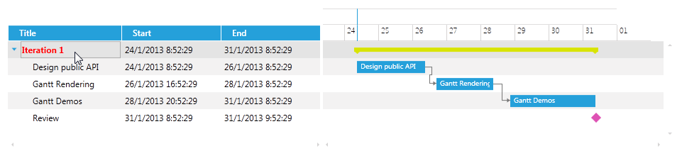
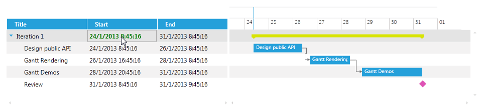

# Customizing the CellHighlightTemplate

The __CellHighlightTemplate__ is the Template that is displayed when you hover over the cell with the mouse pointer.

## 

The next example will demonstrate how to customize the CellHighlightTemplate of the __Title__, __Start__ and __End__ columns in order to change the FontWeight and Foreground of the text.

The xaml of the GanttView should look like this:

#### __XAML__

{{region radganttview-features-columns-highlight-template-0}}
	<telerik:RadGanttView TasksSource="{Binding Tasks}"
						  VerticalAlignment="Top"
						  VisibleRange="{Binding VisibleTime}">
		<telerik:RadGanttView.Columns>
			<telerik:TreeColumnDefinition Header="Title" MemberBinding="{Binding Title}" Width="AutoHeaderAndContent">
				<telerik:ColumnDefinition.CellHighlightTemplate>
					<DataTemplate>
						<TextBlock Text="{Binding FormattedValue}" FontWeight="Bold" Foreground="Red" VerticalAlignment="Center"/>
					</DataTemplate>
				</telerik:ColumnDefinition.CellHighlightTemplate>
			</telerik:TreeColumnDefinition>
			<telerik:ColumnDefinition MemberBinding="{Binding Start}" Header="Start" Width="AutoHeaderAndContent">
				<telerik:ColumnDefinition.CellHighlightTemplate>
					<DataTemplate>
						<TextBlock Text="{Binding FormattedValue}" FontWeight="Bold" Foreground="Green" VerticalAlignment="Center"/>
					</DataTemplate>
				</telerik:ColumnDefinition.CellHighlightTemplate>
			</telerik:ColumnDefinition>
			<telerik:ColumnDefinition MemberBinding="{Binding End}" Header="End" Width="AutoHeaderAndContent">
				<telerik:ColumnDefinition.CellHighlightTemplate>
					<DataTemplate>
						<TextBlock Text="{Binding FormattedValue}" FontWeight="Bold" Foreground="Blue" VerticalAlignment="Center"/>
					</DataTemplate>
				</telerik:ColumnDefinition.CellHighlightTemplate>
			</telerik:ColumnDefinition>
		</telerik:RadGanttView.Columns>
	</telerik:RadGanttView>
	{{endregion}}

>importantWhen creating a custom CellHighlightTemplate for a ColumnDefinition which __MemberBinding__ is set to a custom property or a property that is not the Start, End or Title properties of the GanttTask you should set the binding in the DataTemplate to the built-in __FormattedValue__ property as the above code snippet shows. This is an optimized string value that comes from the built-in virtualization of the control in order to achieve maximum performance.
              

>tipYou can download a runnable project of the previous example from our online SDK repository
                  [here](https://github.com/telerik/xaml-sdk), the example is listed as __GanttView / CustomCellTemplates__.
              

The next screenshots show the final result:

# See Also

 * [Overview]()

 * [Customizing the CellTemplate]()

 * [Customizing the CellEditTemplate]()

 * [Customizing the CellSelectionTemplate]()
