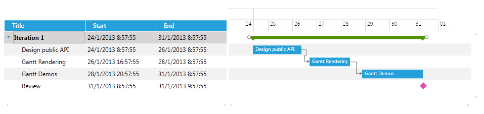
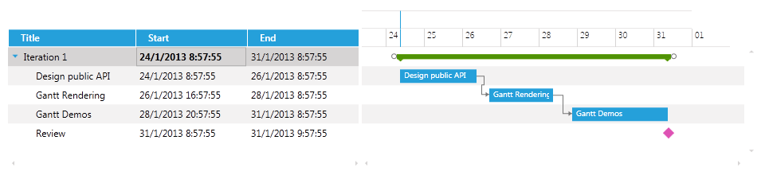

# Customizing the CellSelectionTemplate

The __CellSelectionTemplate__ is the Template that is displayed when a cell is selected with a single mouse click.

The next example will demonstrate how to customize the CellSelectionTemplate of the Title, Start and End columns so that the text in those filed is bolded when the cell is selected.

The xaml of the GanttView should look like this:

#### __XAML__

```XAML
	<telerik:RadGanttView TasksSource="{Binding Tasks}"
	VerticalAlignment="Top"
	VisibleRange="{Binding VisibleTime}">
	    <telerik:RadGanttView.Columns>
	        <telerik:TreeColumnDefinition Header="Title" MemberBinding="{Binding Title}" Width="AutoHeaderAndContent">
	            <telerik:ColumnDefinition.CellSelectionTemplate >
	                <DataTemplate>
	                    <TextBlock Text="{Binding FormattedValue}" FontWeight="Bold" VerticalAlignment="Center"/>
	                </DataTemplate>
	            </telerik:ColumnDefinition.CellSelectionTemplate >
	        </telerik:TreeColumnDefinition>
	        <telerik:ColumnDefinition MemberBinding="{Binding Start}" Header="Start" Width="AutoHeaderAndContent">
	            <telerik:ColumnDefinition.CellSelectionTemplate>
	                <DataTemplate>
	                    <TextBlock Text="{Binding FormattedValue}" FontWeight="Bold" VerticalAlignment="Center"/>
	                </DataTemplate>
	            </telerik:ColumnDefinition.CellSelectionTemplate>
	        </telerik:ColumnDefinition>
	        <telerik:ColumnDefinition MemberBinding="{Binding End}" Header="End" Width="AutoHeaderAndContent">
	            <telerik:ColumnDefinition.CellSelectionTemplate>
	                <DataTemplate>
	                    <TextBlock Text="{Binding FormattedValue}" FontWeight="Bold" VerticalAlignment="Center"/>
	                </DataTemplate>
	            </telerik:ColumnDefinition.CellSelectionTemplate>
	        </telerik:ColumnDefinition>
	    </telerik:RadGanttView.Columns>
	</telerik:RadGanttView>
```

>importantWhen creating a custom CellSelectionTemplate for a ColumnDefinition which __MemberBinding__ is set to a custom property or a property that is not the Start, End or Title properties of the GanttTask you should set the binding in the DataTemplate to the built-in __FormattedValue__ property as the above code snippet shows. This is an optimized string value that comes from the built-in virtualization of the control in order to achieve maximum performance.

>tip Find a runnable project of the previous example in the [WPF Samples GitHub repository](https://github.com/telerik/xaml-sdk/tree/master/GanttView/CustomCellTemplates).

The next screenshots show the final result:





## See Also

 * [Overview]()

 * [Customizing the CellTemplate]()

 * [Customizing the CellEditTemplate]()

 * [Customizing the CellHighlightTemplate]()
