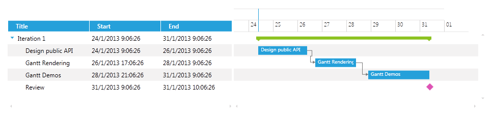
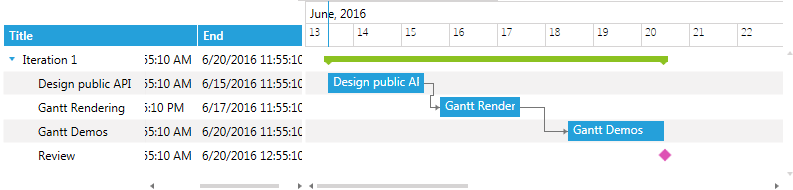

# Overview

In __RadGanttView__ Tasks fields are displayed in different columns. Two types of columns can be defined in the control: __Column__ and __TreeColumn__. TreeColumn is a special type of column that is used to visualize tasks and their children in a tree structure. Both types of columns have the following customizable Templates: CellTemplate, CellEditTemplate, CellHighlightTemplate, and CellSelectionTemplate.

>Before proceeding with the following example you should be familiar with [Implementing View-ViewModel](). 

<!-- -->

>With the Q1 2013 release of __RadGanttView__, you can set each ColumnDefinition’s Width to a predefined value (__50__, __100__, __150__, __200__, __250__, __300__, __AutoHeader__ or __AutoHeaderAndContent__).
>	* The 50 to 300 values are in inches.
>	* AutoHeader automatically sets the Width of the ColumnDefinition to the width that is required to render the column's Header.
>	* AutoHeaderAndContent automatically sets the ColumnDefinition to the width required to render the column's Header and content. If one is larger than the other, the value is used.

Let us now see the following sections:

* [Defining columns](#defining-columns)

* [Frozen columns](#frozen-columns)

## Defining columns

To define columns in the RadGanttView control, you have to add them to the Columns collection of the control.

* First, you have to declare the RadGanttView control and populate it with data:

__Example 1: Declaring RadGanttView__

```XAML
	<telerik:RadGanttView TasksSource="{Binding Tasks}"
	       VerticalAlignment="Top"
	       VisibleRange="{Binding VisibleTime}">
	</telerik:RadGanttView>
```

* Then define the required columns in the Columns collection of the control:

__Example 2: Adding columns__

```XAML
	<telerik:RadGanttView TasksSource="{Binding Tasks}"
	 VerticalAlignment="Top"
	    VisibleRange="{Binding VisibleTime}">
	    <telerik:RadGanttView.Columns>
	        <telerik:TreeColumnDefinition/>
	        <telerik:ColumnDefinition/>
	        <telerik:ColumnDefinition/>
	    </telerik:RadGanttView.Columns>
	</telerik:RadGanttView>
```

* Finally set the Header, MemberBinding, and other required properties of the columns: 

__Example 3: Setting column properties__

```XAML
	<telerik:RadGanttView TasksSource="{Binding Tasks}"
	             VerticalAlignment="Top"
	             VisibleRange="{Binding VisibleTime}">
	    <telerik:RadGanttView.Columns>
	        <telerik:TreeColumnDefinition Header="Title" MemberBinding="{Binding Title}" Width="AutoHeaderAndContent"/>
	        <telerik:ColumnDefinition MemberBinding="{Binding Start}" Header="Start" Width="AutoHeaderAndContent"/>
	        <telerik:ColumnDefinition MemberBinding="{Binding End}" Header="End" Width="AutoHeaderAndContent"/>
	    </telerik:RadGanttView.Columns>
	</telerik:RadGanttView>
```

__Figure 1__ shows an example of defined columns.

#### __Figure 1: RadGanttView with the defined columns__



## Frozen columns

__RadGanttView__ provides a way to exclude one or more columns from the horizontal scrolling by setting their __IsFrozenColumn__ property. The frozen columns stay static on top of the horizontal scrolling.  

Let us, for example, set the first "Title" column to be frozen, as shown in __Example 4__.

__Example 4: Setting IsFrozenColumn property__

```XAML
	<telerik:RadGanttView TasksSource="{Binding Tasks}">
	<telerik:RadGanttView.Columns>
	<telerik:TreeColumnDefinition Header="Title" IsFrozenColumn="True" MemberBinding="{Binding Title}" Width="AutoHeaderAndContent" />
	<telerik:ColumnDefinition MemberBinding="{Binding Start}" Header="Start" Width="AutoHeaderAndContent"/>
	<telerik:ColumnDefinition MemberBinding="{Binding End}" Header="End" Width="AutoHeaderAndContent"/>
	</telerik:RadGanttView.Columns>  
	</telerik:RadGanttView>
```

__Figure 2__ illustrates how the "Title" column stays static while scrolling horizontally.

#### __Figure 2: Scrolling the Grid part with a frozen column__



## See Also

 * [Customizing the CellTemplate]()

 * [Customizing the CellEditTemplate]()

 * [Customizing the CellHighlightTemplate]()

 * [Customizing the CellSelectionTemplate]()
