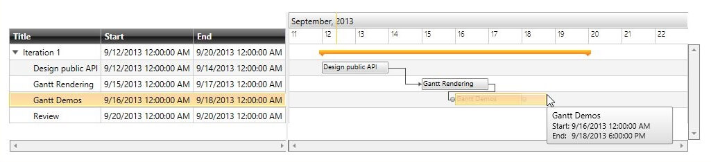
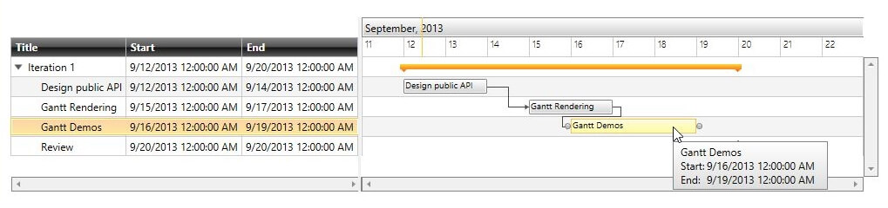

# Custom Drag and Drop Behaviors

__RadGanttView__ provides the option to customize its DragDrop and Resize behaviors in order to add some custom logic for drag and drop as well as resizing of tasks. This topic describes all the available methods you can use to implement custom drag and drop/resizing functionality.

## Custom DragDropBehavior

In order to create a custom DragDropBehavior you will need to create a class that inherits from __Telerik.Windows.Controls.GanttView.GanttDragDropBehavior__ and override its methods. The following methods could be overridden:

* __CanStartDrag__(SchedulingDragDropState state) – returns a Boolean value that determines if the drag operation of tasks could start

* __CanDrop__(SchedulingDragDropState state) – returns a Boolean value that determines if the drop operation of tasks can be executed

* __Drop__(SchedulingDragDropState state) – occurs when a task has been dropped

The next example shows how to create a custom GanttDragDropBehavior in order to prevent the drag-drop of Milestone tasks.

* Create a CustomDragDragDropBehavior class and override its CanStartDrag method:


```C#
	public class CustomDragDropBehavior : Telerik.Windows.Controls.GanttView.GanttDragDropBehavior
	{
	    protected override bool CanStartDrag(SchedulingDragDropState state)
	    {
	        var task = state.DraggedItem as GanttTask;
	        if (task.IsMilestone)
	            return false;
	
	        return base.CanStartDrag(state);
	    }
	}
```

* Set the just created class as RadGanttView DragDropBehavior:


```XAML
	<telerik:RadGanttView  x:Name="ganttView" TasksSource="{Binding Tasks}" >
	    <telerik:RadGanttView.DragDropBehavior>
	        <local:CustomDragDropBehavior />
	    </telerik:RadGanttView.DragDropBehavior>
	</telerik:RadGanttView>
```

The dragging of milestone tasks will be disabled.

## Custom ResizeBehavior

In order to create a custom ResizeBehavior you will need to create a class that inherits from __Telerik.Windows.Controls.Scheduling.SchedulingResizeBehavior__ and override its methods. The following methods could be overridden: 

* __CanResize__(SchedulingResizeState state) - returns a Boolean value that determines if the resize operation of the task is allowed

* __CanStartResize__(SchedulingResizeState state) - returns a Boolean value that determines if the resize operation of the task could start

* __Resize__(SchedulingResizeState state) – occurs when a task is being resized

* __ResizeCanceled__(SchedulingResizeState state) – occurs when the resize operation is canceled.

The next example will demonstrate how to create custom __SchedulingResizeBehavior__ in order to create a behavior that will snap the Start and End times of the resized Task to the nearest day.

* Create a custom SchedulingResizeBehavior class and override its Resize method:


```C#
	public class SnappingSchedulingResizeBehavior : SchedulingResizeBehavior
	{
	    protected override void Resize(SchedulingResizeState state)
	    {
	        if (state.IsResizeFromEnd)
	        {
	            state.DestinationSlot.End = RoundUpDateTime(state.DestinationSlot.End);
	        }
	        else
	        {
	            state.DestinationSlot.Start = RoundUpDateTime(state.DestinationSlot.Start);
	        }
	
	        base.Resize(state);
	    }
	
	    private DateTime RoundUpDateTime(DateTime dateTime)
	    {
	        DateTime result;
	        if (dateTime.Hour >= 12)
	        {
	            result = RoundUpToNextDay(dateTime);
	        }
	        else
	        {
	            result = new DateTime(dateTime.Year, dateTime.Month, dateTime.Day);
	        }
	
	        return result;
	    }
	
	    private static DateTime RoundUpToNextDay(DateTime dateTime)
	    {
	        DateTime result;
	        if (dateTime.Day == DateTime.DaysInMonth(dateTime.Year, dateTime.Month))
	        {
	            if (dateTime.Month < 12)
	            {
	                result = new DateTime(dateTime.Year, dateTime.Month + 1, 1);
	            }
	            else
	            {
	                result = new DateTime(dateTime.Year + 1, 1, 1);
	            }
	        }
	        else
	        {
	            result = new DateTime(dateTime.Year, dateTime.Month, dateTime.Day + 1);
	        }
	        return result;
	    }
	}
```

* Set the newly created class to the RadGanttView ResizeBehavior:


```XAML
	<telerik:RadGanttView  x:Name="ganttView1" TasksSource="{Binding Tasks}" >
	    <telerik:RadGanttView.ResizeBehavior>
	        <local:SnappingSchedulingResizeBehavior />
	    </telerik:RadGanttView.ResizeBehavior>
	</telerik:RadGanttView>
```

The next figures shows the final result. When the Start or End of a Task is resized by resizing the task object it is snapped to the nearest Day depending on if the Task has been resized above 12:00 PM or not:

Figure 1. Resizing a task and dropping it to 9/18/2013 6:00 PM.



Figure 2. The task’s end time is snapped to 9/19/2013 12:00 AM.


