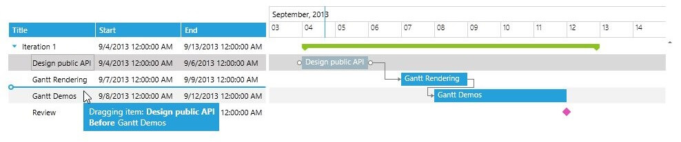
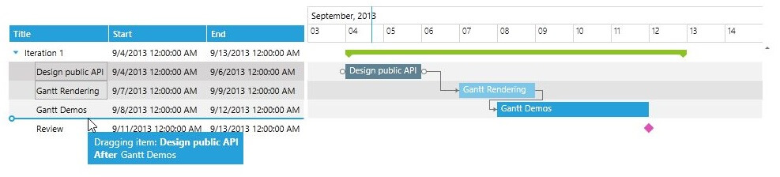
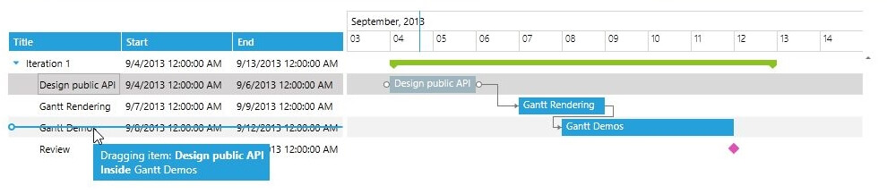
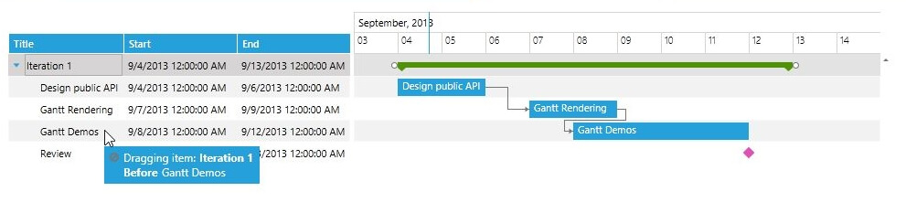
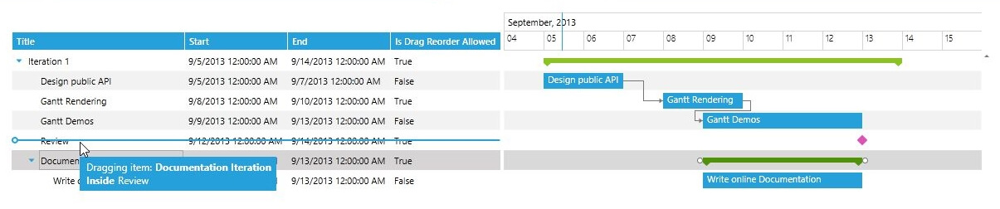
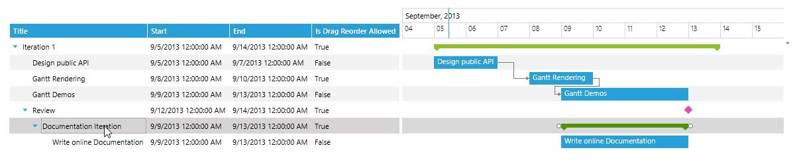
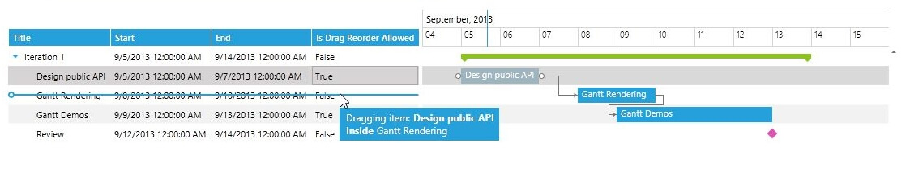
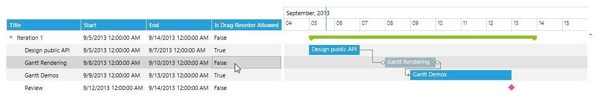

# Drag Reorder

In the __RadGanttView__ control there are multiple build-in features that are related to dragging and dropping with the mouse such as the task __dragging__, __resizing__ and __reordering__ of tasks in the [GridView part]() of the control.

The drag reorder of tasks in the [GridView part]() of the RadGanttView control is done via dragging and dropping the row which is associate with the task. You can start the reorder functionality for any task by click and move of any cell of the task’s row.

## Basic Drag Reorder Functionality

The built-in reorder feature provides multiple drop location in order to support dropping __above__, __inside__ or __below__ another task. With that being said the drop of parent task inside its children tasks is restricted as it is not a valid operation. The next screen shots show the multiple drop operations that the built-in task reorder supports:
                

* Drop above another task (the drop cue is displayed above the “Gantt Demos” task):



* Drop below another task (the drop cue is displayed below the “Gantt Demos” task):



* Drop inside another task (the drop cue is displayed in the middle of the “Gantt Demos” task):



* Drop a parent task inside one of its children tasks (the drop cue is not displayed and the restricted drop icon is shown in the drag visual):



* Dragging a task (the “Documentation Iteration” task) that has inner tasks will drag the entire series of tasks not only the parent task:



## Custom GanttDragDropBehavior

The RadGattView control provides an easy way of customizing the drag and drop of its tasks in its Timeline and GridView part with the use of its __DragDropBehavior__. You can read more about how to customize the drag/drop and resizing of tasks in the Timeline part of the GanttView control [here](). This help article will focus on how to create custom DragDropBehavior in order to control the drag reordering of tasks in the GridView part of the control.

In order to create custom DragDropBehavior there are two possible approaches that could be used:  

* Create a class that inherits the __GanttDragDropBehavior__ class and override its CanDrop, Drop, CanStartDrag, CreateInstanceOverride and GetReorderDropPosition methods.  

or 

* Create a class that implements the __ISchedulingDragDropBehavior__ interface and implement its methods.

### Disable Drag Reorder for Specific Tasks

The next example will demonstrate how to create a custom GanttDragDropBehavior that will disable the drag reorder of some tasks in the RadGanttView control.

>Before proceeding with this help article you should get familiar with [Custom GanttTask]() and [Implementing View-ViewModel]().

* First you will need to create a custom GanttTask and add a Boolean field that will represent the drag reorder state of the task:


```C#
	public class CustomGanttTask : GanttTask
	{
	    private bool isDragReorderAllowed;
	
	    public bool IsDragReorderAllowed
	    {
	        get
	        {
	            return this.isDragReorderAllowed;
	        }
	
	        set
	        {
	            if (this.isDragReorderAllowed != value)
	            {
	                this.isDragReorderAllowed = value;
	                this.OnPropertyChanged(() => this.IsDragReorderAllowed);
	            }
	        }
	    }
	}
```

* After that you will need to create the custom DragDropBehavior with one of the previously mentioned approaches. In the __CanStartDrag__ method you can use the __SchedulingDragDropState__ to determine if the drag and drop operation is in the GridView or the Timeline part of the control with the use of the Boolean __IsReorderOperation__ property. If the value of that property is true the drag drop operation is triggered in the [GridView part]() of the control:


```C#
	public class CustomGanttDragDropBehavior : GanttDragDropBehavior
	{
	    protected override bool CanStartDrag(SchedulingDragDropState state)
	    {
	        if (state.IsReorderOperation)
	        {
	            return ((CustomGanttTask)state.DraggedItem).IsDragReorderAllowed;
	        }
	
	        return base.CanStartDrag(state);
	    }
	}
```

* After populating the control with some sample data the declared in the xaml control should look like this:


```XAML
	<telerik:RadGanttView TasksSource="{Binding Tasks}" Margin="20"
	VerticalAlignment="Top" 
	VisibleRange="{Binding VisibleTime}">
	    <telerik:RadGanttView.DragDropBehavior>
	        <local:CustomGanttDragDropBehavior/>
	    </telerik:RadGanttView.DragDropBehavior>
	    <telerik:RadGanttView.Columns>
	        <telerik:TreeColumnDefinition Header="Title" MemberBinding="{Binding Title}" Width="AutoHeaderAndContent"/>
	        <telerik:ColumnDefinition MemberBinding="{Binding Start}" Header="Start" Width="AutoHeaderAndContent"/>
	        <telerik:ColumnDefinition MemberBinding="{Binding End}" Header="End" Width="AutoHeaderAndContent"/>
	        <telerik:ColumnDefinition MemberBinding="{Binding IsDragReorderAllowed}" Header="Is Drag Reorder Allowed" Width="AutoHeaderAndContent"/>
	    </telerik:RadGanttView.Columns>
	</telerik:RadGanttView>
```

The local namespace is the namespace of the project.

The next screenshots show the final result:



## See Also

 * [Drag and Drop: Overview]()

 * [Custom GanttTask]()
