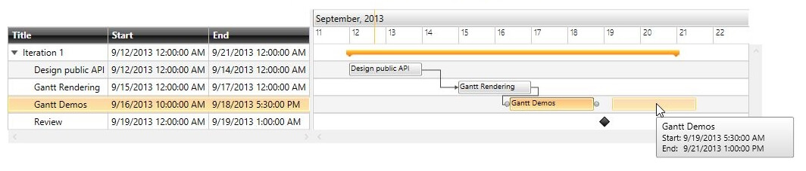

# Overview

The __RadGanttView__ control has a built-in __DragDropBehavior__ and __ResizeBehavior__ that enable the drag and drop feature of tasks as well as their resizing. This article will show the basic functionalities of the two behaviors.
        

## Basic Functionality

The DragDropBehavior is responsible for the dragging, dropping and reordering of tasks in the control.
        

The next figures show the basic operations of the behaviors:
          

                  Figure 1. Task drag and drop
              

                  Figure 2. Task resizing
              

                  Figure 3. Task reorder
              

The DragDropBehavior is easily customizable, for more information take a look at the following help articles:
          

[Drag Reorder]()

[Custom Drag and Drop Behaviors]()
