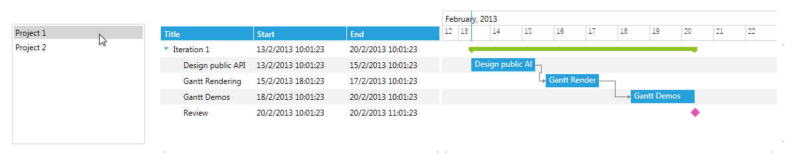
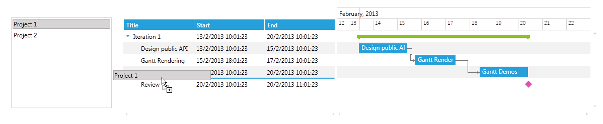
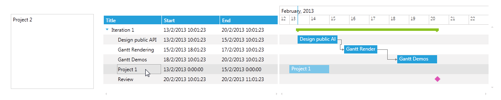

# Drag and Drop with RadListBox

__RadGanttView__ allows drag and drop functionality between the GanttView control and an outside source.

This help article demonstrates how to achieve drag and drop between __RadListBox__ and __RadGanttView__ controls.

>Before proceeding with this help article you should get familiar with [RadListBox: Binding To Object](), [RadListBox: Drag and Drop Overview]() and [RadGanttView: Implementing View-ViewModel]().          

1. First you will need to declare the __RadListBox__ control in the xaml and populate it with some sample data: 

	```XAML
		<telerik:RadListBox ItemsSource="{Binding Projects}" DisplayMemberPath="Name"/>
	```

	and the ViewModel should look like this:

	

	```C#
		public class ViewModel : ViewModelBase
		{
		    private ObservableCollection<Project> projects;
		
		    public ViewModel()
		    {
		        this.projects = this.GetProjects();
		    }
		
		    public ObservableCollection<Project> Projects
		    {
		        get
		        {
		            return this.projects;
		        }
		
		        set
		        {
		            this.projects = value;
		            this.OnPropertyChanged(() => this.Projects);
		        }
		    }
		
		    private ObservableCollection<Project> GetProjects()
		    {
		        var projects = new ObservableCollection<Project>();
		        projects.Add(new Project { Name = "Project 1", Start = DateTime.Today, End = DateTime.Today.AddDays(2) });
		        projects.Add(new Project { Name = "Project 2", Start = DateTime.Today.AddDays(2), End = DateTime.Today.AddDays(4) });
		        return projects;
		    }
		}
	```

1. Next you should declare the __RadGanttView__ control in the xaml and populate it with some sample data:

	```XAML
		<telerik:RadGanttView x:Name="radGanttView" 
		TasksSource="{Binding GanttTasks}" 
		VisibleRange="{Binding VisibleRange}">
		    <telerik:RadGanttView.Columns>
		        <telerik:TreeColumnDefinition MemberBinding="{Binding Title}" Header="Title" Width="AutoHeaderAndContent"/>
		        <telerik:ColumnDefinition MemberBinding="{Binding Start}" Header="Start" Width="AutoHeaderAndContent"/>
		        <telerik:ColumnDefinition MemberBinding="{Binding End}" Header="End" Width="AutoHeaderAndContent"/>
		    </telerik:RadGanttView.Columns>
		</telerik:RadGanttView>
	```

	and the ViewModel should look like this:

	```C#
		public class ViewModel : ViewModelBase
		{
		    //...
		    private ObservableCollection<GanttTask> tasks;
		
		    private DateRange visibleRange;
		
		    public ViewModel()
		    {
		        //...
		        var date = DateTime.Now;
		        var ganttAPI = new GanttTask() { Start = date, End = date.AddDays(2), Title = "Design public API" };
		        var ganttRendering = new GanttTask() { Start = date.AddDays(2).AddHours(8), End = date.AddDays(4), Title = "Gantt Rendering" };
		        var ganttDemos = new GanttTask() { Start = date.AddDays(5), End = date.AddDays(7), Title = "Gantt Demos" };
		        var milestone = new GanttTask() { Start = date.AddDays(7), End = date.AddDays(7).AddHours(1), Title = "Review", IsMilestone = true };
		        ganttRendering.Dependencies.Add(new Dependency() { FromTask = ganttAPI });
		        ganttDemos.Dependencies.Add(new Dependency() { FromTask = ganttRendering });
		        var iterationTask = new GanttTask(date, date.AddDays(7), "Iteration 1")
		        {
		            Children = { ganttAPI, ganttRendering, ganttDemos, milestone }
		        };
		
		        this.tasks = new ObservableCollection<GanttTask>() { iterationTask };
		        var start = this.tasks.Min(t => t.Start).Date;
		        var end = this.tasks.Max(t => t.End).Date;
		        this.visibleRange = new DateRange(start.AddHours(-12), end.AddDays(3));
		    }
		
		    //...
		
		    public ObservableCollection<GanttTask> GanttTasks
		    {
		        get
		        {
		            return this.tasks;
		        }
		
		        set
		        {
		            this.tasks = value;
		            this.OnPropertyChanged(() => this.GanttTasks);
		        }
		    }
		
		    public DateRange VisibleRange
		    {
		        get
		        {
		            return this.visibleRange;
		        }
		
		        set
		        {
		            this.visibleRange = value;
		            this.OnPropertyChanged(() => this.VisibleRange);
		        }
		    }
		
		    //...
		}
	```

1. Create a custom __GanttDragDropBehavior__ and override its __CanStartDrag()__ method in order to restrict the drag and drop functionality from the Timeline of the GanttView control (in the current version of the control drag and drop from the Timeline is not supported):

	```C#
		public class CustomGanttDragDropBehavior : GanttDragDropBehavior
		{
		    protected override bool CanStartDrag(SchedulingDragDropState state)
		    {
		        return state.IsReorderOperation;
		    }
		}
	```

1. Create a custom __DataConverter__ that will convert the drag data from the GanttView to the ListBox control:  

	```C#
		public class CustomGanttConverter : DataConverter
		{
		    public override object ConvertTo(object data, string format)
		    {
		        if (format == typeof(Project).FullName)
		        {
		            var project = DataObjectHelper.GetData(data, typeof(SchedulingDragOperationPayload), true) as SchedulingDragOperationPayload;
		            if (project != null)
		            {
		                return project.DraggedItems.OfType<IGanttTask>().Select(p => new Project { Name = p.Title, Start = p.Start, End = p.End });
		            }
		        }
		
		        return null;
		    }
		
		    public override string[] GetConvertToFormats()
		    {
		        return new[] { typeof(Project).FullName };
		    }
		}
	```

1. Create a custom __DataConverter__ for that will convert data from ListBox to the GanttView control:

	```C#
		public class CustomListBoxConverter : DataConverter
		{
		    public override object ConvertTo(object data, string format)
		    {
		        var draggedProjectItem = (DataObjectHelper.GetData(data, typeof(Project), true) as List<object>).First() as Project;
		        var task = new GanttTask { Title = draggedProjectItem.Name, Start = draggedProjectItem.Start, End = draggedProjectItem.End };
		
		        return task;
		    }
		
		    public override string[] GetConvertToFormats()
		    {
		        return new string[] { typeof(IDateRange).FullName};
		    }
		}
	```

1. Declare the newly created GanttDragDropBehavior and converters to the ListBox and GanttView controls, the xaml of the two controls should look like this:

	```XAML
		<telerik:RadListBox ItemsSource="{Binding Projects}" 
		AllowDrop="True"
		ItemContainerStyle="{StaticResource DraggableListBoxItem}" 
		DisplayMemberPath="Name" Width="200" Margin="20">
		    <telerik:RadListBox.DragDropBehavior>
		        <telerik:ListBoxDragDropBehavior/>
		    </telerik:RadListBox.DragDropBehavior>
		    <telerik:RadListBox.DragVisualProvider>
		        <telerik:ScreenshotDragVisualProvider/>
		    </telerik:RadListBox.DragVisualProvider>
		    <telerik:RadListBox.DataConverter>
		        <local:CustomListBoxConverter/>
		    </telerik:RadListBox.DataConverter>
		</telerik:RadListBox>
		<telerik:RadGanttView x:Name="radGanttView1" 
		TasksSource="{Binding GanttTasks}" 
		VisibleRange="{Binding VisibleRange}" 
		Grid.Column="1">
		    <telerik:RadGanttView.Columns>
		        <telerik:TreeColumnDefinition MemberBinding="{Binding Title}" Header="Title" Width="AutoHeaderAndContent"/>
		        <telerik:ColumnDefinition MemberBinding="{Binding Start}" Header="Start" Width="AutoHeaderAndContent"/>
		        <telerik:ColumnDefinition MemberBinding="{Binding End}" Header="End" Width="AutoHeaderAndContent"/>
		    </telerik:RadGanttView.Columns>
		    <telerik:RadGanttView.DataConverter>
		        <local:CustomGanttConverter/>
		    </telerik:RadGanttView.DataConverter>
		    <telerik:RadGanttView.DragDropBehavior>
		        <local:CustomGanttDragDropBehavior/>
		    </telerik:RadGanttView.DragDropBehavior>
		</telerik:RadGanttView>
	```


The next screenshots show the final result:





## See Also

 * [Overview]()

 * [Implementing View-ViewModel]()
